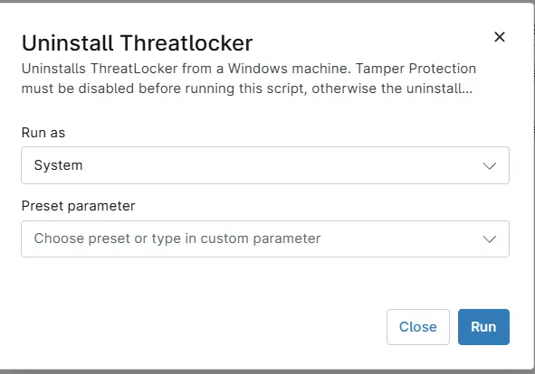

## Overview

Uninstalls ThreatLocker from a Windows machine. Tamper Protection must be disabled before running this script, otherwise the uninstall may fail.

## Sample Run

`Play Button` > `Run Automation` > `Script`  

## Dependencies

- [Solution - ThreatLocker Deployment [NinjaOne]](/docs/a1efd808-41ad-4dee-9ea1-ff0c2a36e019)

## Automation Setup/Import

[Automation Configuration](https://github.com/ProVal-Tech/ninjarmm/blob/main/scripts/uninstall-threatlocker-windows.ps1)

## Output

- Activity Details  

## Changelog

### 2026-05-29

- Initial version of the document