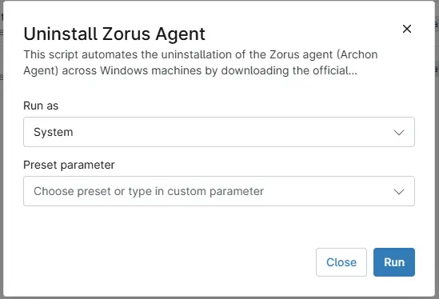

## Overview

This script automates the uninstallation of the Zorus agent (Archon Agent) across Windows machines by downloading the official removal tool, executing it silently, and handling retries and fallback download methods

## Sample Run

`Play Button` > `Run Automation` > `Script`  

## Dependencies

- [Solution: Zorus Agent Manager](/docs/3b1dee7b-3bbb-4122-b33c-da6caa2a2d56)

## Automation Setup/Import

[Automation Configuration](https://github.com/ProVal-Tech/ninjarmm/blob/main/scripts/uninstall-zorus-agent.ps1)

## Output

- Activity Details  

## Changelog

### 2026-05-27

- Initial version of the document