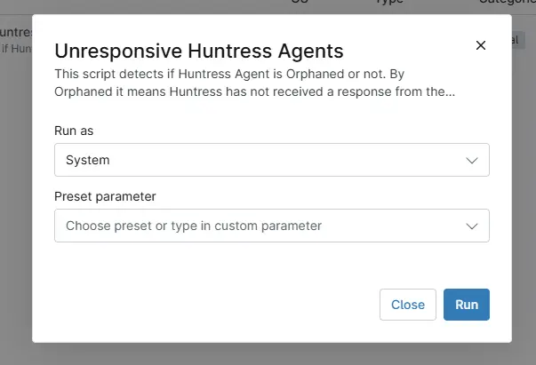

## Overview
This script detects if Huntress Agent is Orphaned or not. By Orphaned it means Huntress has not received a response from the agent within 30 days and the Agent's key/token has been revoked by Huntress. At that point, the agent is unable to send or receive any data from the Huntress portal and is essentially not performing security tasks anymore.

## Sample Run

`Play Button` > `Run Automation` > `Script`  

## Dependencies

- [Solution - Unresponsive Huntress Agent Detection](/docs/48618a4c-997d-4dbc-83ef-cc1bf1ead6c4)  

## Automation Setup/Import

[Automation Configuration](https://github.com/ProVal-Tech/ninjarmm/blob/main/scripts/unresponsive-huntress-agents.ps1)

## Output

- Activity Details 

## Changelog

### 2026-05-12

- Initial version of the document