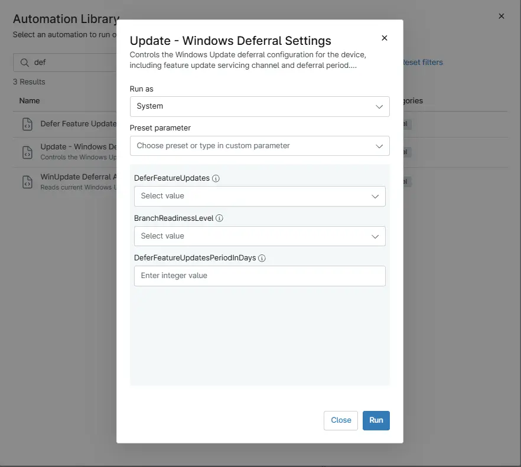

## Overview

Controls the Windows Update deferral configuration for the device, including feature update servicing channel and deferral period. These settings determine when feature updates are made available after release.

## Sample Run

`Play Button` > `Run Automation` > `Script`

## Dependencies

- [Solution - Device Standards](/docs/a0c383d4-699a-4bb8-af7f-c2a007747182)
- [Solution: Update Windows Deferral Settings](/docs/56e6b247-f80a-4bd8-b2e2-8cf44f76b7e1)
- [Custom Field: cPVAL DeferFeatureUpdatesPeriodInDays](/docs/0cb57dd0-6349-4544-a146-f822e6dccceb)
- [Custom Field: cPVAL DeferFeatureUpdates](/docs/297e4a2e-e7a3-43ea-bbae-a88715d472b4)
- [Custom Field: cPVAL BranchReadinessLevel](/docs/c4accdf3-29e3-4dda-8a05-eae9093d629e)

## Parameters

| Name | Accepted Values | Required | Type | Description |
| ---- | --------------- | -------- | ---- | ----------- |
| DeferFeatureUpdates | `Enabled` , `Disabled` | False | `DropDown` | The value in the Custom Field must be set to either Enabled or Disabled. The script will then read this value and configure the corresponding setting accordingly (using 0 or 1 based on the Custom Field data). |
| BranchReadinessLevel | `16`,`32` | False | `Dropdown` | This field controls the Windows Update Branch Readiness Level. Select the appropriate channel to determine which feature update builds the device will receive. |
| DeferFeatureUpdatesPeriodInDays | `0-365` | False | `Integer` | Specifies the number of days to defer Windows feature updates. Accepts values between 0 and 365 days. |

## Automation Setup/Import

[Automation Configuration](https://github.com/ProVal-Tech/ninjarmm/blob/main/scripts/update-windows-deferral-settings.ps1)

## Output

- Activity Details

## Changelog

### 2026-03-06

- Initial version of the document
