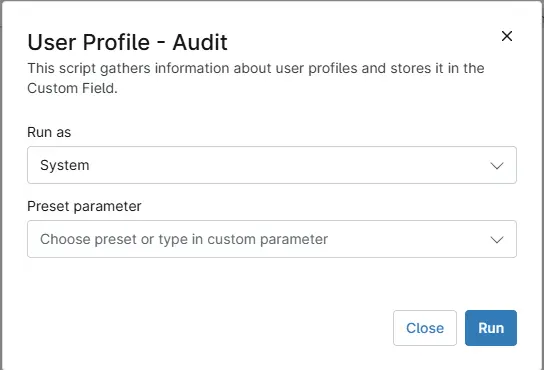

## Overview
This script gathers information about user profiles and stores it in the Custom Field.

## Sample Run

`Play Button` > `Run Automation` > `Script`  

## Dependencies
- [Custom Field - cPVAL User Profile Details](/docs/8e0adb65-9df6-4bbf-a1d9-4a32650776aa)
- [Solution - User Profile - Get Information](/docs/04dfa2f0-b1e0-4860-b7be-39b841a7e492)

## Automation Setup/Import

[Automation Configuration](https://github.com/ProVal-Tech/ninjarmm/blob/main/scripts/user-profile-audit.ps1)

## Output

- Activity Details  
- Custom Field
