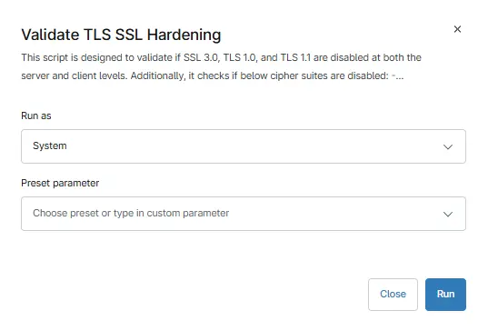

## Overview

This script is designed for post-implementation validation of TLS/SSL hardening. It performs the following checks:

**Protocol Validation:**  Verifies that legacy protocols SSL 3.0, TLS 1.0, and TLS 1.1 are disabled at both the server and client levels by checking the corresponding registry settings under SCHANNEL.
    
**Cipher Suite Validation:** Checks whether the specified weak TLS 1.2 cipher suites are no longer active on the system using the Get-TlsCipherSuite cmdlet. A fallback mechanism is included to support different Windows versions.
    
**Output Format:** Displays results in a simple PASS / FAIL / INFO format for each protocol and cipher, making it easy to review in RMM tools such as NinjaRMM.
   
**Non-Intrusive Operation:** This is a read-only script and does not modify any system settings.

## Sample Run

`Play Button` > `Run Automation` > `Script`  

## Automation Setup/Import

[Automation Configuration](https://github.com/ProVal-Tech/ninjarmm/blob/main/scripts/validate-tls-ssl-hardening.ps1)

## Output

- Activity Details  

## Changelog

*** 2026-04-10

- Initial version of the document.