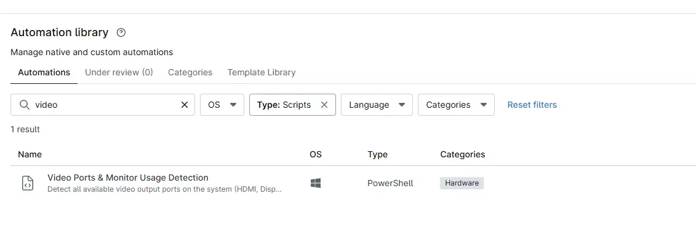

## Overview

Detect all available video output ports on the system (HDMI, DisplayPort, VGA, DVI, etc.). Detect which ports are actively used by connected monitors.

## Sample Run

`Play Button` > `Run Automation` > `Script`  

## Dependencies

## Automation Setup/Import

[Automation Configuration](https://github.com/ProVal-Tech/ninjarmm/blob/main/scripts/video-ports-and-monitor-usage-detection.ps1)

## Output

- Activity Details  
- Custom Field
