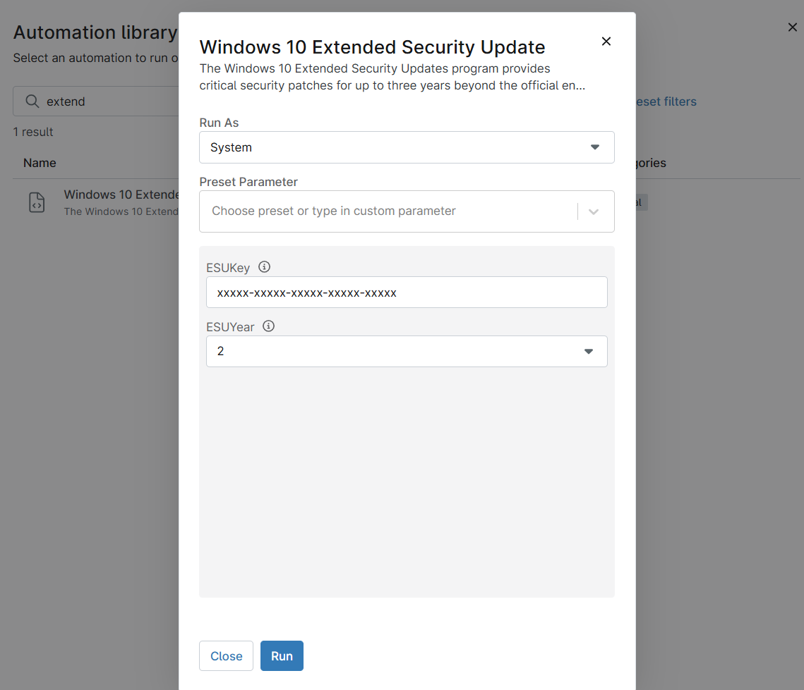

## Overview
The Windows 10 Extended Security Updates program provides critical security patches for up to three years beyond the official end of support date.

## Sample Run

`Play Button` > `Run Automation` > `Script`  

## Dependencies

[CF - cpval ESU Status](/docs/b4d0f4a1-7891-4315-875e-01fc96b17d59)
[Solution - Ninja Win10 ESU Licensing and Auditing](/docs/f1ae37d6-7fa7-414c-8550-1ae9ea11b987)

## Parameters

| Name | Example | Accepted Values | Required | Default | Type | Description |
| ---- | ------- | --------------- | -------- | ------- | ---- | ----------- |
| ESUKey | xxxxx-xxxxx-xxxxx-xxxxx-xxxxx | | False | | String/Text | Provide the ESU license key for activation of Windows 10 extended use |
| ESUYear | 2 | 1,2, or 3 | False | Drop-Down | Select the license key year validation like 1, 2, or 3. |

## Automation Setup/Import

[Automation Configuration](https://github.com/ProVal-Tech/ninjarmm/blob/main/scripts/windows-10-extended-security-update.ps1)

## Output

- Activity Details
