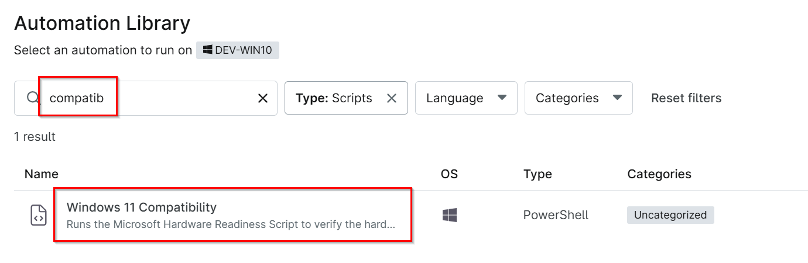
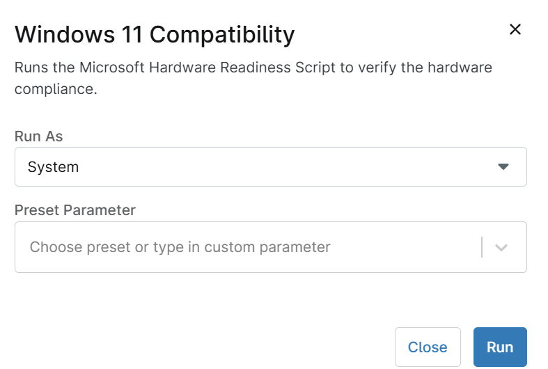
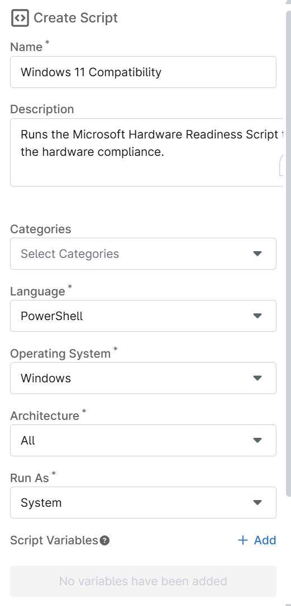
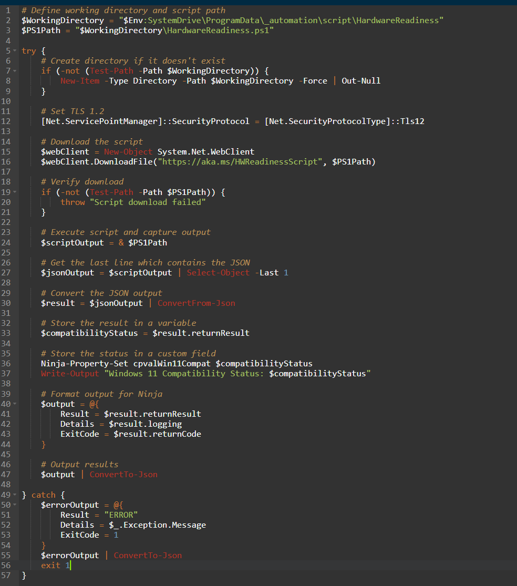
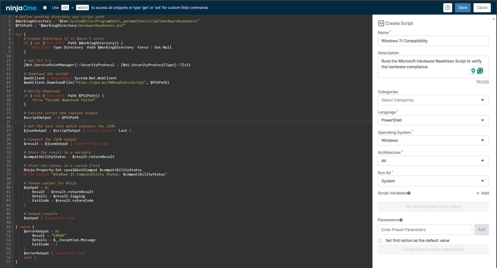

## Overview

Runs the Microsoft Hardware Readiness Script to verify the hardware compliance.

## Sample Run

`Play Button` > `Run Automation` > `Script`  


Search and select `Windows 11 Compatibility`


Set the required arguments and click the `Run` button to run the script.  
**Run As:** `System`  
**Preset Parameter:** `<Leave it Blank>`  



**Run Automation:** `Yes`  


## Dependencies

- [Custom field - cPVAL Win 11 Compatibility](/docs/7967028d-d2ff-4afe-a89e-437541c70208)  
- [Solution - Windows 11 Compatibility Validation](/docs/fa172fda-07d3-4a7c-bb17-5e7179db991a)

## Automation Setup/Import

### Step 1

Navigate to `Administration` > `Library` > `Automation`  


### Step 2

Locate the `Add` button on the right-hand side of the screen, click on it and click the `New Script` button.  


The scripting window will open.  


### Step 3

Configure the `Create Script` section as follows:

- **Name:** `Windows 11 Compatibility`  
- **Description:** `Runs the Microsoft Hardware Readiness Script to verify the hardware compliance.`  
- **Categories:** `<Leave it blank>`  
- **Language:** `PowerShell`  
- **Operating System:** `Windows`  
- **Architecture:** `All`  
- **Run As:** `System`  



## Step 4

Paste the following powershell script in the scripting section:  

```PowerShell
# Define working directory and script path
$WorkingDirectory = "$Env:SystemDrive\ProgramData\_automation\script\HardwareReadiness"
$PS1Path = "$WorkingDirectory\HardwareReadiness.ps1"

try {
    # Create directory if it doesn't exist
    if (-not (Test-Path -Path $WorkingDirectory)) {
        New-Item -Type Directory -Path $WorkingDirectory -Force | Out-Null
    }

    # Set TLS 1.2
    [Net.ServicePointManager]::SecurityProtocol = [Net.SecurityProtocolType]::Tls12

    # Download the script
    $webClient = New-Object System.Net.WebClient
    $webClient.DownloadFile("https://aka.ms/HWReadinessScript", $PS1Path)

    # Verify download
    if (-not (Test-Path -Path $PS1Path)) {
        throw "Script download failed"
    }

    # Execute script and capture output
    $scriptOutput = & $PS1Path

    # Get the last line which contains the JSON
    $jsonOutput = $scriptOutput | Select-Object -Last 1

    # Convert the JSON output
    $result = $jsonOutput | ConvertFrom-Json

    # Store the result in a variable
    $compatibilityStatus = $result.returnResult

    # Store the status in a custom field
    Ninja-Property-Set cpvalWin11Compat $compatibilityStatus
    Write-Output "Windows 11 Compatibility Status: $compatibilityStatus"

    # Format output for Ninja
    $output = @{
        Result = $result.returnResult
        Details = $result.logging
        ExitCode = $result.returnCode
    }

    # Output results
    $output | ConvertTo-Json

} catch {
    $errorOutput = @{
        Result = "ERROR"
        Details = $_.Exception.Message
        ExitCode = 1
    }
    $errorOutput | ConvertTo-Json
    exit 1
}
```



## Saving the Automation

Click the `Save` button in the top-right corner of the screen to save your automation.  


You will be prompted to enter your MFA code. Provide the code and press the Continue button to finalize the process.  


## Completed Automation



## Output

- Activity Details