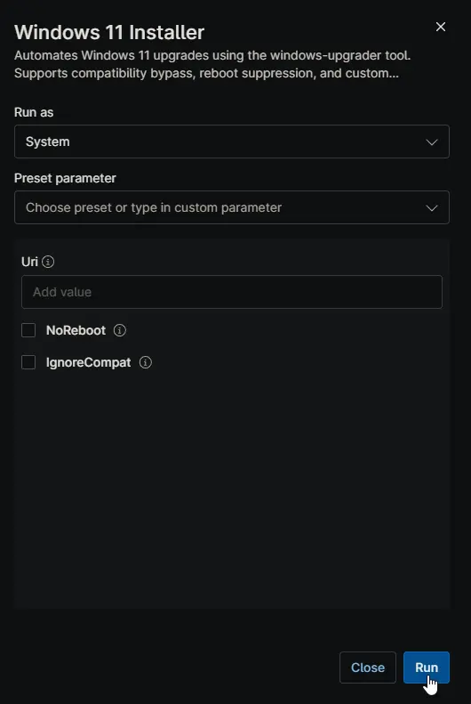
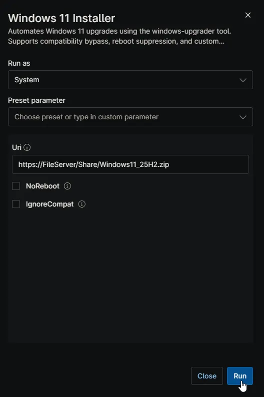
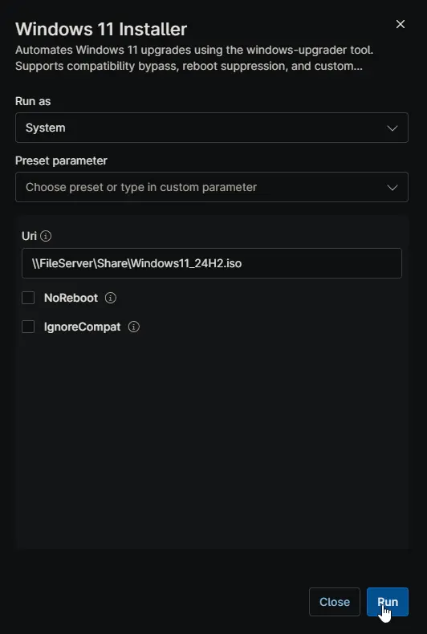
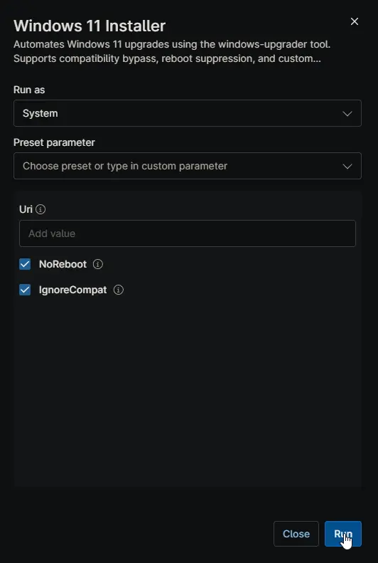

## Summary

Designed to upgrade Windows systems to the latest version. It can be used to:

* Upgrade Windows 10 to Windows 11
* Install Windows 11 feature updates (e.g., 21H2 → 22H2 → 23H2 → 24H2 → 25H2)

Supports multiple source types including HTTP/HTTPS URLs, local files, and network shares (UNC paths).

> **Notes:**  
> • The **Version** and **Uri** parameters should not be used simultaneously. If both are provided, **Version** will override **Uri**.  
> • If no parameters are supplied, the machine will be upgraded to **24H2** by default.  
> • The **Version** parameter can be set to **24H2** or **25H2**, depending on your requirement.  
> • When using the **Version** parameter, you do not need to host an ISO or ZIP file or supply the **Uri**.

## Sample Run

**Scenario 1: Default Execution (No Variables Set)**  
Running the script without configuring any variables.

* **Variables:** None

    

* **Behavior:** The script defaults to installing **Windows 11 24H2** from the internal repository. It performs standard hardware compatibility checks (TPM/Secure Boot) and **automatically reboots** the machine upon successful completion.

**Scenario 2: Installing a Specific Version**  
Targeting a newer or specific build release.

* **Variables:**
* `Version` = `25H2`

    

* **Behavior:** Downloads and installs **Windows 11 25H2** from the internal repository. If `Uri` was also accidentally set, it is ignored in favor of this Version setting.

**Scenario 3: Using a Custom Source (Network Share or URL)**  
Deploying a custom image or saving bandwidth by using a local file server.

* **Variables:**
* `Uri` = `\\FileServer\Share\Windows11_24H2.iso`
* `Version` = *(Left Blank)*

    

* **Behavior:** Mounts the ISO from the specified network share and performs the upgrade.

**Scenario 4: Unsupported Hardware with Reboot Suppression**  
Forcing an upgrade on a device that lacks TPM 2.0 or a supported CPU, while preventing an immediate restart.

* **Variables:**
* `Version` = `24H2`
* `IgnoreCompat` = `true`
* `NoReboot` = `true`

    

* **Behavior:** Installs Windows 11 24H2. The script **bypasses** the official hardware requirements (TPM, CPU, RAM checks) and suppresses the automatic reboot. The device will remain in the upgraded state pending a manual restart.

## Dependencies

* [Windows Upgrader](/docs/8c083d5d-a464-4937-91ef-980a062b26fd/)

## Parameters

Here is the completed parameters table based on the script logic and NinjaRMM configuration.

| Name | Example | Accepted Values | Required | Default | Type | Description |
| --- | --- | --- | --- | --- | --- | --- |
| **Version** | `24H2` | `24H2`, `25H2` | False | `24H2` | Drop-down | The specific Windows 11 version to install from the internal repository. If set, this **overrides** the `Uri` parameter. |
| **Uri** | `\\Server\Share\Win11.iso` | URL (HTTP/S), UNC Path, Local Path | False | Null | String | Custom source location for the Windows 11 payload (.iso or .zip). Only utilized if `Version` is left blank. |
| **NoReboot** | `true` | `true`, `false` | False | `false` | Checkbox | If enabled, prevents the system from automatically rebooting after a successful upgrade. |
| **IgnoreCompat** | `true` | `true`, `false` | False | `false` | Checkbox | If enabled, bypasses official Windows 11 hardware compatibility checks (TPM, Secure Boot, CPU). |

## Automation Setup/Import

[Automation Configuration](https://github.com/ProVal-Tech/ninjarmm/blob/main/scripts/windows-11-installer.ps1)

## Output

* Activity Details

## FAQs

**Q: Will the machine reboot automatically after the installation?**  
**A:** Yes, by default, the script will reboot the machine immediately once the upgrade process is complete. If you wish to suppress this behavior, you must enable the **NoReboot** option.

> **Warning:** Since this is a major operating system upgrade, Windows Setup may occasionally override the suppression flag and force a reboot to complete critical phases. We strongly recommend running this script during after-hours or maintenance windows to avoid unexpected disruption to production environments.

**Q: Can I use this script on hardware that does not meet Windows 11 requirements (e.g., TPM 2.0 or CPU)?**  
**A:** Technically, yes, but **we do not recommend it**. While the **IgnoreCompat** option allows the tool to bypass official checks (CPU, TPM, Secure Boot), running Windows 11 on unsupported hardware may lead to stability issues or missing future updates. We strongly recommend upgrading the physical hardware to a compatible device instead of forcing the upgrade.

**Q: I entered a custom URL in the "Uri" field, but it still installed the standard version from the internal repository. Why?**  
**A:** The **Version** parameter takes precedence over the **Uri** parameter. If the **Version** field has a value (e.g., "24H2"), the script will ignore your custom URI. To use a custom source, ensure the **Version** field is left blank.

**Q: Why did the script fail immediately on a laptop?**  
**A:** The script includes a safety check that prevents execution if the device is running on battery power. This is to ensure the device does not power off in the middle of a critical OS upgrade. Please ensure the laptop is plugged into AC power and retry.

**Q: Does this script support Windows 10 Enterprise LTSC or LTSB?**  
**A:** No. The tool is designed for standard Windows editions (Home, Pro, Enterprise). It will detect LTSC/LTSB editions and abort the process to prevent system instability.

**Q: What does the "System Reserved Partition" error mean?**  
**A:** The Windows upgrade process requires at least 15MB of free space on the System Reserved Partition (SRP).

* **On GPT disks:** The script attempts to automatically clear font caches to free up space.
* **On MBR disks:** The script will fail and exit safely because automated cleanup is risky on MBR. You will need to free up space on that partition manually before retrying.
