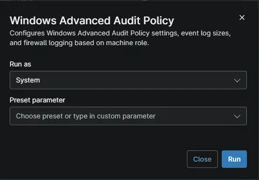

## Overview

`Configures Windows Advanced Audit Policy settings, event log sizes, and firewall logging based on machine role. On Domain Controllers, the script additionally enables Directory Service Access and Directory Service Changes audit subcategories along with increased Event Log MaxSize registry settings. On all machines, it applies 34 auditpol subcategory commands, 3 category-level commands, and configures Windows Firewall logging for Standard, Public, and Domain profiles.`

## Sample Run

## Dependencies

- [Solution - Windows Audit Policy](/docs/b1682285-652d-4f50-b34b-c23e2c7382f6)

## Automation Setup/Import

[Automation Configuration](https://github.com/ProVal-Tech/ninjarmm/blob/main/scripts/windows-audit-policy.ps1)

## Output

- Activity Details  

## Changelog

### 2026-10-02

- This is initial version of document