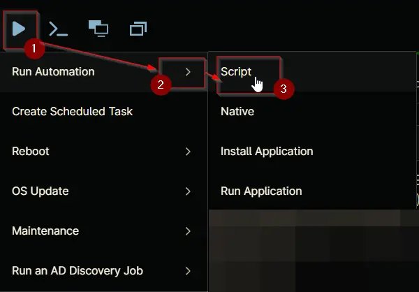
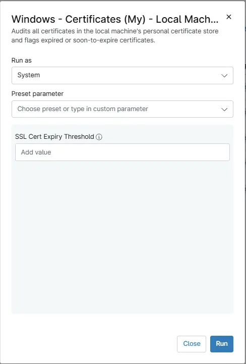

## Overview
This Script audits all certificates in the local machine's personal certificate store and flags expired or soon-to-expire certificates. It then updates the custom field [cPVAL SSL certificate Audit](/docs/350874e6-7bef-4bff-8fce-f2772acab495) with the SSL certificate details and also sets the custom field [cPVAL Expired SSL Certificates Detected](/docs/2c4efab3-5417-485a-b9cd-7d67ce474fd9) to True if any expired or soon-to-expire certificates are found during the audit.

## Sample Run

`Play Button` > `Run Automation` > `Script`  

## Dependencies

- [Solution - SSL Certificate Audit](/docs/cf5acc69-183c-4838-9484-2f3d9a247877)
- [Custom field - cPVAL SSL certificate Audit](/docs/350874e6-7bef-4bff-8fce-f2772acab495)
- [cPVAL Expired SSL Certificates Detected](/docs/2c4efab3-5417-485a-b9cd-7d67ce474fd9)

## Parameters

| Name | Example | Accepted Values | Required | Default | Type | Description |
| ---- | ------- | --------------- | -------- | ------- | ---- | ----------- |
| SSL Cert Expiry Threshold | 15 | Numeric Values | False | - | Text | Set the number of days before SSL certificate expiration to detect and report certificates requiring attention. | 

**Note** : `SSL Cert Expiry Threshold should be similar to [Script : SSL Certificate Expiration Monitoring](/docs/4b6c5595-4336-4e14-a119-c6c7e2c31443) to alert for the certificates that are expired or soon to expire.`

## Automation Setup/Import

[Automation Configuration](https://github.com/ProVal-Tech/ninjarmm/blob/main/scripts/windows-certificates-local-machine-audit.ps1)

## Output

- Activity Details  
- Custom Field

## Changelog

### 2026-07-20

- Renamed the script from `SSL Certificate Audit` to `Windows - Certificates (My) - Local Machine - Audit` since this script pulls all certificates and not just SSL certificates on the machine.

### 2026-02-13

- Initial version of the document
