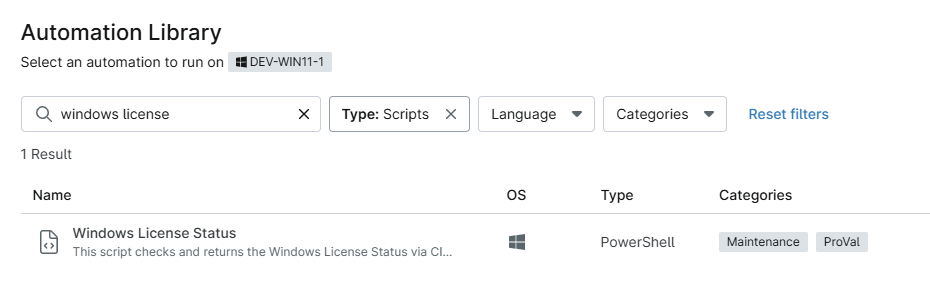
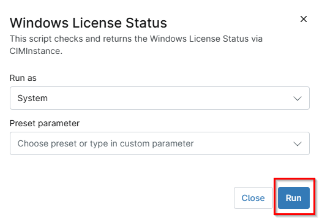

## Overview

This script checks and returns the Windows License Status via CIMInstance.

## Sample Run

`Play Button` > `Run Automation` > `Script`  

## Dependencies

- [Solution - Windows License Status](/docs/e05c7729-ebb0-4818-a3a9-b8f736c46c23)
- [Custom Field - cpval Windows License Check](/docs/6d9eacd6-a4e1-474c-bdee-02b753001ac3)

## Automation Setup/Import

[Automation Configuration](https://github.com/ProVal-Tech/ninjarmm/blob/main/scripts/windows-license-status.ps1)

## Output

- Activity Details  
- Custom Field

## Changelog

### 2026-05-08

- Initial version of the document