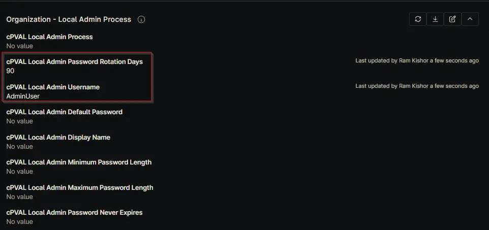
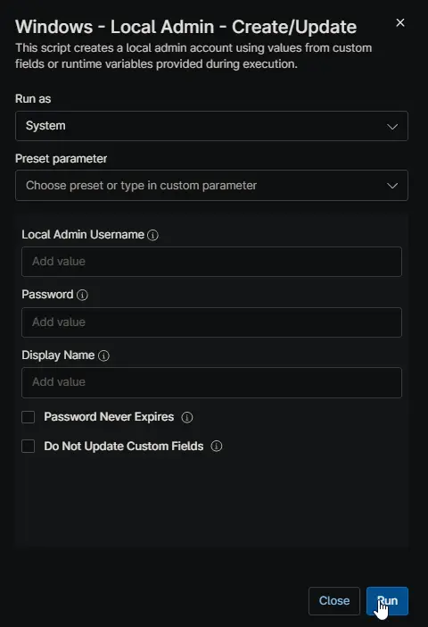
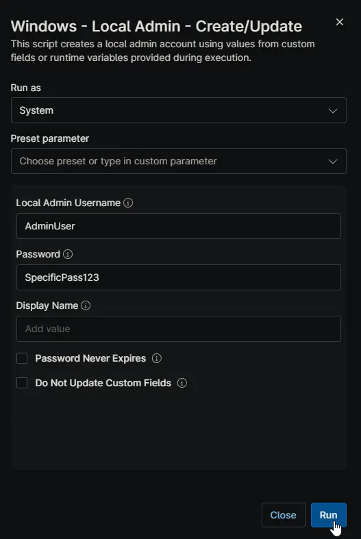
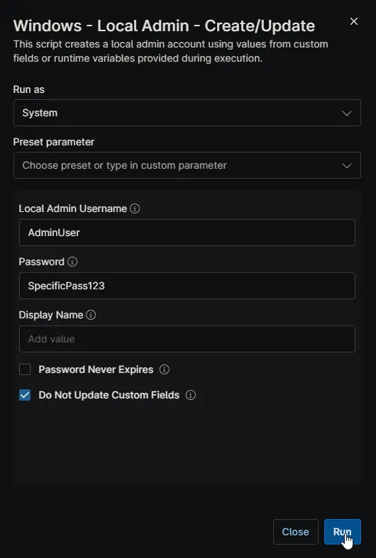

## Overview

Automates local administrator account management, password rotation, and NinjaRMM Custom Field synchronization.

## Dependencies

- [Custom Field: cPVAL Local Admin Password Rotation Days](/docs/5a3c6f86-4e2f-425f-8178-1e76b8f85ec5)
- [Custom Field: cPVAL Local Admin Username](/docs/e1b7982c-35bc-43b4-870f-2f27f8ed582e)
- [Custom Field: cPVAL Local Admin Password](/docs/922e9ee1-9e5f-41cb-b397-62379f9ce9fc)
- [Custom Field: cPVAL Local Admin Default Password](/docs/6f35eac6-9d3b-454a-b37e-ab3b719d44e3)
- [Custom Field: cPVAL Local Admin Display Name](/docs/40b4ecfd-059e-4734-b652-377781bed1b2)
- [Custom Field: cPVAL Local Admin Minimum Password Length](/docs/354d5885-8a36-4478-884e-cb14fcdad4d8)
- [Custom Field: cPVAL Local Admin Maximum Password Length](/docs/98ad71a3-d6aa-492b-ac94-71053d1c3211)
- [Custom Field: cPVAL Local Admin Password Never Expires](/docs/28f3bc57-90ef-4976-866e-09a57c690bee)
- [Custom Field: cPVAL Local Admin Password Update Date](/docs/d46e9ed6-3757-459f-a08e-530490f5f08c)
- [Solution: Windows - Local Admin - Process](/docs/11107cf4-cdb3-4d93-be1a-431ffbdce8da)

## Sample Run

### Scenario 1: Automated Maintenance (Standard Use)

**Goal:** Automatically manage the admin account defined in Custom Fields and rotate the password every 90 days.

**Configuration:**

- "[cPVAL Local Admin Username](/docs/e1b7982c-35bc-43b4-870f-2f27f8ed582e)" is set to "AdminUser"
- "[cPVAL Local Admin Password Rotation Days](/docs/5a3c6f86-4e2f-425f-8178-1e76b8f85ec5)s" is set to 90  
  
- Script Variables (Runtime) are left empty  
  

**Result:**

- The script checks "[cPVAL Local Admin Password Update Date](/docs/d46e9ed6-3757-459f-a08e-530490f5f08c)
"
- If more than 90 days have passed, it generates a new random password
- It updates the password on the local machine
- It saves the new password back to "[cPVAL Local Admin Password](/docs/922e9ee1-9e5f-41cb-b397-62379f9ce9fc)" and updates the date

### Scenario 2: Manual Override (Forcing a Credential)

**Goal:** Force the password to "SpecificPass123!" for a specific user, regardless of what is stored in Custom Fields.

**Configuration:**

- Script Variable "Local Admin Username" = "AdminUser"
- Script Variable "Password" = "SpecificPass123!"
  

**Result:**

- The script ignores the "[cPVAL Local Admin Username](/docs/e1b7982c-35bc-43b4-870f-2f27f8ed582e)" field
- It sets the machine password to "SpecificPass123!"
- Because "Do Not Update Custom Fields" was not set, the script overwrites "cPVAL Local Admin Password" with "SpecificPass123!"

### Scenario 3: Temporary Access (No Save)

**Goal:** Temporarily change the password for troubleshooting without overwriting the stored password in Ninja.

**Configuration:**

- Script Variable "Local Admin Username" = "AdminUser"
- Script Variable "Password" = "TempPass123!"
- Script Variable "Do Not Update Custom Fields" = "True"
  

**Result:**

- The script sets the machine password to "TempPass123!"
- The script does not update "[cPVAL Local Admin Password Rotation Days](/docs/5a3c6f86-4e2f-425f-8178-1e76b8f85ec5)"
- Ninja continues to show the old password, allowing you to revert later or keep official records clean

## Parameters

| Name | Example | Accepted Values | Required | Default | Type | Description |
| ---- | ------- | --------------- | -------- | ------- | ---- | ----------- |
| Local Admin Username | AdminUser | Any valid Windows username | No | From Custom Field | String | Override the username for creating the local admin account via runtime variable |
| Password | SpecificPass123! | Any valid password string | No | Auto-generated | String | Override the password for the local admin account via runtime variable |
| Display Name | Local Administrator | Any display name string | No | Matches username | String | Display name for the local admin account (runtime variable only) |
| Password Never Expires | True/False | True, False | No | False | Boolean | Set the local admin password to never expire (runtime variable only) |
| Do Not Update Custom Fields | True/False | True, False | No | False | Boolean | Prevent writing data back to NinjaRMM custom fields |

## Custom Fields

| Name | Purpose |
| ---- | ------- |
| [cPVAL Local Admin Username](/docs/e1b7982c-35bc-43b4-870f-2f27f8ed582e) | Enter the username for the local admin account to be created |
| [cPVAL Local Admin Password](/docs/922e9ee1-9e5f-41cb-b397-62379f9ce9fc) | Stores the password for the local admin account (automatically updated by script) |
| [cPVAL Local Admin Password Rotation Days](/docs/5a3c6f86-4e2f-425f-8178-1e76b8f85ec5) | Set the number of days for automatic password rotation (0 or blank = no rotation) |
| [cPVAL Local Admin Password Update Date](/docs/d46e9ed6-3757-459f-a08e-530490f5f08c) | Tracks the last date a new password was set (automatically updated by script) |
| [cPVAL Local Admin Default Password](/docs/6f35eac6-9d3b-454a-b37e-ab3b719d44e3) | Set a default password to use during account creation instead of generating a random one |
| [cPVAL Local Admin Display Name](/docs/40b4ecfd-059e-4734-b652-377781bed1b2) | Enter the display name for the local admin account (defaults to username if blank) |
| [cPVAL Local Admin Minimum Password Length](/docs/354d5885-8a36-4478-884e-cb14fcdad4d8) | Set the minimum password length for auto-rotation (Default: 14 characters) |
| [cPVAL Local Admin Maximum Password Length](/docs/98ad71a3-d6aa-492b-ac94-71053d1c3211) | Set the maximum password length for auto-rotation (Default: minimum + 5 characters) |
| [cPVAL Local Admin Password Never Expires](/docs/28f3bc57-90ef-4976-866e-09a57c690bee) | Enable to set the local admin password to never expire |
| [cPVAL Local Admin Password Update Date](/docs/d46e9ed6-3757-459f-a08e-530490f5f08c) | Select the operating system to enable the solution |

## Automation Setup/Import

[Automation Configuration](https://github.com/ProVal-Tech/ninjarmm/blob/main/scripts/windows-local-admin-create-update.ps1)

## Output

- Activity Details  
- Custom Field
