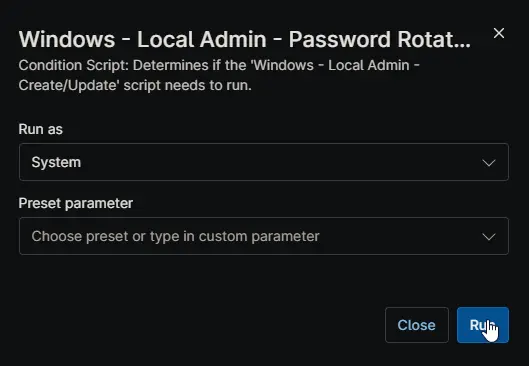

## Summary

Condition Script: Determines if the Local Admin Password Rotation script needs to run.

## Detection Method

1. [cPVAL Local Admin Username](/docs/e1b7982c-35bc-43b4-870f-2f27f8ed582e) is set, but [cPVAL Local Admin Password](/docs/922e9ee1-9e5f-41cb-b397-62379f9ce9fc) is empty (First Run).
2. [cPVAL Local Admin Password](/docs/922e9ee1-9e5f-41cb-b397-62379f9ce9fc) is set, and the 'Update Date' is older than that duration.

## Sample Run

## Dependencies

- [Custom Field: cPVAL Local Admin Password Rotation Days](/docs/5a3c6f86-4e2f-425f-8178-1e76b8f85ec5)
- [Custom Field: cPVAL Local Admin Username](/docs/e1b7982c-35bc-43b4-870f-2f27f8ed582e)
- [Custom Field: cPVAL Local Admin Password](/docs/922e9ee1-9e5f-41cb-b397-62379f9ce9fc)
- [Custom Field: cPVAL Local Admin Password Update Date](/docs/d46e9ed6-3757-459f-a08e-530490f5f08c)

## Automation Setup/Import

[Automation Configuration](https://github.com/ProVal-Tech/ninjarmm/blob/main/scripts/windows-local-admin-password-rotation-check.ps1)

## Output

- Activity Log
- Custom Field
