## Overview

Retrieves installed Windows Server roles, additional services, and FSMO roles (if applicable).

## Sample Run

`Play Button` > `Run Automation` > `Script`  


Search and select `Windows Server Roles Detection`  
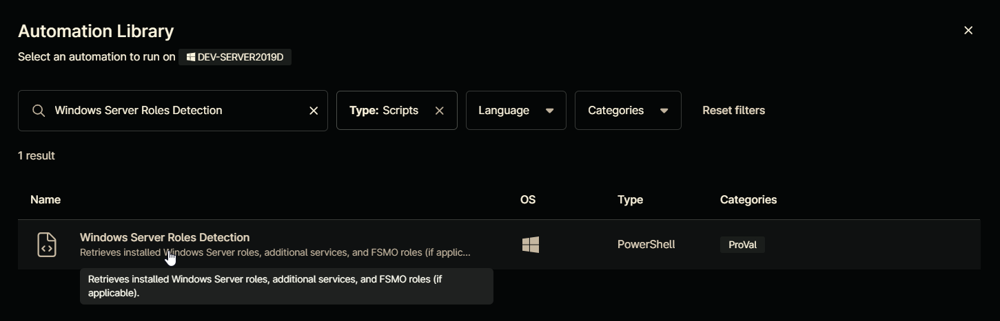

**Run As:** `System`  
**Preset Parameter:** `Leave it untouched`  
**Custom Field:** `cpvalRolesDetected`  
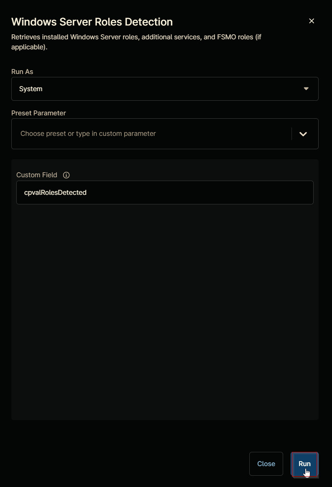

**Run Automation:** `Yes`  
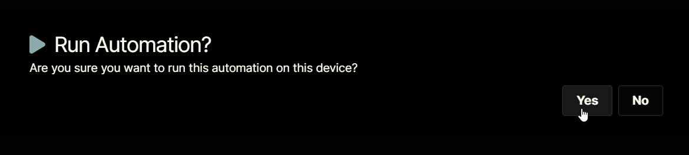

## Dependencies

[cPVAL Roles Detected](../custom-fields/cpval-roles-detected.md)

## Parameters

| Name | Example | Required | Default | Type | Description |
| ---- | ------- | -------- | ------- | ---- | ----------- |
| CustomField | cpvalRolesDetected | True | cpvalRolesDetected | String/Text | Specifies a custom field name to store results using Ninja-Property-Set. Accepts value from `customfield` variable. |

## Automation Setup/Import

### Step 1

Navigate to `Administration` > `Library` > `Automation`  


### Step 2

Locate the `Add` button on the right-hand side of the screen, click on it and click the `New Script` button.  


The scripting window will open.  


### Step 3

Configure the `Create Script` as follows:

**Name:** `Windows Server Roles Detection`  
**Description:** `Retrieves installed Windows Server roles, additional services, and FSMO roles (if applicable).`  
**Categories:** `ProVal`  
**Language:** `PowerShell`  
**Operating System:** `Windows`  
**Architecture:** `All`  
**Run As:** `System`  
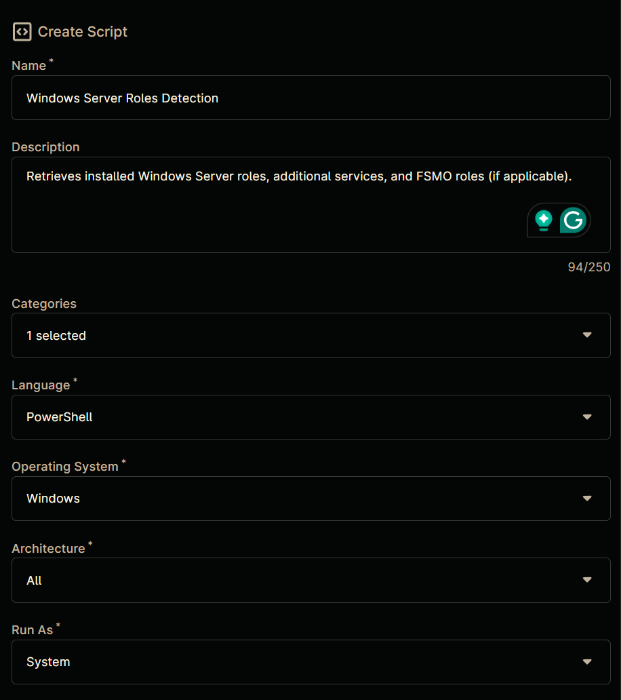

### Step 4

Paste the following powershell script in the scripting windows:

```powershell
#Requires -Version 4.0

<#
.SYNOPSIS
    Retrieves installed Windows Server roles, additional services, and FSMO roles (if applicable).

.DESCRIPTION
    This script detects:
    - Windows Server roles using Get-WindowsFeature
    - Additional services through service/registry detection (SQL Server, Exchange Server, MySQL, Veeam, SharePoint)
    - FSMO roles if the server is an Active Directory Domain Controller
    
    Detection methods vary:
    - Windows roles: Built-in PowerShell cmdlets
    - Additional services: Service existence and registry entries
    - FSMO roles: Active Directory queries (only on Domain Controllers)

.PARAMETER CustomField
    Specifies a custom field name to store results using Ninja-Property-Set.
    Accepts value from $env:customfield if present.

.EXAMPLE
    Get-ServerRolesNinja
    ## EXAMPLE OUTPUT ##
    Active Directory Domain Services
    DNS Server
    File and Storage Services
    Schema Master
    PDC Emulator

.EXAMPLE
    -CustomField 'cpvalRolesDetected'
    Saves output to NinjaRMM custom field 'cpvalRolesDetected'

.OUTPUTS
    String array of installed components. FSMO roles appear only on Domain Controllers.

.NOTES
    Minimum OS Supported: Windows Server 2012
    Admin Privileges: Required for Windows Feature detection
#>

[CmdletBinding()]
param (
    [string]
    $CustomField
)

begin {
    # Prefer environment variable for custom field if available
    if (-not [string]::IsNullOrEmpty($env:customfield)) {
        $CustomField = $env:customfield
    }
} process {
    $InstalledFeatures = @()

    # Service-based detection for SQL Server
    $SQLServices = Get-Service | Where-Object { $_.DisplayName -match 'SQL Server' }

    # Exchange Server detection via critical service
    $ExchangeServices = Get-Service -Name MSExchangeServiceHost -ErrorAction SilentlyContinue

    # MySQL detection through registry uninstall entries
    $MySQLServer = Get-ChildItem -Path HKLM:\SOFTWARE\Microsoft\Windows\CurrentVersion\Uninstall, 
    HKLM:\SOFTWARE\Wow6432Node\Microsoft\Windows\CurrentVersion\Uninstall -ErrorAction SilentlyContinue |
        Get-ItemProperty | Where-Object { $_.DisplayName -match 'mysql server' }

    # Veeam detection via registry
    $VeeamBDR = Get-ChildItem -Path HKLM:\SOFTWARE\Microsoft\Windows\CurrentVersion\Uninstall,
    HKLM:\SOFTWARE\Wow6432Node\Microsoft\Windows\CurrentVersion\Uninstall -ErrorAction SilentlyContinue |
        Get-ItemProperty | Where-Object { $_.DisplayName -eq 'Veeam Backup & Replication' }

    # SharePoint detection via PowerShell snapin
    try {
        Add-PSSnapin Microsoft.SharePoint.PowerShell -ErrorAction Stop
        $SharePointServer = [bool](Get-Command Get-SPFarm -ErrorAction SilentlyContinue)
    } catch {
        $SharePointServer = $false
    }

    # Get core Windows Server roles
    $InstalledFeatures = (Get-WindowsFeature -ErrorAction SilentlyContinue |
            Where-Object { $_.Installed -and $_.FeatureType -eq 'Role' }).DisplayName

    # Add supplemental detections
    if ($SQLServices) { $InstalledFeatures += 'MSSQL Server' }
    if ($ExchangeServices) { $InstalledFeatures += 'Exchange Server' }
    if ($MySQLServer) { $InstalledFeatures += 'MySQL Server' }
    if ($VeeamBDR) { $InstalledFeatures += 'Veeam BDR' }
    if ($SharePointServer) { $InstalledFeatures += 'SharePoint Server' }

    # FSMO Role Detection (only if AD DS role is present)
    if ($InstalledFeatures -contains 'Active Directory Domain Services') {
        try {
            Import-Module ActiveDirectory -ErrorAction Stop
            $currentDC = Get-ADDomainController -Identity $env:COMPUTERNAME -ErrorAction Stop
            $currentServerFQDN = $currentDC.HostName

            $forest = Get-ADForest
            $domain = Get-ADDomain

            # Map FSMO roles to their current holders
            $fsmoRoles = @{
                'Schema Master' = $forest.SchemaMaster
                'Domain Naming Master' = $forest.DomainNamingMaster
                'PDC Emulator' = $domain.PDCEmulator
                'RID Master' = $domain.RIDMaster
                'Infrastructure Master' = $domain.InfrastructureMaster
            }

            # Identify roles hosted on this server
            $InstalledFeatures += foreach ($role in $fsmoRoles.Keys) {
                if ($fsmoRoles[$role] -match "^$currentServerFQDN$") { $role }
            }
        } catch {
            Write-Output 'Active Directory module not available - skipping FSMO checks'
        }
    }

    # NinjaRMM Custom Field
    if ($CustomField) {
        Ninja-Property-Set -Name $CustomField -Value ($InstalledFeatures -join "`n")
    }
} end {
    return $InstalledFeatures
}
```

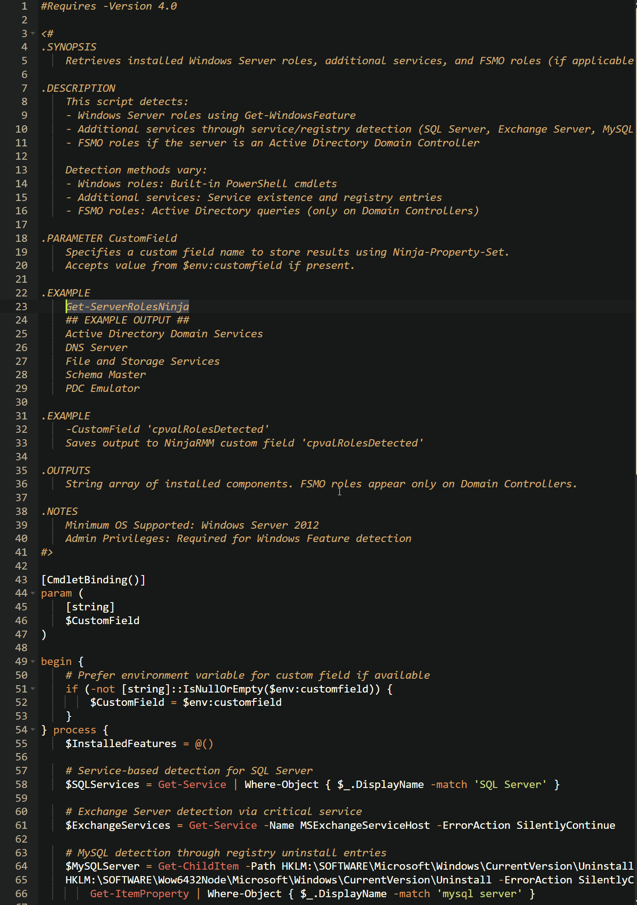

## Script Variables

Click the `Add` button next to `Script Variables`.  
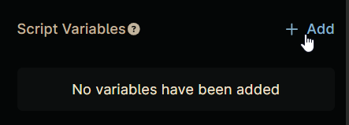

Select the `String/Text` option.  
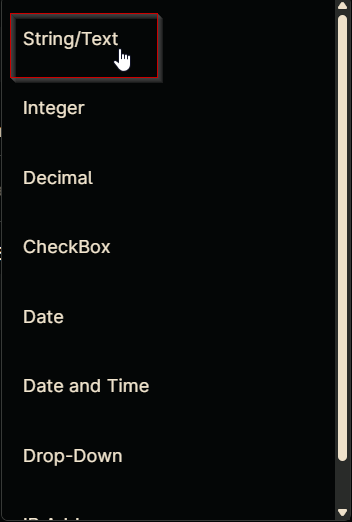

The `Add String/Text Variable` window will open.  
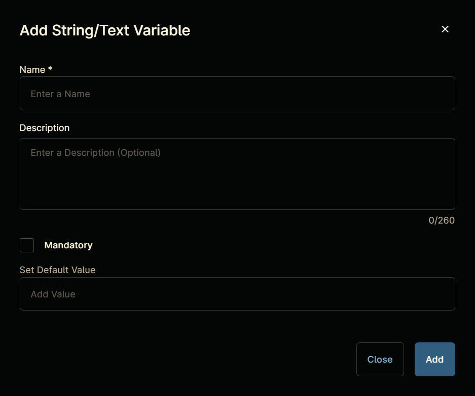

In the box, fill in the following details and select `Add` to create the script variable.  

**Name:** `Custom Field`  
**Description:** `Specifies the custom field where the detected roles will be stored.`  
**Mandatory:** `Enable`  
**Set Default Value:** `cpvalRolesDetected`  

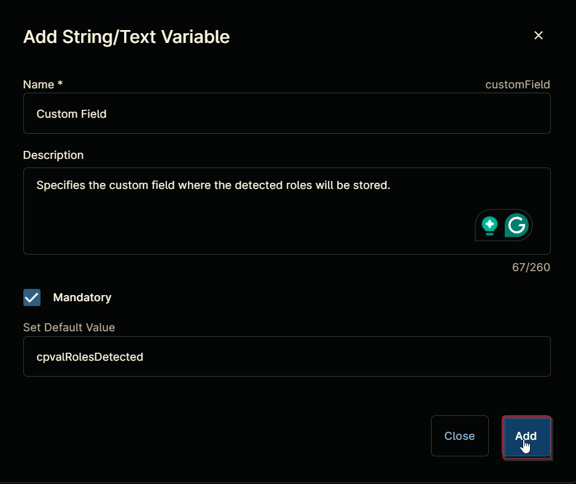

## Saving the Automation

Click the Save button in the top-right corner of the screen to save your automation.  


You will be prompted to enter your MFA code. Provide the code and press the Continue button to finalize the process.  


## Completed Automation

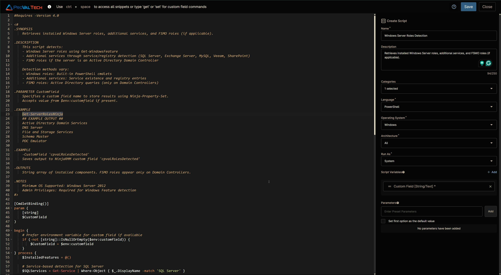

## Output

- Activity Details  
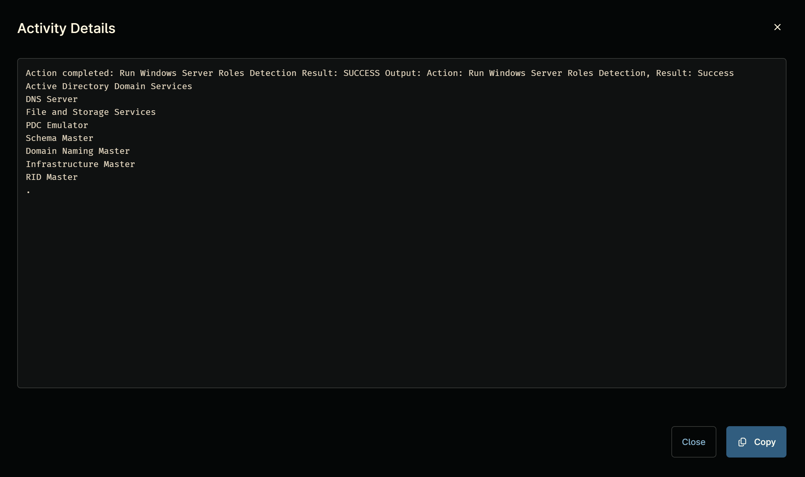