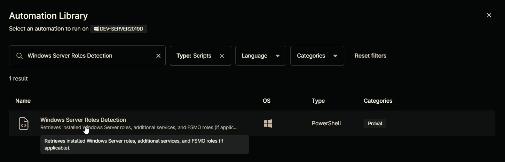
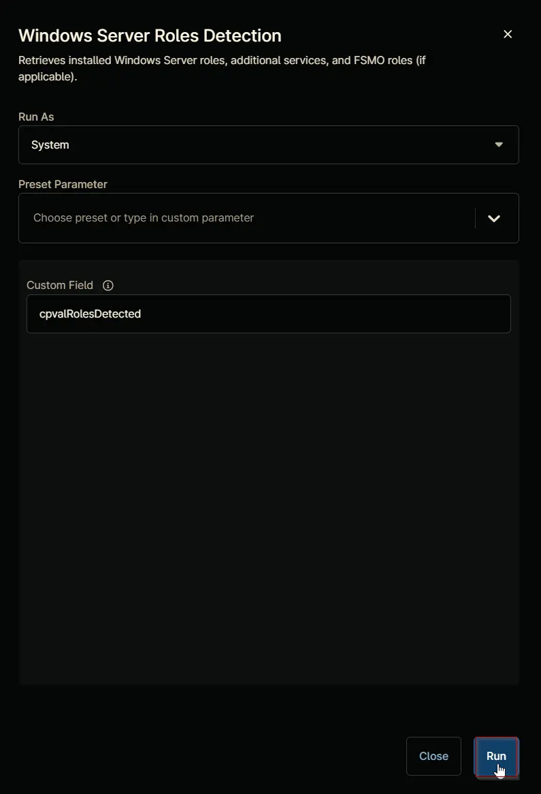

## Overview

Retrieves installed Windows Server roles, additional services, and FSMO roles (if applicable).

## Sample Run

`Play Button` > `Run Automation` > `Script`  

Search and select `Windows Server Roles Detection`  

- **Run As:** `System`  
- **Preset Parameter:** `Leave it untouched`  
- **Custom Field:** `cpvalRolesDetected` 

**Run Automation:** `Yes`  

## Dependencies
- [Solution - Server Roles Detection and Grouping for NinjaOne](/docs/56ed4b40-11ce-4f8d-b1ca-c897d2c496e6)  
- [Custom Field - cPVAL Roles Detected](/docs/e9ec73dd-98b1-4436-a027-4ee8906f7cba)

## Automation Setup/Import

[Automation Configuration](https://github.com/ProVal-Tech/ninjarmm/blob/main/scripts/windows-server-roles-detection.ps1)

## Output

- Activity Details
- Custom field

## Changelog

### 2026-05-12

- Updated the document with configuration steps

### 2025-10-31

- Updated the script to detect SMB1 role

### 2025-03-28

- Initial version of the document
