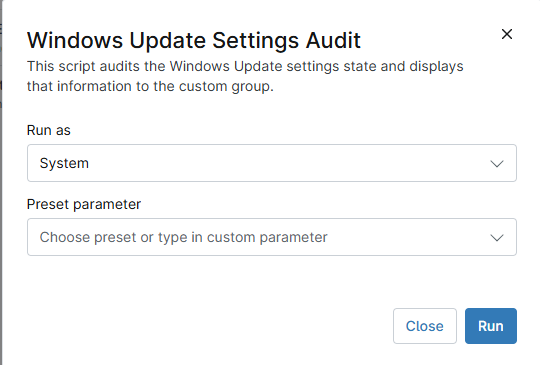

## Overview

This script audits the Windows Update settings state and displays that information to the custom group.

## Sample Run

`Play Button` > `Run Automation` > `Script`  

Select the **Button Action** and **Update Notifications Level** options as required.

## Dependencies

- [Solution - Windows Update UI Enable-Disable](/docs/a6da0735-ac80-40f8-8ad3-375ffa8d0e93)

## Automation Setup/Import

[Automation Configuration](https://github.com/ProVal-Tech/ninjarmm/blob/main/scripts/windows-update-settings-audit.ps1)

## Output

- Activity Details  
- Custom Field

## Changelog

### 2026-04-13

- Audit version created

### 2026-04-08

- Initial version of the document