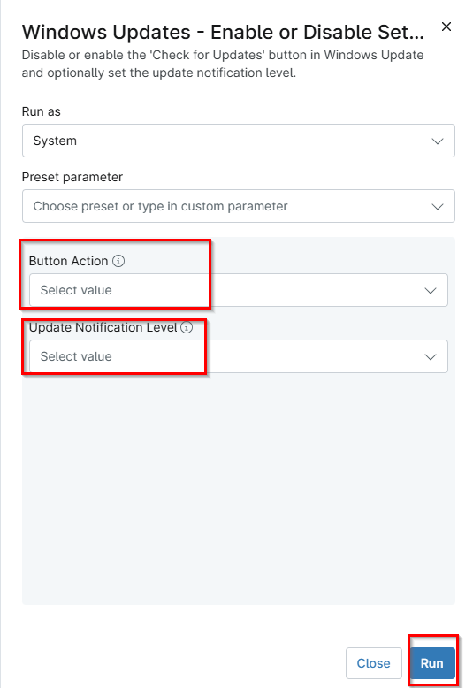

## Overview
Manages Windows Update user interface access and notification behavior using local policy settings.
This script controls two Windows Update behaviors by configuring supported registry policy keys under `HKLM:\Software\Policies\Microsoft\Windows\WindowsUpdate`.

## Sample Run

`Play Button` > `Run Automation` > `Script`  

Select the Button Action and Update Notifications options as required.

## Dependencies

## Parameters

| Name | Example | Accepted Values | Required | Default | Type | Description |
| ---- | ------- | --------------- | -------- | ------- | ---- | ----------- |
| Button Action | Enable | Enable, Disable | False |  | DropDown | Specify whether the 'Check for Updates' button should be accessible to all users of this machine. |
| Update Notification Level | The default Windows Update notification level | The default Windows Update notification level, Disable all notifications including restart prompt, Disable all notifications excluding restart prompt | False |  | DropDown | Specify whether to show or hide all update notifications, including restart warnings. |

## Automation Setup/Import

[Automation Configuration](https://github.com/ProVal-Tech/ninjarmm/blob/main/scripts/windows-update-enable-disable.ps1)

## Output

- Activity Details  
- Custom Field

## Changelog

- Initial version of the document