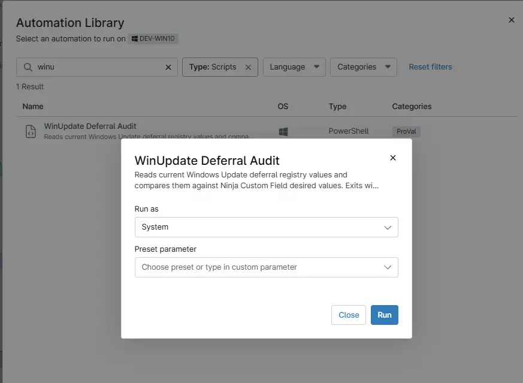

## Overview

Reads current Windows Update deferral registry values and compares them against Ninja Custom Field desired values. Exits with 1 if drift is detected.

## Sample Run

`Play Button` > `Run Automation` > `Script`  

## Dependencies

- [Solution - Device Standards](/docs/a0c383d4-699a-4bb8-af7f-c2a007747182)
- [Solution: Update Windows Deferral Settings](/docs/56e6b247-f80a-4bd8-b2e2-8cf44f76b7e1)

## Automation Setup/Import

[Automation Configuration](https://github.com/ProVal-Tech/ninjarmm/blob/main/scripts/winupdate-deferral-Audit.ps1)

## Output

- Activity Details

## Changelog

### 2026-03-06

- Initial version of the document
