## Overview

NinjaOne has no equivalent of the ConnectWise Automate dataview, a single view that lists the same audit data for every device of a client, or of the whole tenant, at once. That makes reviewing audit data across devices difficult as soon as the data spans more than one line per device.

For single-line data, custom fields come close. When a device has exactly one value to report, such as a status, a version or a date, that value can be stored in a custom field and reviewed across devices through a device group or a custom field report. This only works while each device contributes a single row:

- **One value per field:** a group or report shows one value per device for each custom field. Presenting several entries per device would need a separate custom field for every entry, and the number of entries differs from device to device.
- **Multi-entry data does not fit:** many audits return a list per device rather than a single value. A device can hold several user profiles, and an IIS Crypto audit returns dozens of protocol, cipher and hash settings per server.

ProVal audit solutions such as BitLocker, TPM, and User Profiles therefore store their results as an HTML table in a device-level WYSIWYG custom field, with one row per entry. For example, the User Profile audit writes one row for every profile on the device. This keeps the full detail, but a WYSIWYG field belongs to a single device: it can only be opened on each device in turn, and its data cannot be viewed together at the organization or global level.

This automation closes that gap. It reads one WYSIWYG custom field from every device through the NinjaOne Public API, merges the table rows from all devices into a single table, adds device details such as the organization, location and last contact to each row, and publishes the result:

- as a **report per organization**, a **global report** covering the whole tenant, or both;
- as **NinjaOne Knowledge Base articles**, **local CSV files**, or both.

The script is not tied to any one audit. Any solution that writes a table to a WYSIWYG field can be reported on by scheduling this automation again with different script variables. No new report script is needed.

The script authenticates with the OAuth 2.0 client credentials grant. The credential is read at runtime from two secure custom fields, [cPVAL Ninja API Client ID](/docs/32142af2-d352-4d0d-9ec3-9dae0a5fef88) and [cPVAL Ninja API Client Secret](/docs/58b01634-4e1a-4793-aafd-18526ea8c80e), so it never appears in script variables or run history. Because every run covers the whole tenant, it is scheduled against **one** device, not deployed across the fleet.

:::note  
**NinjaOne Documentation is required for Knowledge Base articles.** The Knowledge Base belongs to the NinjaOne Documentation app, which is a paid add-on and is not enabled on every tenant. To use this automation to its full potential, which means publishing organization and global Knowledge Base articles that technicians can open from the organization in NinjaOne, the Documentation app must be subscribed to and enabled.

Without it, set **Report Output** to **Local CSV Files**. Every other feature keeps working, and the reports are saved as CSV files on the device that runs the script instead of as articles.

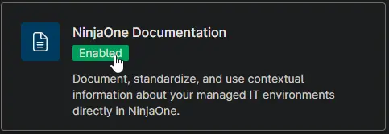

**References:**

- [NinjaOne Documentation: Knowledge Base](https://ninjarmm.zendesk.com/hc/en-us/articles/6921324974861-NinjaOne-Documentation-Knowledge-Base-Feature)

:::

## How It Works

1. **Authenticate:** The script reads the Client ID and Client Secret from the two secure custom fields and exchanges them for an access token.
2. **Read:** It reads the organizations, locations and devices of the tenant, then the chosen WYSIWYG custom field for every device that holds a value. The first HTML table in each value is read, and its first row of `th` cells is used as the header.
3. **Shape:** It keeps only the rows that match the **Filter**, splits them by **Device Category** when requested, adds the chosen device columns, leaves out excluded columns, and orders the rows with **Group By** and **Sort By**.
4. **Publish:** It writes the organization and global reports to the Knowledge Base, to CSV files, or both, as chosen in **Report Output**.
   - An existing article with the same name is updated in place rather than duplicated.
   - Reports that are no longer needed are removed.

The script makes no change to the device it runs on, apart from the CSV files it writes under `C:\ProgramData\_Automation\Report`.

## When to Use This Script

Use this automation whenever a solution stores its results as an HTML table in a device-level WYSIWYG custom field and the results need to be reviewed across devices rather than one device at a time. Typical uses:

- **Client-facing evidence:** a per-organization article, such as BitLocker status or local administrator accounts, that technicians and account managers can open from the organization in NinjaOne.
- **Internal rollups:** one tenant-wide article or CSV file covering every organization, for compliance reviews and project scoping.
- **Exception reports:** a filtered report that lists only the rows needing attention, such as IIS Crypto settings that are not Windows defaults.
- **Point-in-time history:** time-stamped reports that are kept run after run, for audit trails.
- **Tenants without NinjaOne Documentation:** the same reports as CSV files.

:::note  
The custom field must hold an HTML table with a header row of `th` cells, which is what ProVal audit solutions write. A device whose field holds text without such a table is skipped and reported as a warning in the activity output. Devices whose field is empty are ignored.  
:::

## Implementation

### Step 1: Check NinjaOne Documentation

Decide where the reports will go before setting anything up.

- **Documentation app enabled:** reports can be published as Knowledge Base articles, CSV files, or both.
- **Documentation app not enabled or not subscribed:** use **Local CSV Files** only. Steps 2 to 8 still apply; only the Knowledge Base variables can be left blank.

### Step 2: Create the API Application

The automation authenticates as a registered NinjaOne API application. Create it once under **Administration → Apps → API → Client App IDs → Add**.

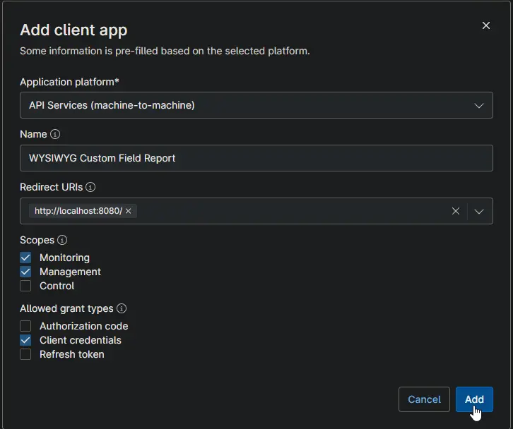

| Setting | Value | Notes |
| ------- | ----- | ----- |
| Application platform | `API Services (machine-to-machine)` | Required. Pre-fills the dialog for unattended access with no user sign-in. |
| Name | `WYSIWYG Custom Field Report` | Any name works. Naming it after the automation makes the credential easy to identify and revoke later. |
| Redirect URIs | `http://localhost:8080/` | Not used by the client credentials flow, but the field must contain a value. |
| Scopes | `Monitoring`, `Management` | **Monitoring** reads organizations, devices and custom fields. **Management** writes the Knowledge Base articles. The script requests both scopes, so grant both even when only CSV files are produced. Leave **Control** unchecked. |
| Allowed grant types | `Client credentials` | Leave **Authorization code** and **Refresh token** unchecked. |

On **Add**, NinjaOne issues a Client ID and a Client Secret. Keep the dialog open until both are copied in Step 4.

:::note  
**The Client Secret is shown only once.** If the dialog is closed before it is copied, the secret cannot be retrieved. A new one must be generated, which immediately invalidates the old one and every automation that uses it.  
:::

:::note  
If an API application was already created for another ProVal reporting automation, such as [Application Installation Report - Organization and Global KB](/docs/d128edba-4851-4810-8b99-c94e0ac0780a), it can be reused as long as it has the **Monitoring** and **Management** scopes. Skip to Step 5 in that case.  
:::

### Step 3: Create the Credential Custom Fields

Skip this step if the two fields already exist in the tenant. Otherwise, create them under **Administration → Devices → Global Custom Fields** using the details below, or import them from the linked configuration files.

| Label | Field Name | Definition Scope | Type | Required | Editable | Custom Field Tab | Configuration |
| ----- | ---------- | ---------------- | ---- | -------- | -------- | ---------------- | ------------- |
| `cPVAL Ninja API Client ID` | `cpvalNinjaApiClientId` | `System` | `Secure` | `Yes` | `Yes` | `Client_Credentials_API` | [cpval-ninja-api-client-id.toml](https://github.com/ProVal-Tech/ninjarmm/blob/main/custom-fields/cpval-ninja-api-client-id.toml) |
| `cPVAL Ninja API Client Secret` | `cpvalNinjaApiClientSecret` | `System` | `Secure` | `Yes` | `Yes` | `Client_Credentials_API` | [cpval-ninja-api-client-secret.toml](https://github.com/ProVal-Tech/ninjarmm/blob/main/custom-fields/cpval-ninja-api-client-secret.toml) |

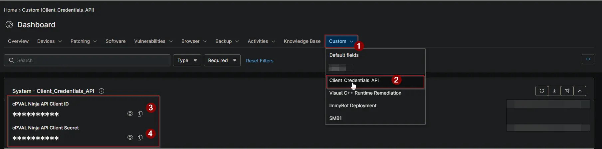

:::note  
Both fields must be readable by automations, because the script reads them at runtime on the device it runs on. Full details are in the [cPVAL Ninja API Client ID](/docs/32142af2-d352-4d0d-9ec3-9dae0a5fef88) and [cPVAL Ninja API Client Secret](/docs/58b01634-4e1a-4793-aafd-18526ea8c80e) documents.  
:::

### Step 4: Populate the Credentials

Copy the values issued in Step 2 into the fields:

- Client ID → `cPVAL Ninja API Client ID`
- Client Secret → `cPVAL Ninja API Client Secret`

### Step 5: Allow API Access to the WYSIWYG Fields

The script reads the audit results through the API, so each WYSIWYG field to be reported on must allow API access. Open the field, for example `cPVAL IIS Crypto Info`, and set its **API** permission to **Read Only** or **Read/Write** if it's not already set.

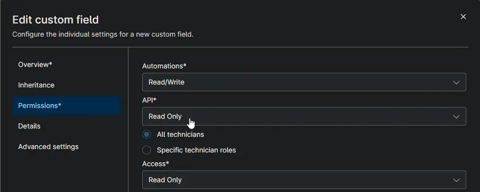

:::note  
A field without API access returns no values. The report then shows no rows even though the field is populated on the devices.  
:::

### Step 6: Create the Automation

Create the automation from the configuration linked in [Automation Setup/Import](#automation-setupimport). Set **Run as** to `System`. The automation provides the 20 script variables described in [Parameters](#parameters).

:::note  
NinjaOne allows at most 20 script variables per automation, and this automation uses all 20. That is why the scope is a single **Report Scope** drop-down and why the sort direction is written into **Sort By**, for example `LastContact desc`.  
:::

### Step 7: Choose the Execution Device

Pick **one** Windows device to run every report. A server or an always-on primary machine works best. The device needs to:

- be online when the schedule runs;
- reach the NinjaOne instance over HTTPS;
- be a secured, admin-only machine if CSV files are produced. The CSV files are saved on its local disk and hold data from every organization in the scope.

:::note  
**Do not deploy this automation across the fleet.** Every run reports on the whole tenant, or on the named organizations, regardless of the device it runs on. Running it on many devices repeats the same work, produces duplicate updates and exhausts the API rate limit.  
:::

### Step 8: Schedule the Reports

Create one scheduled task per report against the device chosen in Step 7, each with its own script variables. For example, one task for BitLocker, one for IIS Crypto and one for User Profiles. Schedule each report to run after the audit solution that populates its custom field, so that the report reflects fresh data.

## Recommendations

**Scheduling and placement:**

- **Run on one device:** a server or primary machine, as described in Step 7, with **Run as** set to `System`.
- **Run after the audit:** for example, the audit daily at 02:00 and the report at 06:00. Daily or weekly suits most audits.
- **Keep CSV reports on a secured device:** standard users can read files under `C:\ProgramData` by default.

**Scope and naming:**

- **Start small:** test with **Selected Organizations** and one organization, then switch to **All Organizations and Global** once the output looks right.
- **Choose names for the purpose:** keep article and file names free of the `CurrentTime` token for reports that should stay current. Add the token only when a history is wanted, because time-stamped reports are never removed automatically.
- **Use device categories when tables differ:** if the field's table differs between operating systems or device types, use **Device Category** to give each its own report instead of one table with many blank cells.

**Content and size:**

- **Remove sensitive columns:** use the Exclude Columns variables to drop columns such as SIDs, paths or recovery information before they reach a global article or a CSV file.
- **Use Multipart on large tenants:** enable it when a report could exceed the Knowledge Base article size limit, so no rows are cut off.

## Sample Run

The scenarios below show the same automation producing different reports for three audit fields:

- `cpvalBitlockerInfo`, written by the BitLocker audit;
- `cpvalIisCryptoInfo`, written by the IIS Crypto audit;
- `cpvalUserProfileDetails`, written by the User Profile audit.

The sample tenant has two organizations, **Internal Infrastructure** and **ProVal - Dev**. Script variables not listed in a scenario are left blank or at their default value.

### Scenario 1: BitLocker Details for Every Organization and the Whole Tenant

**Goal:** Keep a BitLocker article current in every organization that has BitLocker results, plus one tenant-wide article. Every row should open with the device details.

#### Input

| Script Variable | Value |
| --------------- | ----- |
| Report Output | `Knowledge Base Articles` |
| Custom Field Name | `cpvalBitlockerInfo` |
| Report Scope | `All Organizations and Global` |
| Organization KB Article Name | `BitLocker Details` |
| Organization KB Folder Name | `BitLocker` |
| Organization Additional Columns | `Location, Device, Domain, LastContact, LastUser, DeviceType, OS` |
| Global KB Article Name | `BitLocker Details` |
| Global KB Folder Name | `BitLocker` |
| Global Additional Columns | `Organization, Location, Device, Domain, LastContact, LastUser, DeviceType, OS` |
| Multipart | `Checked` |
| Device Category | `All` |

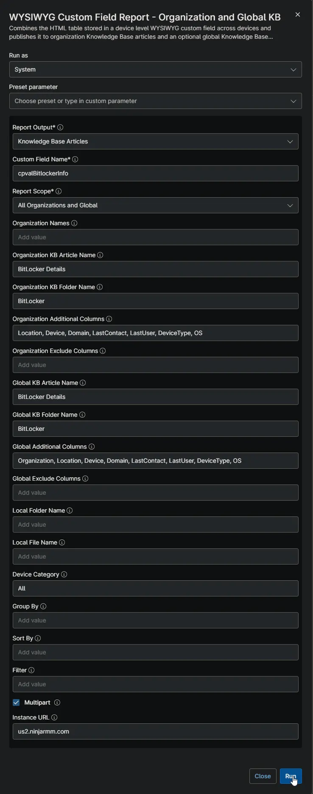

#### Output

- **Organization articles:** an article named `BitLocker Details` in the **BitLocker** folder of the Knowledge Base of every organization that has BitLocker results. The folder is created on the first run.
  - Each article starts with a caption line showing the organization, the custom field, the generation time and the device and row counts.
  - The table follows, with the seven device columns first and then the BitLocker columns from the custom field.
- **Global article:** an article named `BitLocker Details` in the **BitLocker** folder of the global Knowledge Base, holding the rows of every device in the tenant. Rows are ordered by organization, then device.
- **Later runs:** the same articles are updated in place.
  - An organization that no longer has BitLocker results loses its article.
  - An article that outgrows the size limit is split into `BitLocker Details - Part 1`, `BitLocker Details - Part 2`, and so on.

**Organization article:**

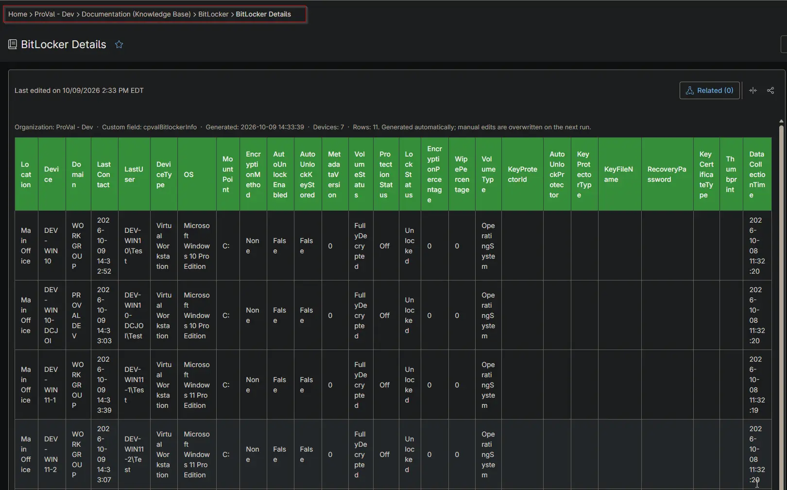

**Global article:**

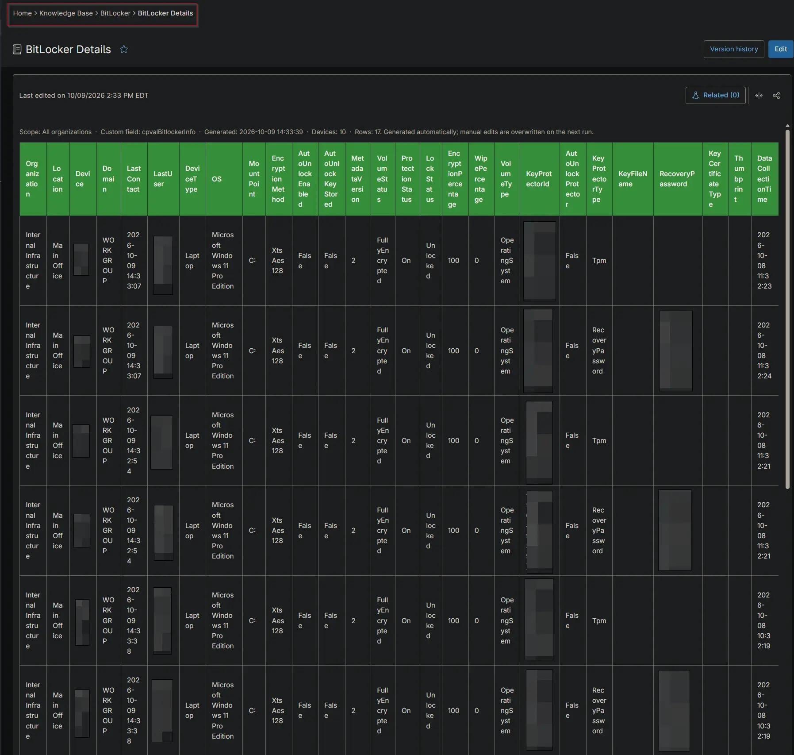

:::note  
Each organization article lives in that organization's own Knowledge Base, so the same name, `BitLocker Details`, can be used for all of them. Add the `OrgName` token, for example `BitLocker Details - OrgName`, only if the organization name should appear in the article title.  
:::

### Scenario 2: IIS Crypto Exceptions as Articles and CSV Files, Grouped and Sorted

**Goal:** Report only the IIS Crypto rows that need attention, meaning settings that are not Windows defaults plus every protocol setting. Publish them both as articles and as CSV files, with each organization's rows together and the devices that have been offline longest at the top.

#### Input

| Script Variable | Value |
| --------------- | ----- |
| Report Output | `Knowledge Base Articles and Local CSV Files` |
| Custom Field Name | `cpvalIisCryptoInfo` |
| Report Scope | `All Organizations and Global` |
| Organization KB Article Name | `IISCrypto Audit` |
| Organization KB Folder Name | `IISCrypto` |
| Organization Additional Columns | `Location, Device, Domain, LastContact, DaysSinceLastContact, DeviceType, OS` |
| Global KB Article Name | `IISCrypto Audit` |
| Global KB Folder Name | `IISCrypto` |
| Global Additional Columns | `Organization, Location, Device, Domain, LastContact, DaysSinceLastContact, DeviceType, OS` |
| Local Folder Name | `IISCrypto` |
| Local File Name | `IISCrypto Audit` |
| Device Category | `All` |
| Group By | `Organization` |
| Sort By | `DaysSinceLastContact desc` |
| Filter | `[Current Value] notcontains 'default' or [Setting Category] contains 'protocol'` |
| Multipart | `Checked` |

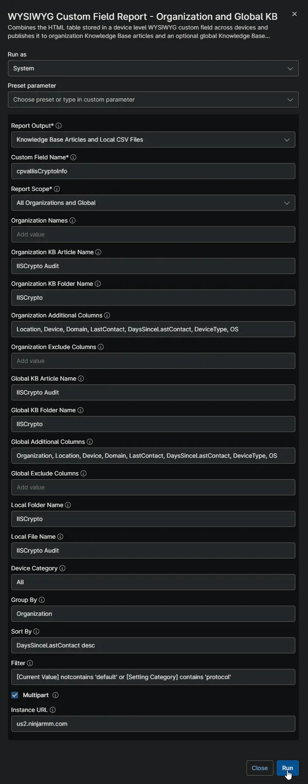

#### Output

The filter kept 198 of the 480 IIS Crypto rows across the 12 devices that hold the field. Those rows were published as:

| Report | Knowledge Base Article | CSV File | Devices | Rows |
| ------ | ---------------------- | -------- | ------- | ---- |
| Internal Infrastructure | `IISCrypto Audit` in the organization's **IISCrypto** folder | `C:\ProgramData\_Automation\Report\IISCrypto\Organization_Level_Reports\IISCrypto Audit_Internal Infrastructure.csv` | 3 | 51 |
| ProVal - Dev | `IISCrypto Audit` in the organization's **IISCrypto** folder | `C:\ProgramData\_Automation\Report\IISCrypto\Organization_Level_Reports\IISCrypto Audit_ProVal - Dev.csv` | 9 | 147 |
| Global | `IISCrypto Audit` in the global **IISCrypto** folder | `C:\ProgramData\_Automation\Report\IISCrypto\IISCrypto Audit.csv` | 12 | 198 |

- **Caption:** the caption of every article shows the filter, so readers know the article is an exception report.
- **Columns:** the device columns come first, followed by the IIS Crypto columns: Setting Category, Setting Name, Current Value and Data Collection Time.
- **Row order:** rows are grouped by organization. Within each organization, the devices with the most days since their last contact come first.
- **Size:** Multipart was enabled, but every article fitted the size limit, so each was written as a single article without a part suffix.

**Activity output of the run:**

```text
[INFO] Targeting NinjaOne instance https://us2.ninjarmm.com.
[INFO] Reading WYSIWYG custom field cpvalIisCryptoInfo; Report Scope: All Organizations and Global; Report Output: Knowledge Base Articles and Local CSV Files.
[INFO] Organization articles: IISCrypto Audit in folder IISCrypto.
[INFO] Global article: IISCrypto Audit in folder IISCrypto.
[INFO] Local CSV files: IISCrypto Audit in C:\ProgramData\_Automation\Report\IISCrypto.
[PASS] Authenticated against the NinjaOne Public API.
[PASS] Found WYSIWYG custom field cpvalIisCryptoInfo (cPVAL IIS Crypto Info).
[INFO] Processing all 2 organization(s); organizations without rows get no report.
[INFO] Reading devices of every organization.
[INFO] Retrieved 16 device record(s).
[INFO] 12 device(s) hold a table in cpvalIisCryptoInfo.
[INFO] The filter kept 198 of 480 row(s), on 12 of 12 device(s).
[INFO] Writing reports for device category: All.
[PASS] Wrote organization 1 CSV file C:\ProgramData\_Automation\Report\IISCrypto\Organization_Level_Reports\IISCrypto Audit_Internal Infrastructure.csv (51 rows).
[PASS] Updated organization 1 knowledge base article IISCrypto Audit (47471 characters).
[PASS] Wrote organization 2 CSV file C:\ProgramData\_Automation\Report\IISCrypto\Organization_Level_Reports\IISCrypto Audit_ProVal - Dev.csv (147 rows).
[PASS] Updated organization 2 knowledge base article IISCrypto Audit (136216 characters).
[PASS] Wrote global CSV file C:\ProgramData\_Automation\Report\IISCrypto\IISCrypto Audit.csv (198 rows).
[PASS] Created global knowledge base article IISCrypto Audit (198112 characters).

Scope          ArticleName     CsvFile                                                                                                            Devices Rows RowsDropped Parts Removed
-----          -----------     -------                                                                                                            ------- ---- ----------- ----- -------
organization 1 IISCrypto Audit C:\ProgramData\_Automation\Report\IISCrypto\Organization_Level_Reports\IISCrypto Audit_Internal Infrastructure.csv       3   51           0     1       0
organization 2 IISCrypto Audit C:\ProgramData\_Automation\Report\IISCrypto\Organization_Level_Reports\IISCrypto Audit_ProVal - Dev.csv                  9  147           0     1       0
global         IISCrypto Audit C:\ProgramData\_Automation\Report\IISCrypto\IISCrypto Audit.csv                                                         12  198           0     1       0

InstanceUrl      : https://us2.ninjarmm.com
ReportOutput     : Knowledge Base Articles and Local CSV Files
CustomFieldName  : cpvalIisCryptoInfo
DeviceCategory   : All
Filter           : [Current Value] notcontains 'default' or [Setting Category] contains 'protocol'
DevicesRead      : 16
DevicesWithTable : 12
DevicesSkipped   : 0
ArticlesWritten  : 3
CsvFilesWritten  : 3
LocalFolder      : C:\ProgramData\_Automation\Report\IISCrypto
ReportsSkipped   : 0
ReportsFailed    : 0
Multipart        : True
GeneratedTime    : 2026-10-09 14:26:37

Success: 3 knowledge base article(s) and 3 CSV file(s) written from cpvalIisCryptoInfo on 12 device(s).
```

**Organization article:**

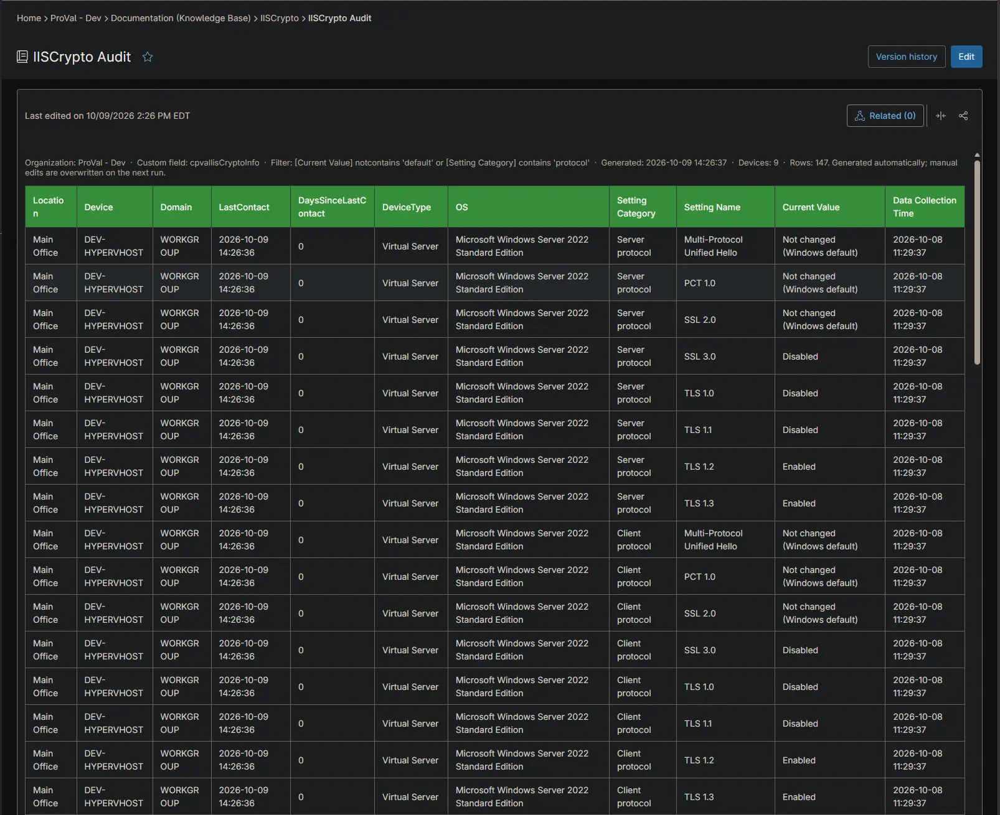

**Global article:**

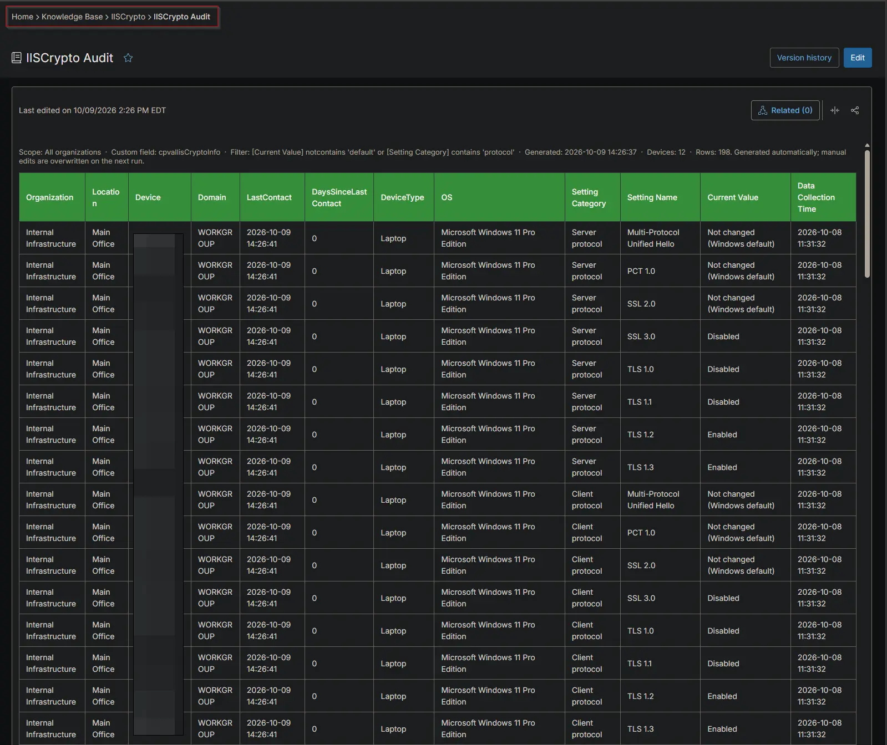

**CSV files on the execution device:**

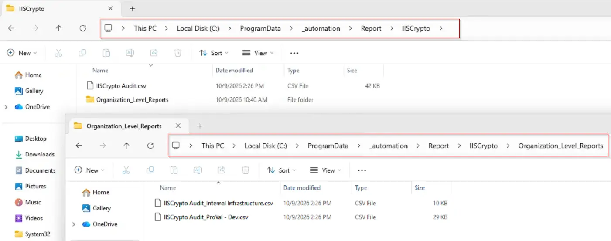

### Scenario 3: User Profiles as CSV Files Only (No NinjaOne Documentation)

**Goal:** A tenant without the NinjaOne Documentation app needs a user profile report per organization plus a tenant-wide one, with the largest profiles first and without the SID and path columns.

#### Input

| Script Variable | Value |
| --------------- | ----- |
| Report Output | `Local CSV Files` |
| Custom Field Name | `cpvalUserProfileDetails` |
| Report Scope | `All Organizations and Global` |
| Organization Additional Columns | `Location, Device, Domain, LastContact, DaysSinceLastContact, DeviceType, OS` |
| Organization Exclude Columns | `SID, Path` |
| Global Additional Columns | `Organization, Location, Device, Domain, LastContact, DaysSinceLastContact, DeviceType, OS` |
| Global Exclude Columns | `SID, Path` |
| Local Folder Name | `UserProfile` |
| Local File Name | `User Profile Audit` |
| Group By | `Organization` |
| Sort By | `ProfileSize desc` |

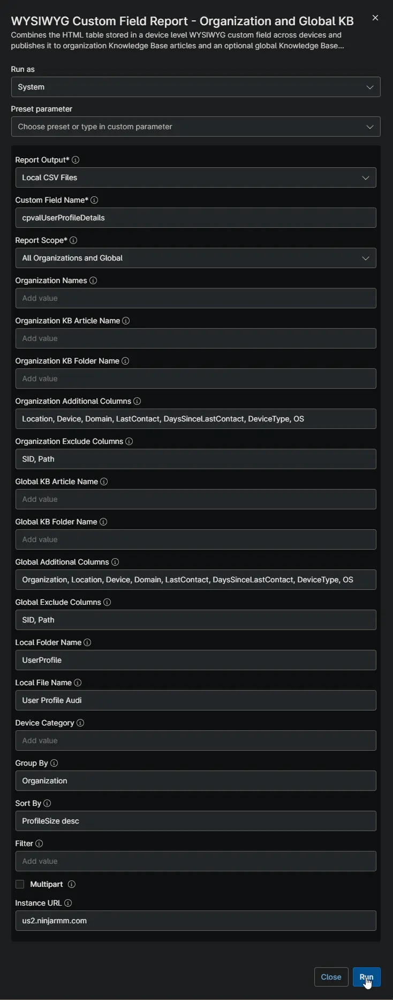

#### Output

No Knowledge Base request is made, so the KB variables are left blank. The files are saved on the execution device:

```text
C:\ProgramData\_Automation\Report\UserProfile\
├── User Profile Audit.csv
└── Organization_Level_Reports\
    ├── User Profile Audit_Internal Infrastructure.csv
    └── User Profile Audit_ProVal - Dev.csv
```

- **Format:** each file is UTF-8 with a header row and opens directly in Excel. Files are replaced on every run.
- **Columns:** the device columns come first, followed by Username, IsLocalUser, IsAdmin, LastLogon, ProfileSize and Enabled. SID and Path are left out.
- **Row order:** `ProfileSize` holds numbers, so it is sorted numerically. Within each organization, the largest profiles come first.
- **Empty organizations:** an organization with no user profile rows gets no file, and an earlier file of the same name is deleted.

**Report folder:**

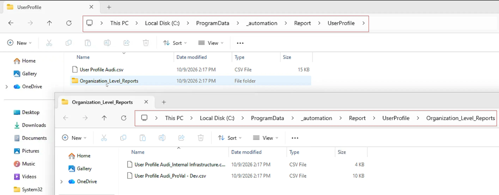

**Global CSV file opened in Excel:**

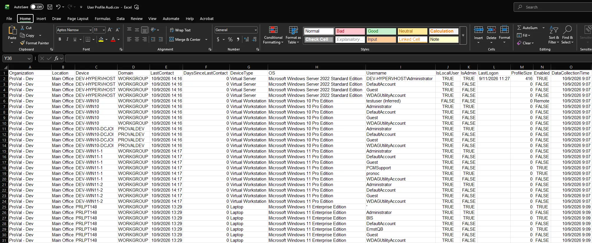

### Scenario 4: User Profile Article for a Single Client

**Goal:** Produce a user profile article for one client only, with the organization name in the title, ahead of a client review.

#### Input

| Script Variable | Value |
| --------------- | ----- |
| Report Output | `Knowledge Base Articles` |
| Custom Field Name | `cpvalUserProfileDetails` |
| Report Scope | `Selected Organizations` |
| Organization Names | `Internal Infrastructure` |
| Organization KB Article Name | `User Profile Audit - OrgName` |
| Organization KB Folder Name | `UserProfile` |
| Organization Additional Columns | `Location, Device, Domain, LastContact, DaysSinceLastContact, DeviceType, OS` |
| Sort By | `Device` |

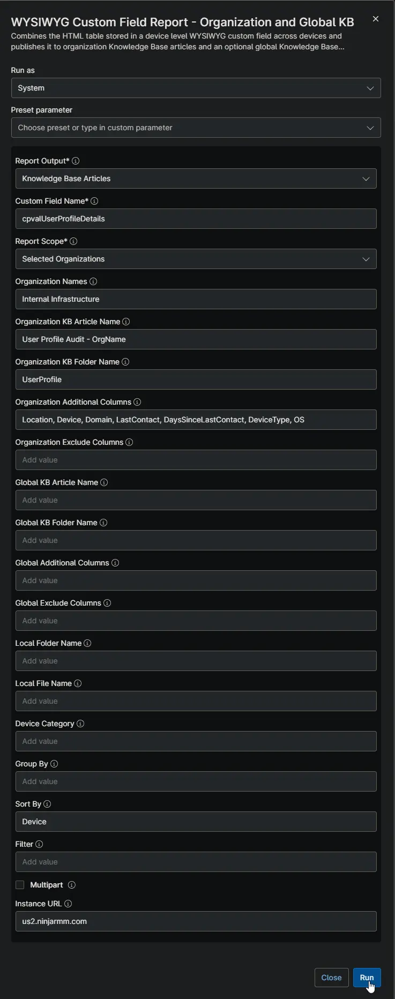

#### Output

- **Organization article:** an article named `User Profile Audit - Internal Infrastructure` in the **UserProfile** folder of the Internal Infrastructure Knowledge Base, with the rows ordered by device name.
- **Other organizations:** nothing is written to any other organization, and no global article is produced.
- **No rows:** a selected organization without rows still gets its article, stating that no device holds a table in the custom field.

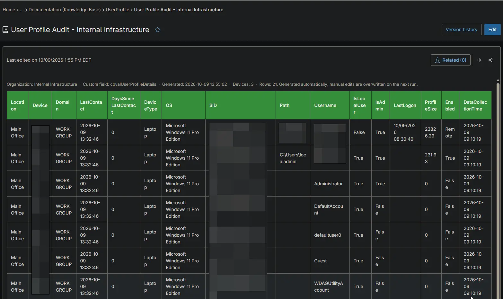

:::note  
Organization names must match NinjaOne exactly, ignoring case. Several organizations can be listed, separated by commas. The run stops before writing anything if a name matches no organization.  
:::

### Scenario 5: Separate IISCrypto Articles for Servers and Workstations

**Goal:** Servers and workstations are reviewed by different teams, so each should get its own tenant-wide IISCrypto article.

#### Input

| Script Variable | Value |
| --------------- | ----- |
| Report Output | `Knowledge Base Articles` |
| Custom Field Name | `cpvalIisCryptoInfo` |
| Report Scope | `Global` |
| Global KB Article Name | `IISCrypto Audit` |
| Global KB Folder Name | `IISCrypto` |
| Global Additional Columns | `Organization, Location, Device, Domain, LastContact, LastUser, DeviceType, OS` |
| Device Category | `Windows Server, Windows Workstation` |
| Multipart | `Checked` |

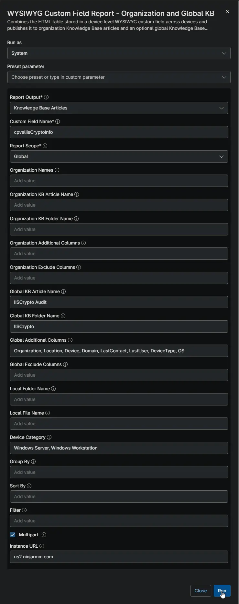

#### Output

Two articles are written to the **IISCrypto** folder of the global Knowledge Base. Each caption names its device category.

- **`IISCrypto Audit - Windows Server`:** the rows of Windows servers only.
- **`IISCrypto Audit - Windows Workstation`:** the rows of Windows workstations only.

**Windows Server article:**

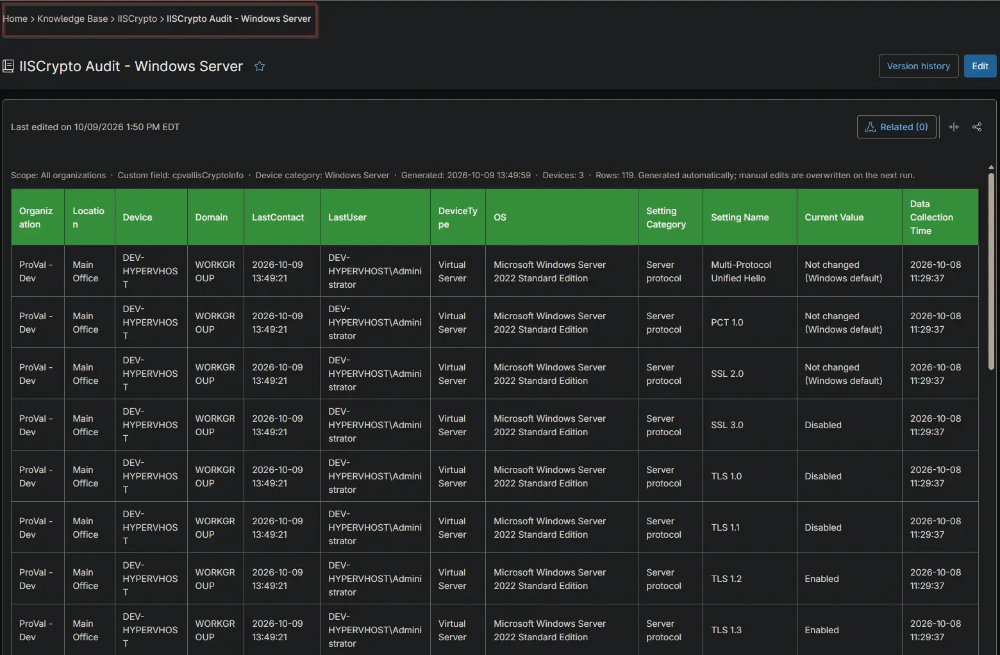

**Windows Workstation article:**

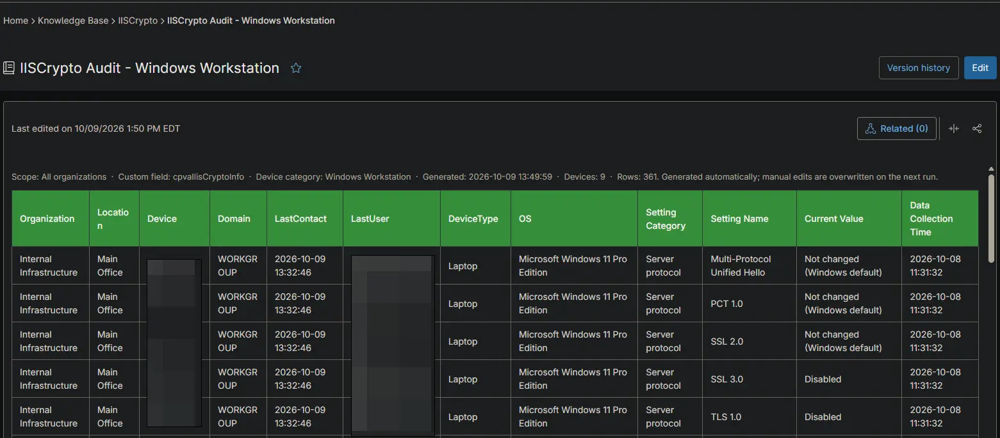

:::note  
An article that was written before the device categories were added, such as the plain `BitLocker Details` from Scenario 1, is not removed by this run. Delete it manually if it is no longer wanted.  
:::

### Scenario 6: Enabled Local Administrator Accounts

**Goal:** A security review needs one list of every enabled local account with administrator rights across the tenant, both as an article and as a file to attach to the review.

#### Input

| Script Variable | Value |
| --------------- | ----- |
| Report Output | `Knowledge Base Articles and Local CSV Files` |
| Custom Field Name | `cpvalUserProfileDetails` |
| Report Scope | `Global` |
| Global KB Article Name | `Local Administrator Accounts` |
| Global KB Folder Name | `UserProfile` |
| Global Additional Columns | `Organization, Location, Device, Domain, LastContact, DaysSinceLastContact, DeviceType, OS` |
| Global Exclude Columns | `SID, Path` |
| Local Folder Name | `UserProfile` |
| Local File Name | `Local Administrator Accounts` |
| Group By | `Organization` |
| Sort By | `Device` |
| Filter | `IsLocalUser equals True and IsAdmin equals True and Enabled equals True` |

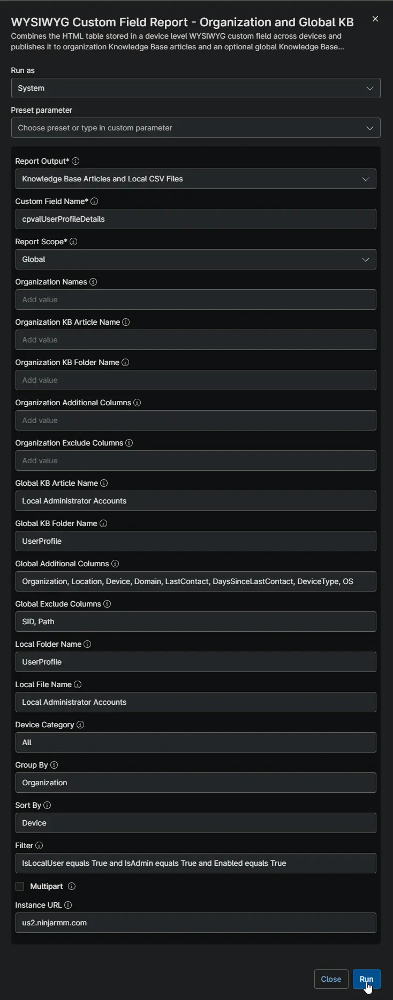

#### Output

- **Global article:** an article named `Local Administrator Accounts` in the **UserProfile** folder of the global Knowledge Base. It lists only the rows where all three conditions hold, with the filter shown in its caption.
- **CSV file:** the same table saved as `C:\ProgramData\_Automation\Report\UserProfile\Local Administrator Accounts.csv`.
- **Excluded devices:** a device without an enabled local administrator account is left out of both.

**Global article:**

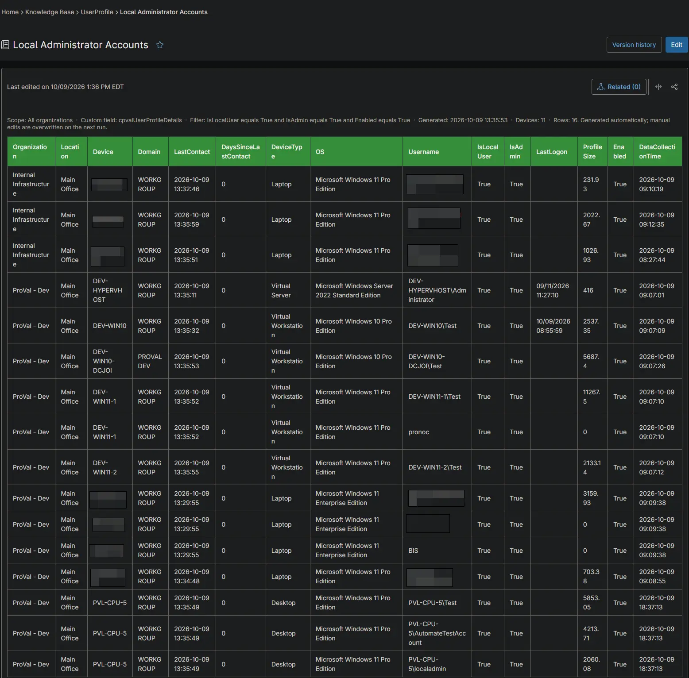

**CSV file:**

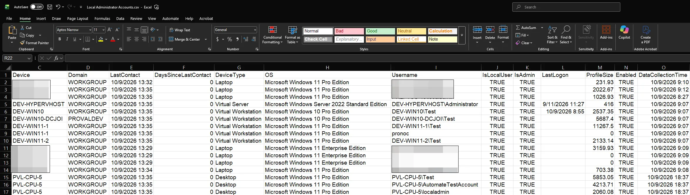

### Scenario 7: Point-in-Time IIS Crypto History

**Goal:** Keep a dated copy of the tenant-wide IIS Crypto results from every run, for an audit trail, instead of a single report that is overwritten.
#### Input

| Script Variable | Value |
| --------------- | ----- |
| Report Output | `Knowledge Base Articles and Local CSV Files` |
| Custom Field Name | `cpvalIisCryptoInfo` |
| Report Scope | `Global` |
| Global KB Article Name | `IISCrypto Audit - CurrentTime` |
| Global KB Folder Name | `IISCrypto\History` |
| Global Additional Columns | `Organization, Location, Device, Domain, LastContact, DaysSinceLastContact, DeviceType, OS` |
| Local Folder Name | `IISCrypto History` |
| Local File Name | `IISCrypto Audit CurrentTime` |
| Multipart | `Checked` |

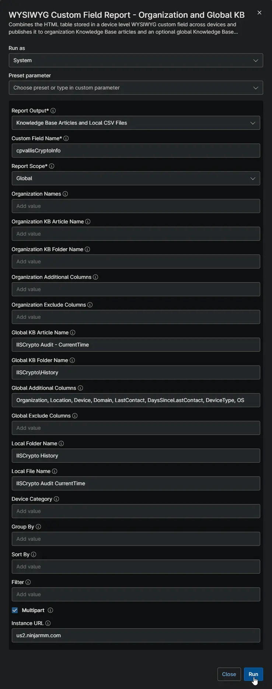

#### Output

- **Articles:** every run adds a new article to the **History** subfolder of the global **IISCrypto** folder, named with the generation time, for example `IISCrypto Audit - 2026-10-09 10:40:48`.
- **CSV files:** every run adds a new file such as `C:\ProgramData\_Automation\Report\IISCrypto History\IISCrypto Audit 2026-10-09 104048.csv`. The colons of the time are removed, because Windows file names cannot contain them.
- **Retention:** earlier articles and files are kept.

**Knowledge Base history folder:**

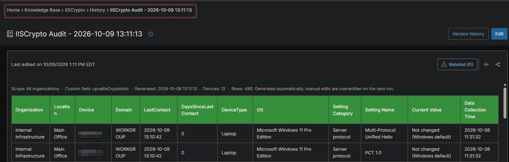

**CSV history folder:**

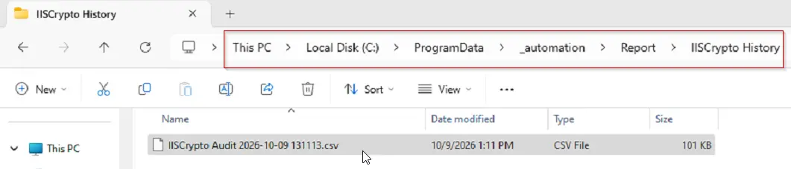

:::note  
Time-stamped articles and files are never removed by the automation, so they accumulate with every run. Remove old copies manually, or schedule the history report less often than the kept-current report.  
:::

## Parameters

| Name | Calculated Name | Example | Accepted Values | Required | Default | Type | Description |
| ---- | --------------- | ------- | --------------- | -------- | ------- | ---- | ----------- |
| Report Output | reportOutput | `Local CSV Files` | `Knowledge Base Articles`, `Local CSV Files`, `Knowledge Base Articles and Local CSV Files` | **True** | `Knowledge Base Articles` | Drop-Down | Where the reports are written. See [Report Output Options](#report-output-options). |
| Custom Field Name | customFieldName | `cpvalIisCryptoInfo` | Field name of a device-level WYSIWYG custom field | **True** | -- | string/text | The custom field to report on. Use the field name, not the label. |
| Report Scope | reportScope | `All Organizations and Global` | `Global`, `Selected Organizations`, `Selected Organizations and Global`, `All Organizations and Global` | **True** | `Global` | Drop-Down | Which reports are written. See [Report Scope Options](#report-scope-options). |
| Organization Names | organizationNames | `Internal Infrastructure, ProVal - Dev` | Comma-separated organization names | False | -- | string/text | Organizations to report on. Required with `Selected Organizations` and `Selected Organizations and Global`; ignored with `All Organizations and Global`. Matching ignores case. |
| Organization KB Article Name | organizationKbArticleName | `User Profile Audit - OrgName` | -- | False | -- | string/text | Name of the organization article. Required when the scope includes organizations and the output includes Knowledge Base Articles. Supports the `OrgName` and `CurrentTime` tokens. |
| Organization KB Folder Name | organizationKbFolderName | `UserProfile` | -- | False | -- | string/text | Organization Knowledge Base folder for the article, created if absent. Separate nested folders with a vertical bar, for example `Reports\|Audit`. Required under the same conditions as the article name. |
| Organization Additional Columns | organizationAdditionalColumns | `Location, Device, OS` | See [Additional Columns](#additional-columns), except `Organization` | False | -- | string/text | Device columns placed before the custom field columns in the organization reports, in the order supplied. |
| Organization Exclude Columns | organizationExcludeColumns | `SID, Path` | Any column name | False | -- | string/text | Columns to leave out of the organization reports. |
| Global KB Article Name | globalKbArticleName | `IISCrypto Audit` | -- | False | -- | string/text | Name of the global article. Required when the scope includes Global and the output includes Knowledge Base Articles. Supports the `CurrentTime` token. |
| Global KB Folder Name | globalKbFolderName | `IISCrypto` | -- | False | -- | string/text | Global Knowledge Base folder for the article, created if absent. Supports nested folders like the organization folder. Required under the same conditions as the article name. |
| Global Additional Columns | globalAdditionalColumns | `Organization, Device, LastContact` | See [Additional Columns](#additional-columns) | False | -- | string/text | Device columns placed before the custom field columns in the global report, in the order supplied. |
| Global Exclude Columns | globalExcludeColumns | `SID, Path` | Any column name | False | -- | string/text | Columns to leave out of the global report. |
| Local Folder Name | localFolderName | `IISCrypto` | -- | False | -- | string/text | Folder under `C:\ProgramData\_Automation\Report` that holds the CSV files. Required when the output includes Local CSV Files. |
| Local File Name | localFileName | `IISCrypto Audit` | -- | False | -- | string/text | Name of the global CSV file without the extension, and the start of each organization CSV file name. Required when the output includes Local CSV Files. Supports the `CurrentTime` token. |
| Device Category | deviceCategory | `Windows Server, Windows Workstation` | See [Device Categories](#device-categories) | False | `All` | string/text | Writes separate reports per device category, named with the category as a suffix. `All` writes a single report and overrides the other values. |
| Group By | groupBy | `Organization` | Any column name | False | -- | string/text | Keeps the rows that share a value in this column together, with the groups in ascending order. |
| Sort By | sortBy | `DaysSinceLastContact desc` | Any column name, optionally followed by `desc` | False | -- | string/text | Orders the rows, within each group when Group By is set. Add `desc` after the column name for descending order. |
| Filter | filter | `[Current Value] notcontains 'default'` | See [Filter Syntax](#filter-syntax) | False | -- | string/text | Keeps only the rows that match. Every row is kept when blank. |
| Multipart | multipart | -- | `True/False` | False | False | Checkbox | Splits a Knowledge Base article that exceeds the size limit into `- Part 1`, `- Part 2` articles instead of cutting rows off. CSV files are never split. |
| Instance URL | instanceUrl | `us2.ninjarmm.com` | Any valid NinjaOne instance host | False | `us2.ninjarmm.com` | string/text | NinjaOne instance the API application belongs to. Must match the tenant's region. |

### Report Output Options

| Report Output | What Is Written |
| ------------- | --------------- |
| Knowledge Base Articles | NinjaOne Knowledge Base articles. Requires the NinjaOne Documentation app. |
| Local CSV Files | CSV files on the execution device. The Knowledge Base is not used. |
| Knowledge Base Articles and Local CSV Files | Both, with identical content. |

### Report Scope Options

| Report Scope | What Is Written |
| ------------ | --------------- |
| Global | One report covering every device in the tenant. |
| Selected Organizations | One report for each organization in Organization Names. |
| Selected Organizations and Global | One report for each organization in Organization Names, and the global report. |
| All Organizations and Global | One report for every organization that has rows, and the global report. An organization that no longer has rows loses its earlier article and CSV file. |

### Additional Columns

| Column | Shows |
| ------ | ----- |
| Organization | Organization name. Global reports only. |
| Location | Location name. |
| Device | System name, falling back to the DNS name or display name. |
| Domain | Domain reported by the device. |
| LastContact | Last contact time, in `yyyy-MM-dd HH:mm:ss`, in the local time of the execution device. |
| DaysSinceLastContact | Whole days since the last contact. |
| LastUser | Last logged-in user. |
| DeviceType | `Physical Server`, `Virtual Server`, `Laptop`, `Desktop` or `Virtual Workstation`. |
| OS | Operating system name. |
| OSBuild | Operating system build number. |
| Manufacturer | System manufacturer. |
| Model | System model. |

All other columns come from the header row of the custom field table.

### Device Categories

| Device Category | Devices Included |
| --------------- | ---------------- |
| All | Every device, in a single report without a suffix. |
| Windows | Windows workstations and servers. |
| Windows Server | Windows servers. |
| Windows Workstation | Windows workstations. |
| Mac | macOS devices. |
| Linux | Linux workstations and servers. |
| Laptop, Desktop, Physical Server, Virtual Server, Virtual Workstation | Devices with that DeviceType value. |

### Filter Syntax

A filter is one or more conditions. A condition is a column, an operator and, for most operators, a value.

| Operator | Matches When the Value |
| -------- | ---------------------- |
| `equals`, `notequals` | Is, or is not, exactly the given text, ignoring case. |
| `contains`, `notcontains` | Contains, or does not contain, the given text. Supports `*` and `?` wildcards. |
| `startswith`, `endswith` | Starts or ends with the given text. Supports wildcards. |
| `isempty`, `isnotempty` | Is blank, or is not blank. These take no value. |
| `lessthan`, `greaterthan` | Is below or above a number, or before or after a date such as `2026-01-31`. |
| `olderthan`, `newerthan` | Is a date further back, or more recent, than a time span such as `30m`, `24h` or `60d`. |

**Writing filters:**

- **Names with spaces:** wrap column names or values that contain spaces in `[square brackets]`, `'single quotes'` or `"double quotes"`.
- **Combining conditions:** join conditions with `and`, `or` and `not`. A filter that mixes `and` with `or` must use parentheses to show which applies first.
- **Blanks:** a blank value never matches the number and date operators. Use `isempty` to include blanks.

```text
DaysSinceLastContact greaterthan 30
[Patch Install Date] olderthan 60d or [Patch Install Date] isempty
(Username contains admin and LastContact newerthan 24h) or DeviceType equals Desktop
```

:::note  
The filter is checked before anything is read from the API. A mistake in it, or a column name that matches no column, stops the run with a clear message before any report is written.  
:::

### Naming Tokens and Patterns

| Token | Replaced With | Available In |
| ----- | ------------- | ------------ |
| `OrgName` | Name of the organization | Organization KB Article Name |
| `CurrentTime` | Generation time, `yyyy-MM-dd HH:mm:ss`. Colons are removed in file names. | Organization KB Article Name, Global KB Article Name, Local File Name |

| Report | Knowledge Base Article Name | CSV File |
| ------ | --------------------------- | -------- |
| Global | `<Global KB Article Name>` | `<Local Folder Name>\<Local File Name>.csv` |
| Organization | `<Organization KB Article Name>` | `<Local Folder Name>\Organization_Level_Reports\<Local File Name>_<Organization>.csv` |
| With a device category | `<Article Name> - <Category>` | `<Local File Name>_<Category>.csv` or `<Local File Name>_<Category>_<Organization>.csv` |
| With Multipart split | `<Article Name> - Part 1`, `- Part 2`, ... | Not split |

Characters that are not valid in Windows file and folder names are removed from local folder names, local file names and organization names.

## Custom Fields

| Field Name | Type | Mandatory | Scope | Description |
| ---------- | ---- | --------- | ----- | ----------- |
| [cPVAL Ninja API Client ID](/docs/32142af2-d352-4d0d-9ec3-9dae0a5fef88) | Secure | Yes | System | Client ID of the client credentials API application. Read at runtime. |
| [cPVAL Ninja API Client Secret](/docs/58b01634-4e1a-4793-aafd-18526ea8c80e) | Secure | Yes | System | Client Secret paired with the Client ID. Read at runtime and never passed as a script variable. |

The WYSIWYG custom field being reported on belongs to the solution that populates it, for example the BitLocker, IIS Crypto or User Profile audit. It is named at run time through **Custom Field Name**.

## Dependencies

- [Custom Field: cPVAL Ninja API Client ID](/docs/32142af2-d352-4d0d-9ec3-9dae0a5fef88)
- [Custom Field: cPVAL Ninja API Client Secret](/docs/58b01634-4e1a-4793-aafd-18526ea8c80e)
- A solution that populates a device-level WYSIWYG custom field with an HTML table
- [NinjaOne Documentation app](https://ninjarmm.zendesk.com/hc/en-us/articles/6921324974861-NinjaOne-Documentation-Knowledge-Base-Feature), for Knowledge Base output only

## Automation Setup/Import

[Automation Configuration](https://github.com/ProVal-Tech/ninjarmm/blob/main/scripts/wysiwyg-custom-field-report-organization-and-global-kb.ps1)

## Output

- **Activity Details:** Logs the following, ending with a run summary and a single line beginning with `Success` or `Failure`:
  - the authentication result;
  - the devices read and the devices that hold a table;
  - the rows kept by the filter;
  - every article and CSV file written or removed.
- **Knowledge Base:** Organization and global articles, or their parts, in the chosen folders, when Report Output includes Knowledge Base Articles.
- **Local Files:** CSV files under `C:\ProgramData\_Automation\Report\<Local Folder Name>` on the execution device, when Report Output includes Local CSV Files.

## FAQs

### General

**Q. What does this automation do?**  
**A:** It takes the HTML table that an audit solution stores in a WYSIWYG custom field on each device, joins the rows from every device into one table, and publishes the result. The output is a report per organization, a tenant-wide report, or both, written as Knowledge Base articles, CSV files, or both.

**Q. Which custom fields can it report on?**  
**A:** Any device-level WYSIWYG custom field that holds an HTML table with a header row, which is what ProVal audit solutions write. Use the field name, such as `cpvalBitlockerInfo`, not the label.

**Q. Does it need to run on every device?**  
**A:** No. It reads data NinjaOne already holds through the API, so one run on one device covers the whole tenant. Run it on a server or primary machine only.

**Q. Do I need a separate copy of the script for each audit?**  
**A:** No. Create one scheduled task per report, each with its own script variables.

### No NinjaOne Documentation

**Q. We do not have the NinjaOne Documentation app. Can we still use this?**  
**A:** Yes. Set **Report Output** to **Local CSV Files** and leave the four KB variables blank. Every other feature keeps working, including scope, device categories, filters, grouping and sorting.

**Q. What happens if Knowledge Base output is chosen without Documentation enabled?**  
**A:** NinjaOne rejects the Knowledge Base requests. Each affected report is logged as `[FAIL]` and the run ends with a failure. Switch **Report Output** to **Local CSV Files**.

**Q. Where are the CSV files saved?**  
**A:** On the device that runs the automation, under `C:\ProgramData\_Automation\Report\<Local Folder Name>`. Organization files are saved in its `Organization_Level_Reports` subfolder. Nothing is uploaded elsewhere.

**Q. How do technicians get the CSV files?**  
**A:** From the execution device, using NinjaOne remote tools or normal file access. Choose that device with this in mind, and keep it restricted, because the files hold data from every organization in scope.

**Q. Does the API application still need the Management scope for CSV-only reports?**  
**A:** Yes. The script requests both scopes when it authenticates, but in CSV-only mode it never reads or writes the Knowledge Base.

### Reports and Articles

**Q. Will manual edits to an article survive?**  
**A:** No. Articles are rewritten on every run, as stated in their caption line. Keep notes in a separate article.

**Q. Why did an organization not get a report?**  
**A:** With **All Organizations and Global**, an organization only gets a report when at least one of its devices has rows. Check that:

- the audit solution has populated the field on that organization's devices;
- the filter or device category did not remove every row;
- the field allows API access, as described in Step 5.

**Q. Why does an article end in "- Part 1" and "- Part 2"?**  
**A:** The table exceeded the Knowledge Base article size limit and **Multipart** is enabled, so the rows were split evenly across parts. Parts that are no longer needed are removed on later runs.

**Q. An article says only the first rows are shown. Why?**  
**A:** The table exceeded the size limit and **Multipart** is disabled, so the rows that did not fit were left out. Enable **Multipart** to publish every row.

**Q. How do I keep a history of reports?**  
**A:** Add the `CurrentTime` token to the article and file names, as in Scenario 7. Each run then creates new copies instead of updating the existing ones.

**Q. I renamed a report or changed the device categories. Why are the old articles still there?**  
**A:** The automation only maintains reports under their current names. Delete articles and files left under an old name manually.

**Q. Why is a column blank for some devices?**  
**A:** That column exists only in the tables of some devices, for example after an audit was updated. Devices whose tables do not carry it show a blank cell.

### Filtering and Sorting

**Q. How do I sort in descending order?**  
**A:** Add `desc` after the column name in **Sort By**, for example `LastContact desc`.

**Q. The run fails with "The filter combines and with or without parentheses". Why?**  
**A:** A filter like `A and B or C` can be read two ways, so the automation requires parentheses to make the meaning explicit, for example `(A and B) or C`.

**Q. Do numbers and dates sort correctly?**  
**A:** Yes. A column whose values are all numbers is sorted numerically, and a column whose values are all dates is sorted by date. Anything else is sorted as text.

### Credentials and Permissions

**Q. The automation fails at authentication. What should I check?**  
**A:** Check, in order:

1. Both credential fields are populated and were not truncated when pasted.
2. **Instance URL** matches the tenant's region.
3. The API application has the **Client credentials** grant type and the **Monitoring** and **Management** scopes.
4. The secret has not been regenerated without updating the field.

**Q. The run fails with "No device custom field named ... exists". Why?**  
**A:** **Custom Field Name** must be the field name, such as `cpvalIisCryptoInfo`, not the label, such as `cPVAL IIS Crypto Info`.

**Q. Can this automation share the API application with other reporting automations?**  
**A:** Yes. The credential fields are named generically for that reason. Rotating the secret then affects every automation that uses it, so update the field at the same time.

## Changelog

### 2026-10-09

- Initial version of the document
