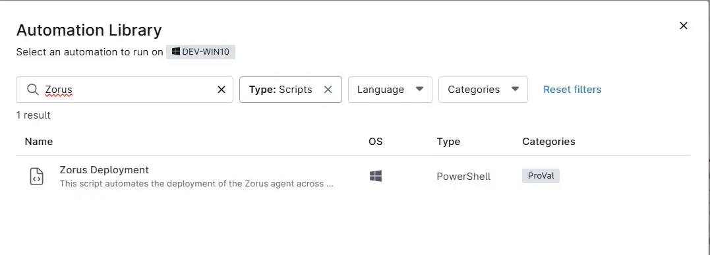

## Overview
This script automates the deployment of the Zorus (Archon Agent) across Windows machines by downloading the required installer, executing the installation silently, and verifying that the agent is successfully installed.

## Sample Run

`Play Button` > `Run Automation` > `Script`  

Search and select `Zorus Deployment`

## Dependencies
- [cPVAL Zorus Token Key](/docs/a3bdf78e-b4fd-499e-9e30-3eb49f6653cd)
- [cPVAL Zorus Uninstallation Password](/docs/a3bdf78e-b4fd-499e-9e30-3eb49f6653cd)

## Automation Setup/Import

[Automation Configuration]((https://github.com/ProVal-Tech/ninjarmm/blob/main/scripts/zorus-deployment.ps1))

## Output

- Activity Details  