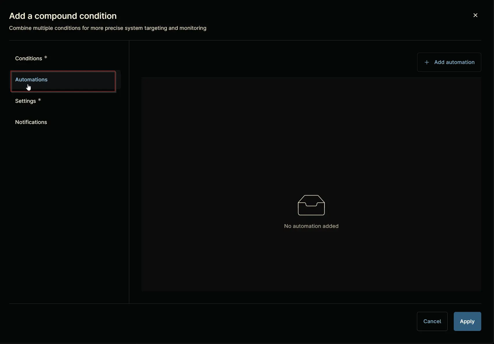
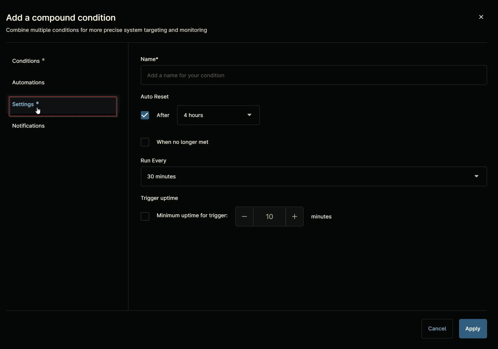

## Summary
This creates ticket if the hyper-v checkpoint detected older than the provided threshold days via script [Hyper-V - Checkpoint Expiration Alert](/docs/e2ab9b55-fbd3-4be9-801c-51b813b4bd13).

## Details

**Name:** `Hyper-V - Checkpoint Expiration Alert`  
**Description:** `This creates ticket if the hyper-v checkpoint detected older than the provided threshold days.`  

**Recommended Agent Policies:** It is advised to configure this compound policy within the following default agent policies:

- `Windows Server - Hyper-V [Default]`

## Dependencies

[Script - Hyper-V - Checkpoint Expiration Alert](/docs/e2ab9b55-fbd3-4be9-801c-51b813b4bd13)

[Solution - Hyper-V Checkpoint Expiration Alert](/docs/621e8dcc-3405-47e6-b1e6-d9190971e8ee)

## Compound Condition Creation

Compound conditions can be configured within an `Agent Policy`. This document provides an example using the default `Windows Server - Hyper-V [Default]` policy.

Navigate to `Administration` `>` `Policies` `>` `Agent Policies`.  

Search for `Hyper` and select the default `Windows Server - Hyper-V [Default]` policy.  

This will navigate you to the policy's landing page, which is the `Conditions` section. Note that conditions may vary across different policies and environments. The provided screenshot is for demonstration purposes only.  

Navigate to the `Compound Conditions` section. Note that existing compound conditions may vary across different policies and environments. The provided screenshot is for demonstration purposes only.  

Click the `+ Add` button to add a compound condition.  

Clicking the `+ Add` button opens the compound condition creation window.  

## Conditions

### Condition 1: Software

Click the `+ Add condition` button.  

Select the `Script Result Condition` option from the list that will appear after clicking the `+ Add condition` button.  

`Add Script Result Condition` screen will appear. Select the `Evaluation Script` `+Add` button option:  

Configure the `Script Result Condition` as follow:  

**Evaluation Script:** 

Search for `Hyper` and select `Hyper-V - Checkpoint Expiration Alert` script:

It will open up the `Hyper-V - Checkpoint Expiration Alert` parameter setting.
Set the threshold as per the requirement in the `Age Limit` parameter or provide the custom field name containing the threshold days in the parameter `Retrieve Age Limit From Custom Field` and click `Apply`

It will look like below after clicking on apply:

Set Values in the Add Script Result Condition:

**Evaluation Script:** - `Hyper-V - Checkpoint Expiration Alert`
**Result code:** - `not equal to` - `0`
**Timeout:** - `10 Minutes`
**Output:** - `Contains` and put the value `There are checkpoints older than`
**Include script output in final Alert:** - `<Keep Unchecked>`
**Script error notification:** - `<Keep Unchecked>`

Click the `Apply` button to save the `Script Result Condition`.  

## Automations

Navigate to `Automations` section.  

Click `Apply` without any automation selection.

## Settings

Navigate to `Settings` section.  

Set the `Settings` section as follows:  

**Name:** `Hyper-V - Checkpoint Expiration Alert`  
**Auto Reset:**

- **After:** `True` `4 hour`
- **When no longer met:** `True`

**Run Every:** `1 hour`  
**Trigger uptime:** `False`  

## Notifications

Set the following values:

**Severity:** - `Major`

**Priority:** - `High`

**Notify Technicians:** - `Do not send notifications`

**Channels:** - `Select any available channel`

**ConnectWise:** - `Create a ticket` and select a `Ticket Template`

**Ticketing Rule:** - `Off`

## Completed Component

Click the `Apply` button at the bottom to save the compound condition.  

## Saving Agent Policy

Click the `Save` button located at the top-right corner of the screen to save the agent policy.  

You will be prompted to enter your MFA code. Provide the code and press the Continue button to finalize the process.  
