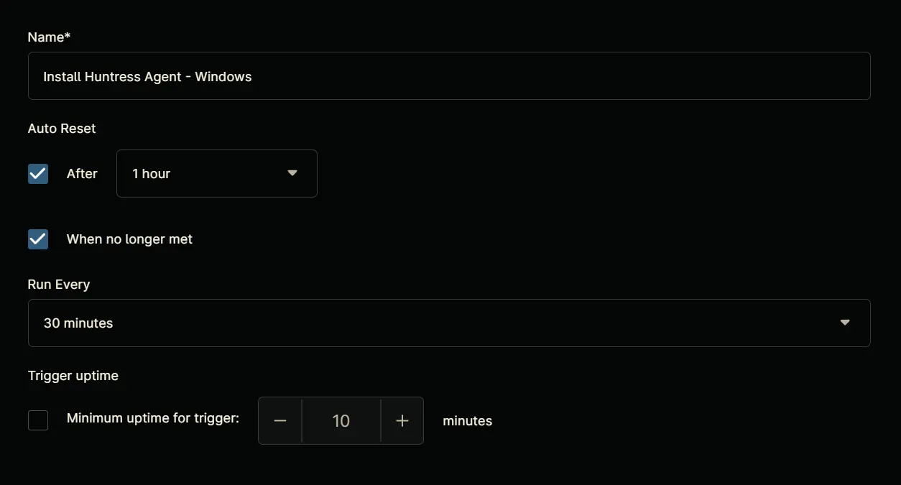

## Summary

Triggers the [Install Huntress Agent - Windows](/docs/518bff20-44d4-4206-9336-bb6922d959da) automation on Windows machines where deployment is enabled.

## Details

**Name:** `Install Huntress Agent - Windows`  
**Description:** `Triggers the auto-deployment script for the Huntress Agent on Windows machines where deployment is enabled.`  

**Recommended Agent Policies:** It is advised to configure this compound policy within the following default agent policies:

- `Windows Server [Default]`
- `Windows Workstation [Default]`

## Dependencies

- [Install Huntress Agent - Windows](/docs/518bff20-44d4-4206-9336-bb6922d959da)  
- [cPVAL Huntress Deployment](/docs/67554954-e8da-48af-bda9-13a6a37c8295)  
- [cPVAL Huntress Install - Exclude](/docs/bdb92684-f093-49f8-9568-09874f9f79d5)

## Compound Condition Creation

Compound conditions can be configured within an `Agent Policy`. This document provides an example using the default `Windows Workstation [Default]` policy for demonstration purposes.

Navigate to `Administration` `>` `Policies` `>` `Agent Policies`.  

Search for `Windows Workstation` and select the default `Windows Workstation [Default]` policy.  

This will navigate you to the policy's landing page, which is the `Conditions` section. Note that conditions may vary across different policies and environments. The provided screenshot is for demonstration purposes only.  

Navigate to the `Compound Conditions` section. Note that existing compound conditions may vary across different policies and environments. The provided screenshot is for demonstration purposes only.  

Click the `+ Add` button to add a compound condition.  

Clicking the `+ Add` button opens the compound condition creation window.  

## Conditions

### Condition 1: Software

Click the `+ Add condition` button.  

Select the `Software` option from the list that will appear after clicking the `+ Add condition` button.  

`Add Software Condition` screen will appear on selecting the `Software` option:  

Configure the `Add Software Condition` as follow:  

**Software Name:** `Huntress Agent`  
**Trigger when:** `Any Software` `Doesn't exist`  

**Note:** The Return key must be pressed after pasting the name to set the `Software Name`.

Click the `Apply` button to save the `software` condition.  

### Condition 2: Custom fields

Click the `+ Add condition` button.  

Select the `Custom fields` option from the list that will appear after clicking the `+ Add condition` button.  

`Add custom fields condition` screen will appear on selecting the `Custom fields` option:  

Click the `+ Add` button within the upper section labeled `Custom field value must meet ALL conditions`.  

A new row will be added upon clicking the `+ Add` button.  

Search and select the `cPVAL Huntress Install - Exclude` custom field.

**Condition:** `cPVAL Huntress Install - Exclude` `does not equal` `Yes`

Click the `+ Add` button within the lower section labeled `Custom field value must meet ANY conditions`.  

A new row will be added upon clicking the `+ Add` button.  

Search and select the `cPVAL Huntress Deployment` custom field.

**Condition:** `cPVAL Huntress Deployment` `equals` `Windows`

Click the `+ Add` button within the lower section labeled `Custom field value must meet ANY conditions`.  

A new row will be added upon clicking the `+ Add` button.  

Search and select the `cPVAL Huntress Deployment` custom field.

**Condition:** `cPVAL Huntress Deployment` `equals` `Windows and Macintosh`

Click the `Apply` button to save the `custom field` condition.  

## Automations

Navigate to `Automations` section.  

Click the `+ Add automation` button.  

`Automation Library` will appear upon clicking the `+ Add Automation` button. Note that existing automation library may vary across different environments. The provided screenshot is for demonstration purposes only.  

Search and select the [Install Huntress Agent - Windows](/docs/518bff20-44d4-4206-9336-bb6922d959da) script.  

Click the `Apply` button to add the automation.  

Completed Automation Section:  

## Settings

Navigate to `Settings` section.  

Set the `Settings` section as follows:  

**Name:** `Install Huntress Agent - Windows`  
**Auto Reset:**

- **After:** `True` `1 hour`
- **When no longer met:** `True`

**Run Every:** `30 Minutes`  
**Trigger uptime:** `False`  

## Notifications

Leave the `Notifications` section untouched.

## Completed Component

Click the `Apply` button at the bottom to save the compound condition.  

## Saving Agent Policy

Click the `Save` button located at the top-right corner of the screen to save the agent policy.  

You will be prompted to enter your MFA code. Provide the code and press the Continue button to finalize the process.  
