## Summary

Triggers the [Local Admin Group Cleanup](/docs/27432f96-a5bf-4605-b2c8-fd046487b2db) automation on Windows Servers (except domain controllers) where cleanup is enabled.

## Details

- **Name:** `Local Admin Group Cleanup - Windows Servers`  
- **Description:** `Triggers the Local Admin Group Cleanup automation on Windows Servers (except domain controllers) where cleanup is enabled.`  
- **Recommended Agent Policy:** `Windows Server [Default]`

## Dependencies

- [Local Admin Group Cleanup](/docs/27432f96-a5bf-4605-b2c8-fd046487b2db)  
- [cPVAL Local Admin Group Cleanup](/docs/d39ab865-2fad-461f-8c39-6540e0199b8e)  
- [cPVAL Roles Detected](/docs/e9ec73dd-98b1-4436-a027-4ee8906f7cba)
- [Solution - Local Admin Group Cleanup](/docs/70aec704-a188-45fe-b059-52f1cf39d468)

## Compound Condition Creation

Compound conditions can be configured within an `Agent Policy`. This document provides an example using the default `Windows Server [Default]` policy for demonstration purposes.

Navigate to `Administration` > `Policies` > `Agent Policies`.  

Search for `Windows Server` and select the default `Windows Server [Default]` policy.  
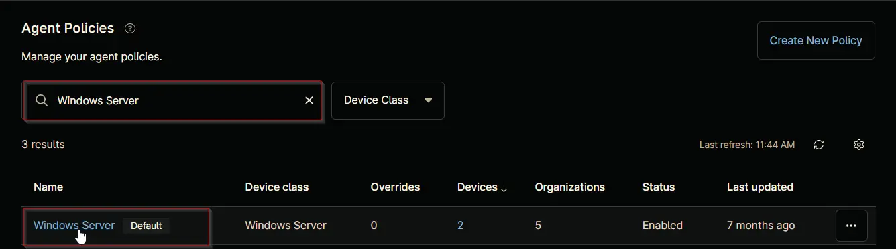

This will navigate you to the policy's landing page, which is the `Conditions` section. `Note` that conditions may vary across different policies and environments. The provided screenshot is for demonstration purposes only.  
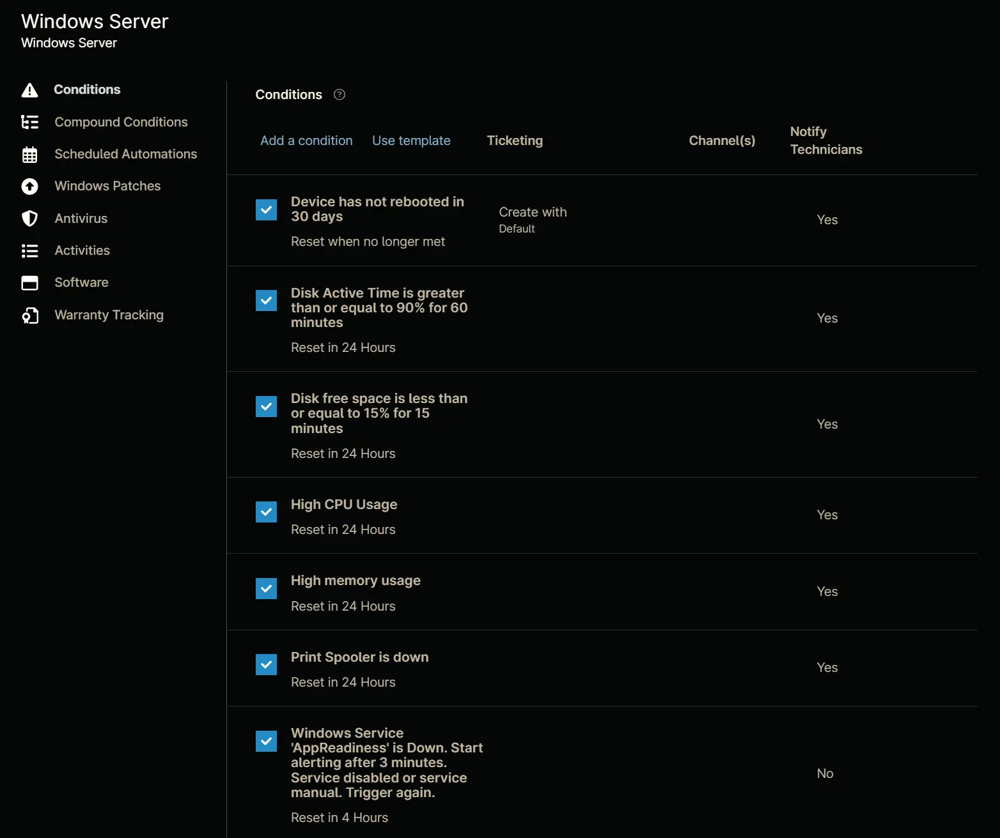

Navigate to the `Compound Conditions` section. `Note` that existing compound conditions may vary across different policies and environments. The provided screenshot is for demonstration purposes only.  
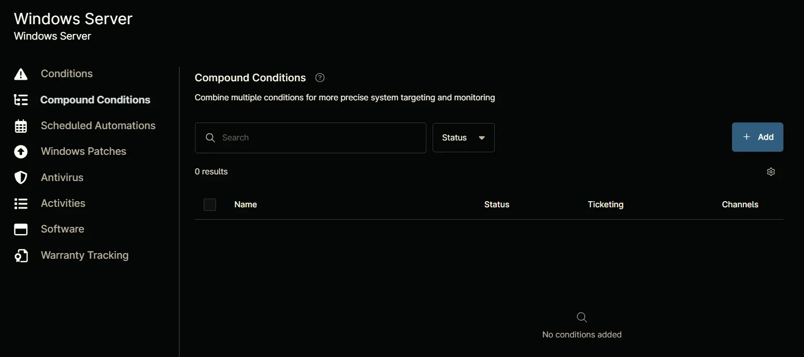

Click the `+ Add` button to add a compound condition.  

Clicking the `+ Add` button opens the compound condition creation window.  
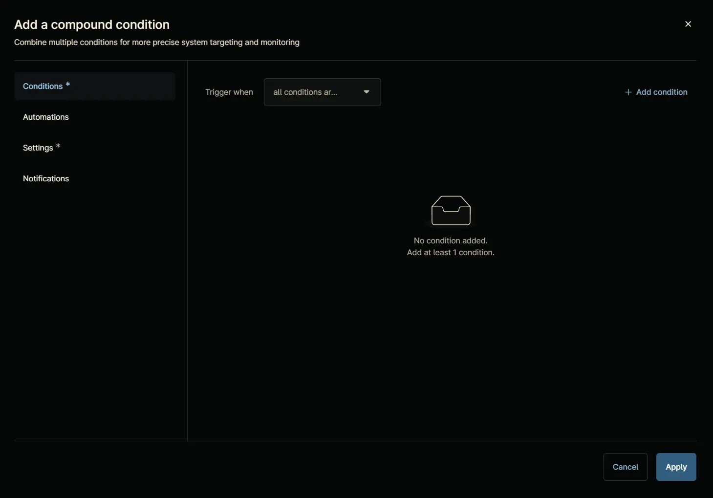

## Conditions

### Condition 1: Custom fields

Click the `+ Add condition` button.  

Select the `Custom fields` option from the list that will appear after clicking the `+ Add condition` button.  
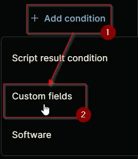

`Add custom fields condition` screen will appear on selecting the `Custom fields` option:  
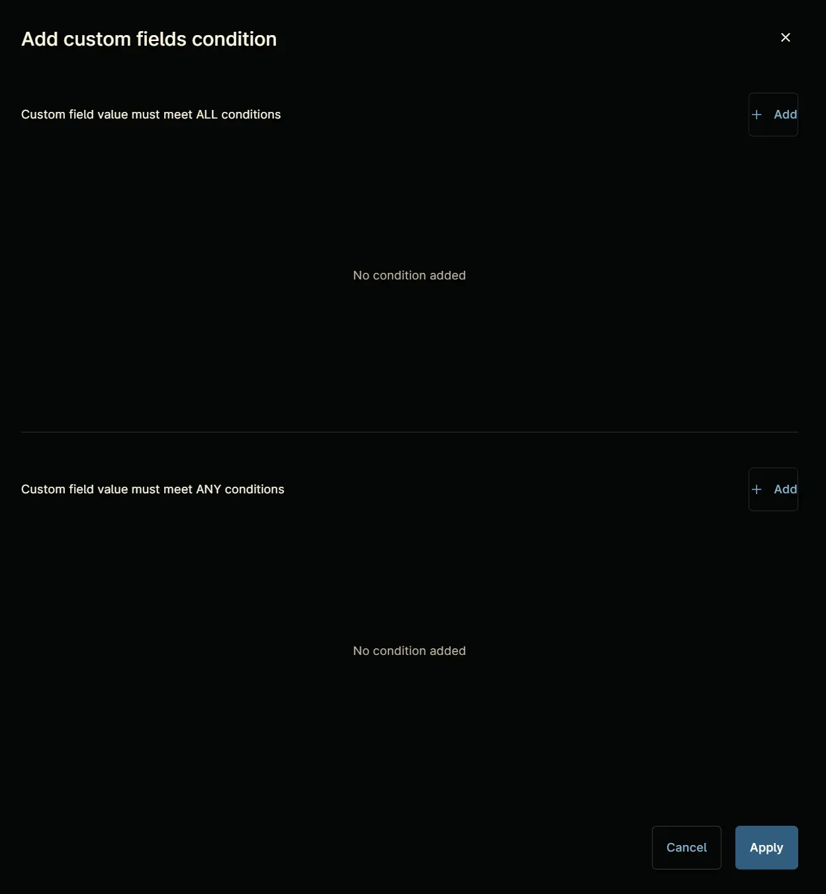

Click the `+ Add` button within the upper section labeled `Custom field value must meet ALL conditions`.  

A new row will be added upon clicking the `+ Add` button.  

Search and select the `cPVAL Roles Detected` custom field.

**Condition:** `cPVAL Roles Detected` `contains none` `Active Directory Domain Services`

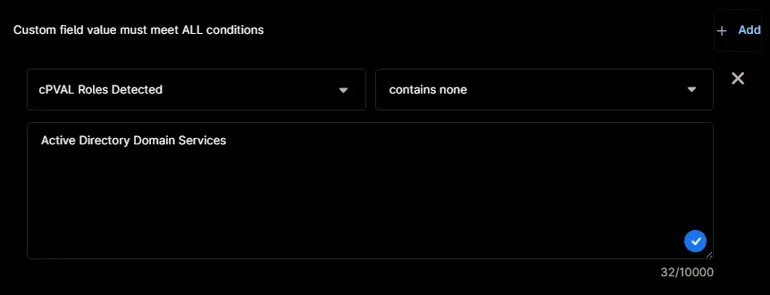

Click the `+ Add` button within the lower section labeled `Custom field value must meet ANY conditions`.  

A new row will be added upon clicking the `+ Add` button.  

Search and select the `cPVAL Local Admin Group Cleanup` custom field.

**Condition:** `cPVAL Local Admin Group Cleanup` `equals` `Windows`

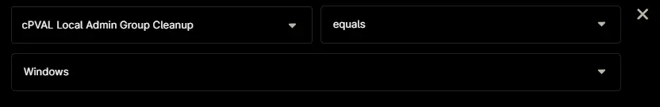

Click the `+ Add` button within the lower section labeled `Custom field value must meet ANY conditions`.  

A new row will be added upon clicking the `+ Add` button.  

Search and select the `cPVAL Local Admin Group Cleanup` custom field.

**Condition:** `cPVAL Local Admin Group Cleanup` `equals` `Windows Servers`

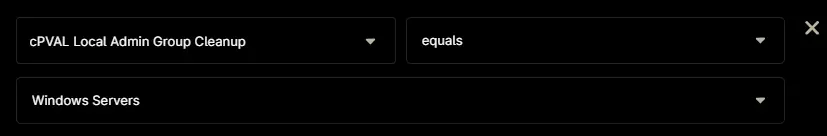

Click the `Apply` button to save the `custom field` condition.  
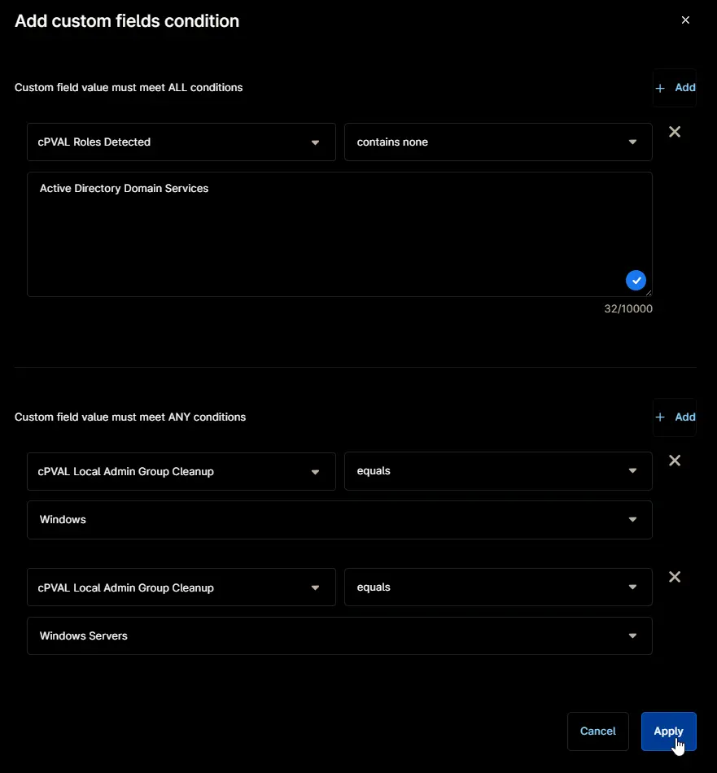

## Automations

Navigate to `Automations` section.  
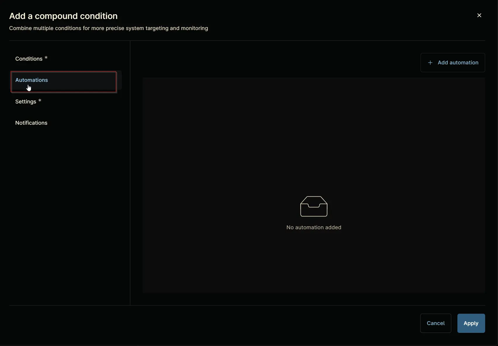

Click the `+ Add automation` button.  

`Automation Library` will appear upon clicking the `+ Add Automation` button. `Note` that existing automation library may vary across different environments. The provided screenshot is for demonstration purposes only.  
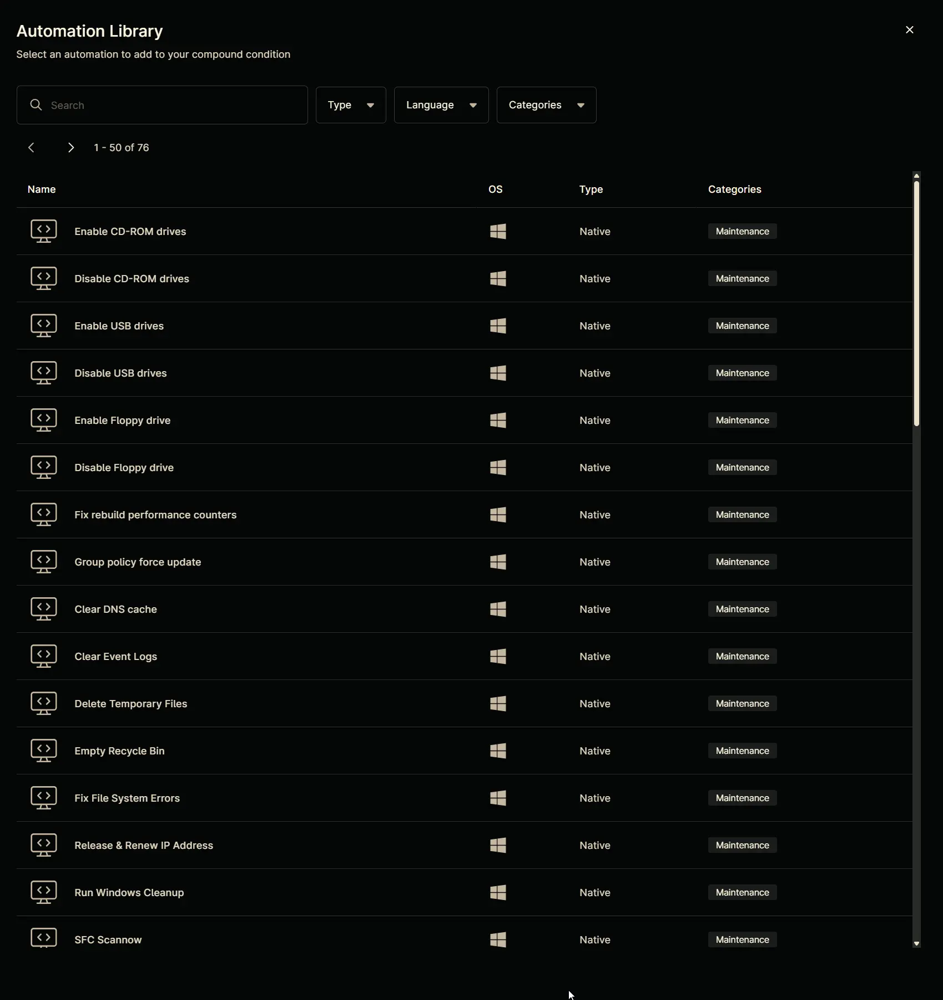

Search and select the [Local Admin Group Cleanup](/docs/27432f96-a5bf-4605-b2c8-fd046487b2db) script.  
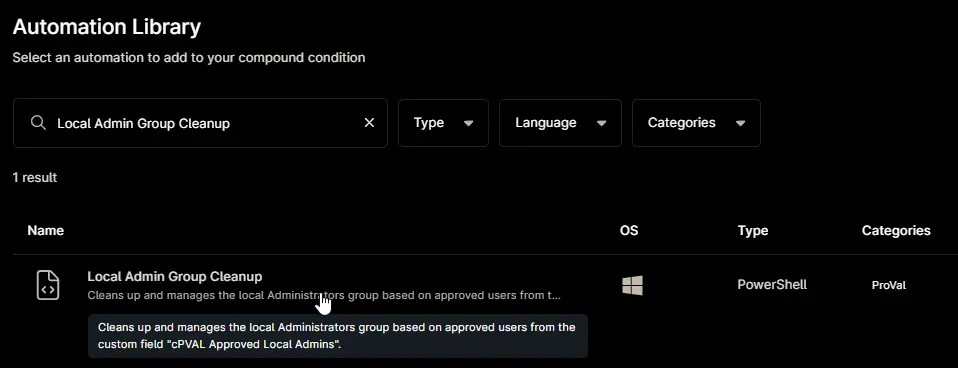

Click the `Apply` button to add the automation.  
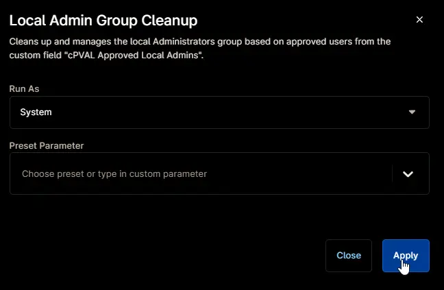

Completed Automation Section:  
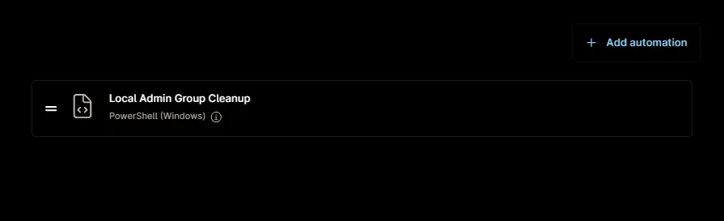

## Settings

Navigate to `Settings` section.  
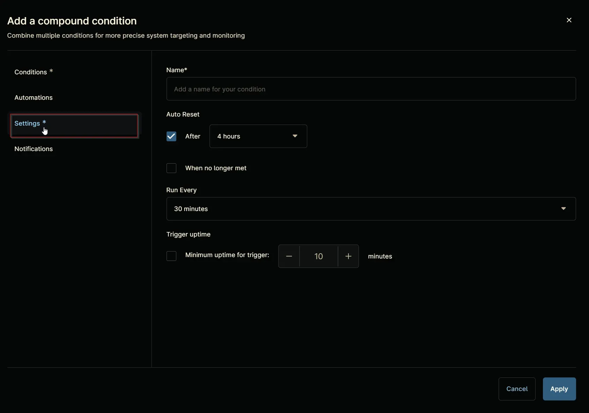

Set the `Settings` section as follows:  

- **Name:** `Local Admin Group Cleanup - Windows Servers`  
- **Auto Reset:**
    - **After:** `True` `12 hour`
    - **When no longer met:** `True`
- **Run Every:** `12 Hours`  
- **Trigger uptime:** `False`  

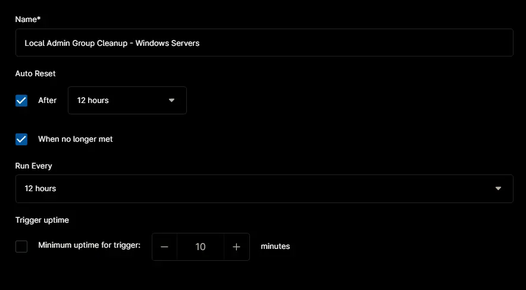

## Notifications

Leave the `Notifications` section untouched.

## Completed Component

Click the `Apply` button at the bottom to save the compound condition.  

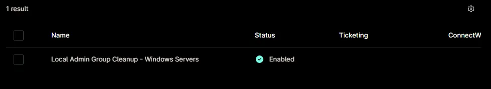

## Saving Agent Policy

Click the `Save` button located at the top-right corner of the screen to save the agent policy.  

You will be prompted to enter your MFA code. Provide the code and press the Continue button to finalize the process.  
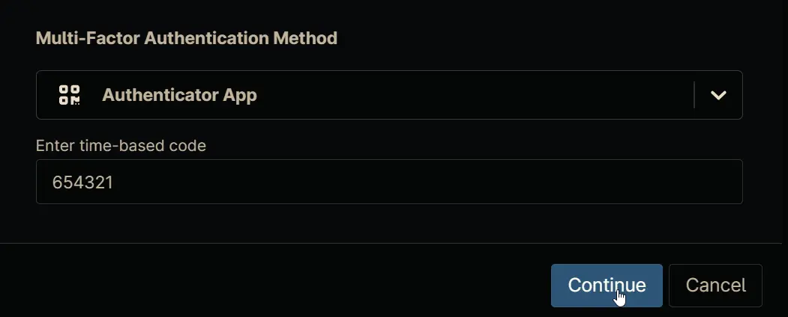
