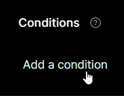
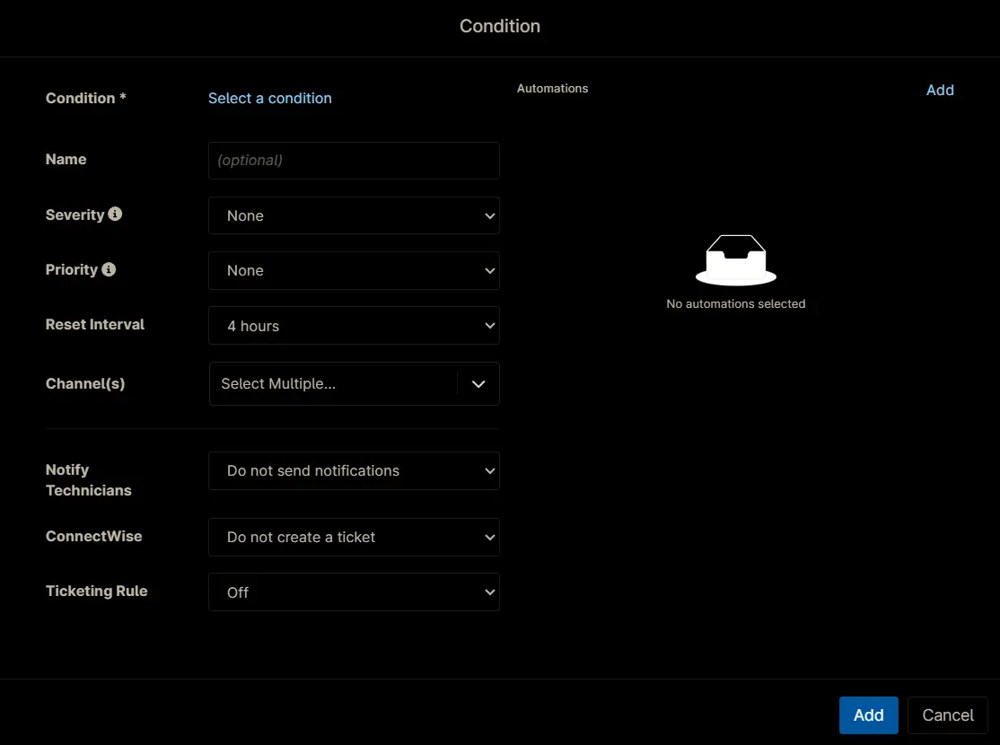
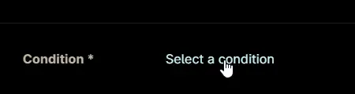

## Summary

The condition runs the [Dell Hardware Monitoring](/docs/45c545e2-a890-4ca8-acfc-5b100c2e100c) automation once per hour and generates a ticket with the script’s results if any monitored event log is detected.

## Details

**Name:** `Dell OMSA Alerts`  
**Description:** `The condition runs the automation once per hour and generates a ticket with the script’s results if any monitored event log is detected.`  
**Recommended Agent Policies:** `Windows Server [Default]`  

## Dependencies

- [CW Manage - Ticket Template - Dell Hardware Monitoring](/docs/c1c2c40f-3a63-4eb8-8460-9f90000337aa)
- [Automation - Dell Hardware Monitoring](/docs/45c545e2-a890-4ca8-acfc-5b100c2e100c)

## Condition Creation

Conditions can be configured within an `Agent Policy`. This document provides an example using the default `Windows Server [Default]` policy for demonstration purposes.

Navigate to `Administration` `>` `Policies` `>` `Agent Policies`.  

Search for `Windows Server` and select the default `Windows Server [Default]` policy.  

This will navigate you to the policy's landing page, which is the `Conditions` section. Note that conditions may vary across different policies and environments. The provided screenshot is for demonstration purposes only.  

Click the `Add a condition` button to add a new condition.  

The `Condition` screen will appear.  

## Condition

Click the `Select a condition` button to select the condition.  

Following screen will appear.  

Select the `Script Result Condition` from the dropdown menu.  

The `Script Result Condition` configuration screen will appear.  

Enter the following details and click `Apply`.  

**Condition:** `Script Result Condition`  
**Evaluation Script:** `Dell Hardware Monitoring`  
**Run Every:** `1` **Hours** `0` **Minutes**  
**Timeout:** `0` **Hours** `5` **Minutes**  
**Result Code:** `equal to` `1`  
**With Output:** `Contains` `Occurrences`  

Condition so far after clicking the `Apply` button.  

## Configuration

Set the following details:

**Name:** `Dell OMSA Alerts`  
**Severity:** `Major`  
**Priority:** `High`  
**Auto-reset:** `When no longer met`  
**Channel(s):** `<Leave it blank>`  
**Notify Technician:** `Do not send notifications`  
**ConnectWise:** `Create a ticket`  
    **Ticket Template:** `Dell Hardware Monitoring`  
**Ticketing Rule:** `Off`  

**Note:** The details above may differ depending on environment. Please verify the required information with consultant or partner before completing these fields.

## Saving the Condition

Click the `Add` button to save the condition.  

## Completed Condition

## Saving Agent Policy

Click the `Save` button located at the top-right corner of the screen to save the agent policy.  

You will be prompted to enter your MFA code. Provide the code and press the Continue button to finalize the process.  

