## Summary

Runs the [Manage Time Zone](/docs/080cb5cd-270d-42ee-aa69-05b88adcb35c) automation once per day on windows workstations where the [cPVAL Manage Time Zone](/docs/7db8dfdf-6825-4349-94e1-f86348fdec03) custom field is enabled.

## Details

- **Name:** `Set Time Zone - Windows Workstations`  
- **Description:** `Runs the "Manage Time Zone" automation on windows workstations where the "cPVAL Manage Time Zone" custom field is enabled.`  
- **Recommended Agent Policies:** `Windows Workstation [Default]`  

## Dependencies

- [Custom Field: cPVAL Manage Time Zone](/docs/7db8dfdf-6825-4349-94e1-f86348fdec03)
- [Automation: Manage Time Zone](/docs/080cb5cd-270d-42ee-aa69-05b88adcb35c)
- [Solution: Time Zone Management](/docs/3641dd0d-82d8-4137-b987-0b6c0d8238da)

## Condition Creation

Conditions can be configured within an `Agent Policy`. This document provides an example using the default `Windows Workstation [Default]` policy for demonstration purposes.

Navigate to `Administration` `>` `Policies` `>` `Agent Policies`.  
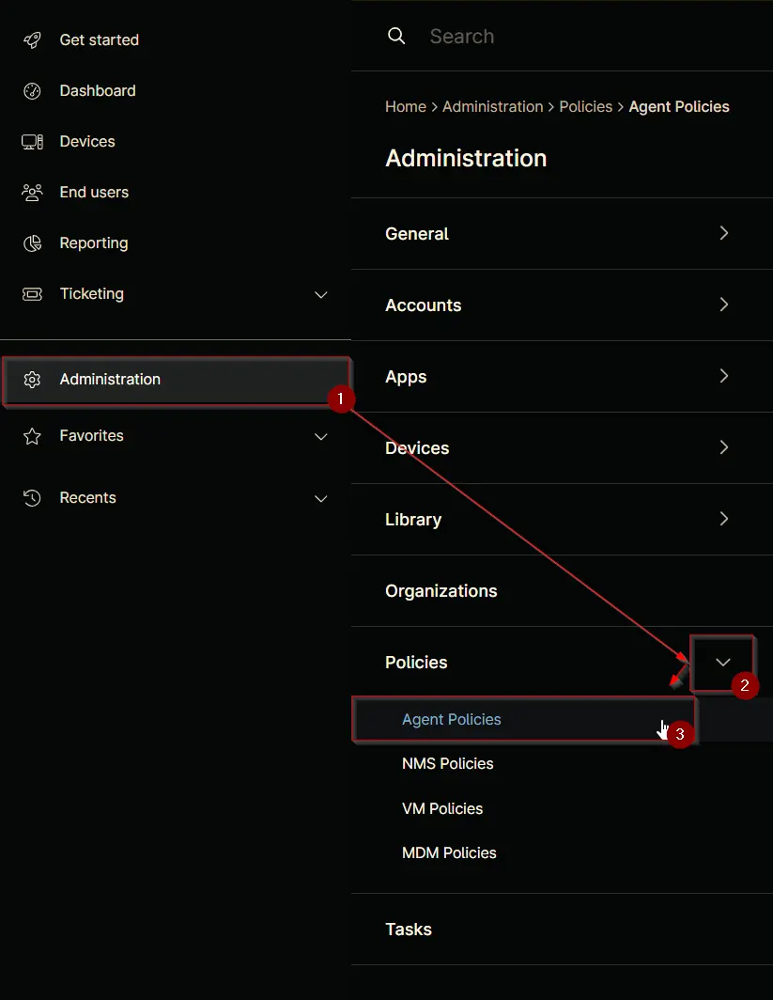

Search for `Windows Workstation` and select the default `Windows Workstation [Default]` policy.  
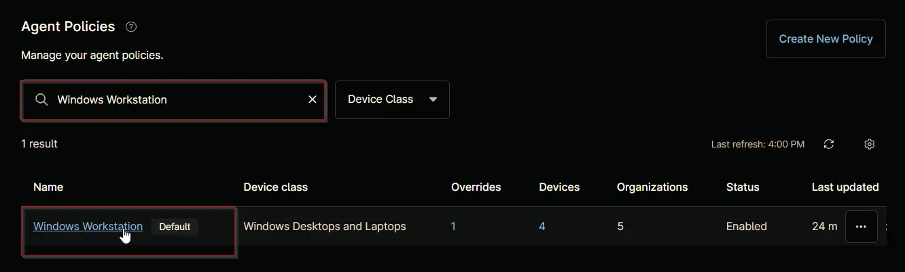

This will navigate you to the policy's landing page, which is the `Conditions` section. Note that conditions may vary across different policies and environments. The provided screenshot is for demonstration purposes only.  
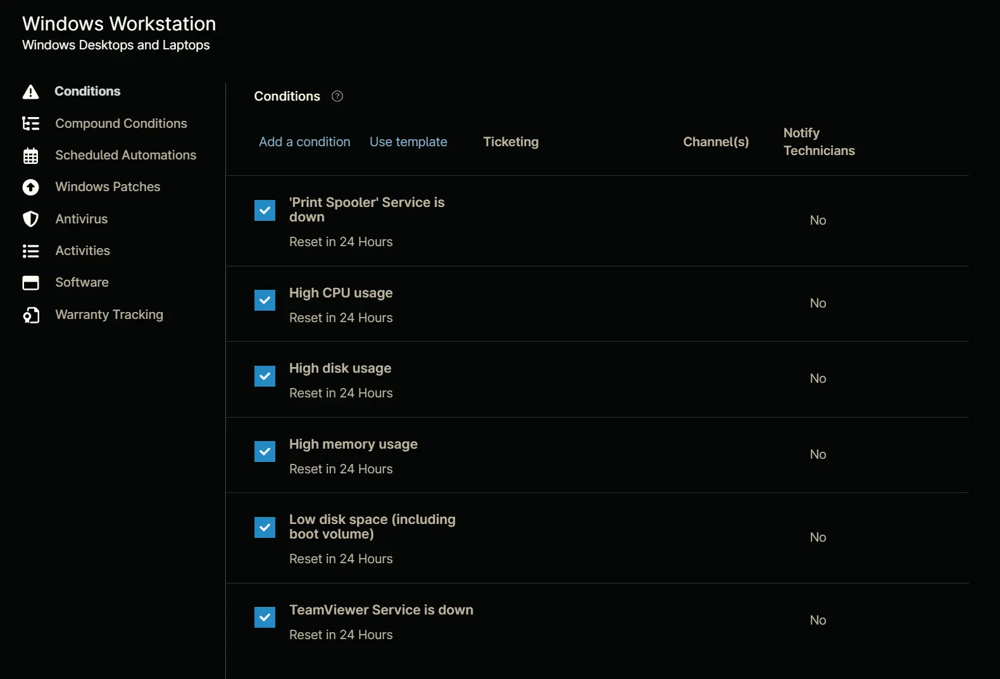

Click the `Add a condition` button to add a new condition.  
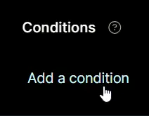

The `Condition` screen will appear.  
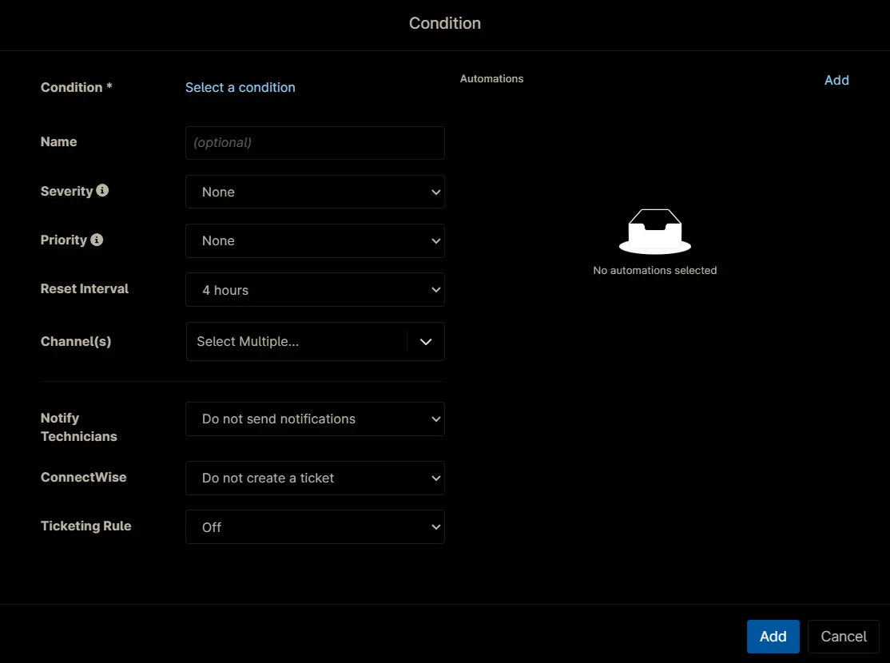

## Condition

Click the `Select a condition` button to select the condition.  

Following screen will appear.  
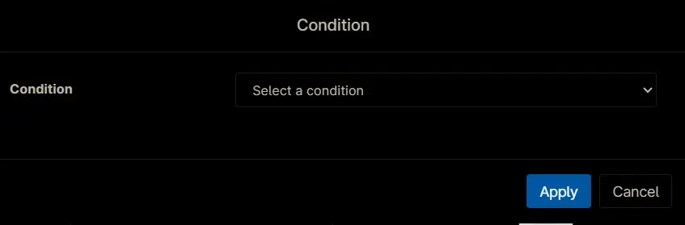

Select the `Custom Fields` from the dropdown menu.  
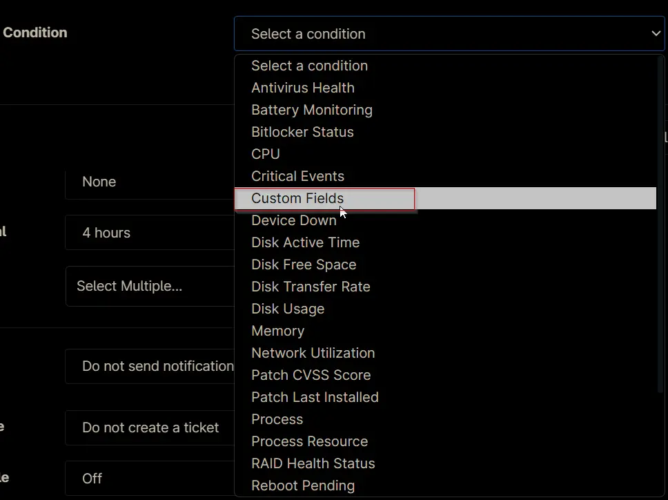

The `Custom Field Condition` configuration screen will appear.  
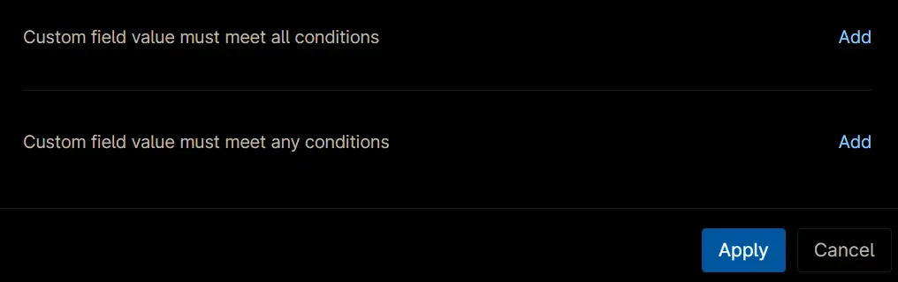

Set the condition as following and Click the `Apply` Button.

**Custom field value must meet any conditions:**

`cPVAL Manage Time Zone` **>>** `equals` **>>** `Windows`  
`cPVAL Manage Time Zone` **>>** `equals` **>>** `Windows  Workstations`  

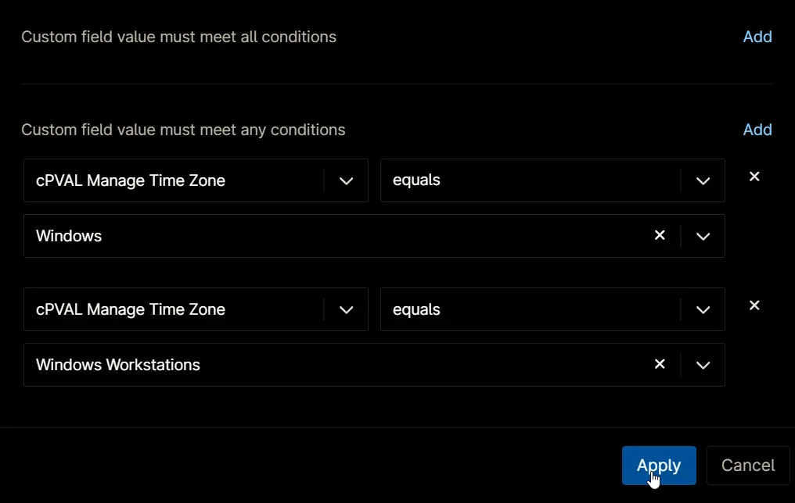

## Configuration

Set the following details:

- **Name:** `Set Time Zone - Windows Workstations`  
- **Severity:** `None`  
- **Priority:** `None`  
- **Reset Interval:** `24 hours`  
- **Channel(s):** `<Leave it blank>`  
- **Notify Technician:** `Do not send notifications`  
- **ConnectWise:** `Do not create a ticket`  
- **Ticketing Rule:** `Off`  

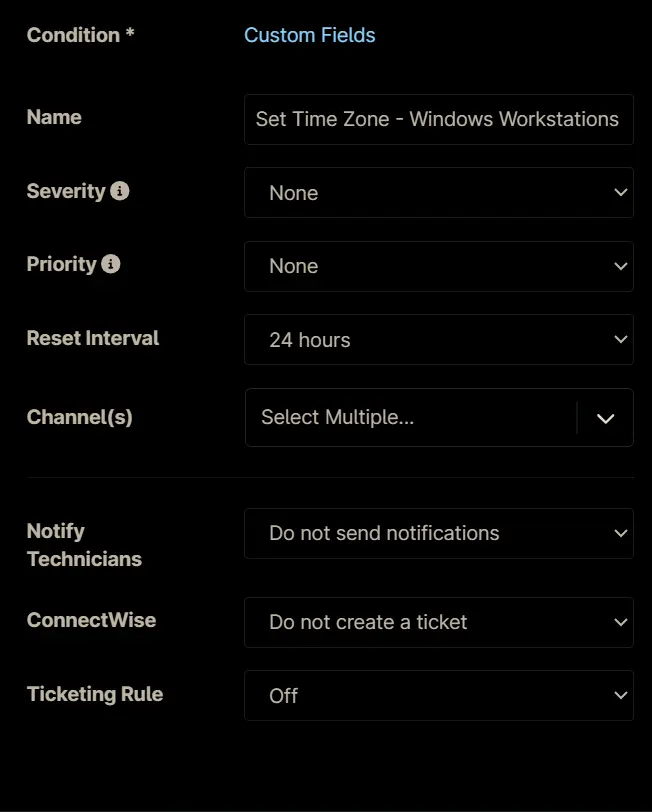

## Automations

Click the `Add` button in the `Automations` section of the condition to add the script to run.  

Search and select the `Manage Time Zone` automation from the `Automation Library`.  
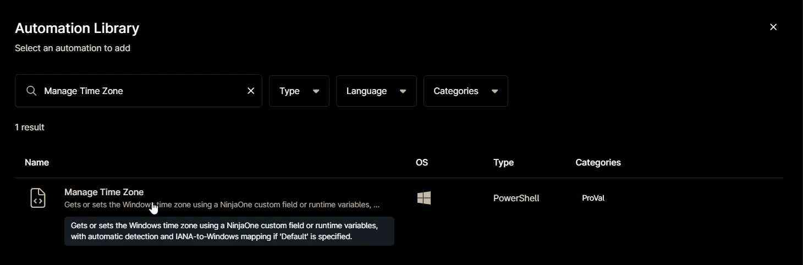

Set appropriate values to the variables and `Apply` the script.  
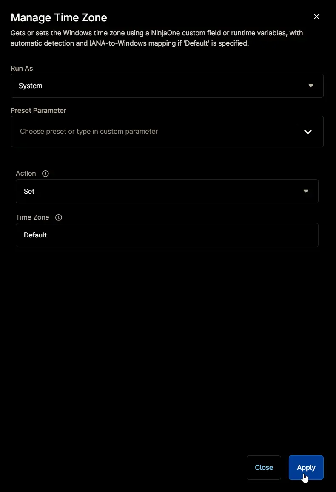

## Saving the Condition

Click the `Add` button to save the condition.  
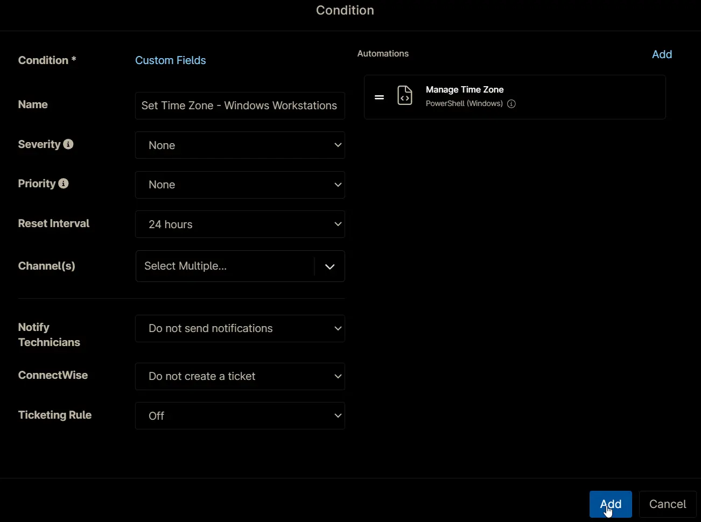

## Completed Condition

## Saving Agent Policy

Click the `Save` button located at the top-right corner of the screen to save the agent policy.  

You will be prompted to enter your MFA code. Provide the code and press the Continue button to finalize the process.  
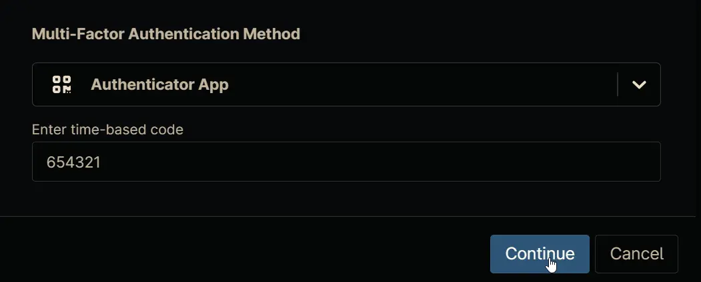
