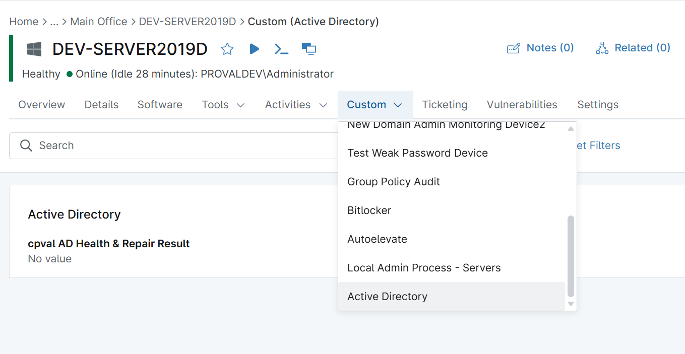

## Summary
This device custom field stores the [Script - Test AD Health and Repair](/docs/adcaec00-fdee-4e38-add4-accca41b36b8) status.
It is kept in the 'Active Directory' Tab.

## Details

| Label | Field Name | Definition Scope | Type | Required | Default Value | Technician Permission | Automation Permission | API Permission | Description | Tool Tip | Footer Text |  Custom Field Tab Name |
| ----- | ---- | ---------------- | ---- | -------- | ------------- | --------------------- | --------------------- | -------------- | ----------- | -------- | ----------- | ----------- |
| cpval AD Health & Repair Result | cpvalAdHealthRepairResult | Device | Text | False | | Read Only | Editable | Editable | This stores the AD Health and Repair success or failure report. | | | Active Directory | 

## Dependencies

[Script - Test AD Health and Repair](/docs/adcaec00-fdee-4e38-add4-accca41b36b8)

## Custom Field Creation

[Custom Field Configuration](https://github.com/ProVal-Tech/ninjarmm/blob/main/custom-fields/cpval-ad-health-and-repair-result.toml)

## Sample Screenshot

