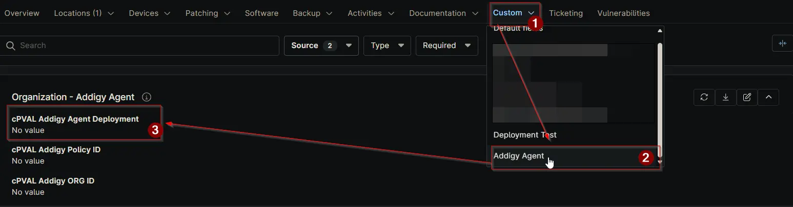

## Summary

Controls Addigy agent auto-deployment for macOS devices. Choose Enable to deploy agents at the selected level; choose Disable to prevent deployment. Device > Location > Organization in precedence.

## Details

| Label | Field Name | Definition Scope | Type | Options | Required | Default Value | Technician Permission | Automation Permission | API Permission | Description | Tool Tip | Footer Text |  Custom Field Tab Name |
| ----- | ---------- | ---------------- | ---- | ------- | -------- | ------------- | --------------------- | --------------------- | -------------- | ----------- | -------- | ----------- | ----------- |
| cPVAL Addigy Agent Deployment | cpvalAddigyAgentDeployment | Organization, Location, Device | Drop-down | <ul><li>Enable</li><li>Disable</li></ul>  | False | | Editable | Read_Write | Read_Write | Controls Addigy agent auto-deployment for macOS devices. Choose Enable to deploy agents at the selected level; choose Disable to prevent deployment. Device > Location > Organization in precedence.  | Enable or disable automatic Addigy agent deployment for macOS devices at this level; device-level settings override location and organization. | Device-level settings take priority over Location and Organization. Disabling at Device stops deployment even if higher levels are enabled. Review hierarchy before changes. | Addigy Agent |

## Dependencies

- [Solution: Addigy Agent Deployment](/docs/1f1e6543-8ab7-4b30-adde-ac0f0b2f54a1)

## Custom Field Creation

- [Custom Field Configuration](https://github.com/ProVal-Tech/ninjarmm/blob/main/custom-fields/cpval-addigy-agent-deployment.toml)

## Sample Screenshot

