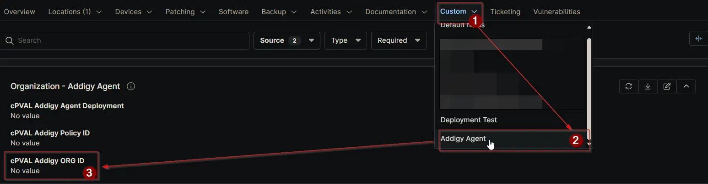

## Summary

Store the Addigy Organization ID here for automatic application to all devices. If not set, provide Org ID as a runtime variable when running the script.

## Details

| Label | Field Name | Definition Scope | Type | Options | Required | Default Value | Technician Permission | Automation Permission | API Permission | Description | Tool Tip | Footer Text |  Custom Field Tab Name |
| ----- | ---------- | ---------------- | ---- | ------- | -------- | ------------- | --------------------- | --------------------- | -------------- | ----------- | -------- | ----------- | ----------- |
| cPVAL Addigy Org ID | cpvalAddigyOrgId | Organization | Text | | Partially | | Editable | Read_Write | Read_Write | Store the Addigy Organization ID here for automatic application to all devices. If not set, provide Org ID as a runtime variable when running the script. | Enter the Addigy Organization ID to apply it automatically to all devices in this organization. If left blank, the Org ID must be provided as a runtime variable in the deployment script. | This field is required for auto-applying Org ID across devices. If empty, ensure the script includes the Org ID as a runtime variable to complete deployment successfully. | Addigy Agent |

## Dependencies

- [Solution: Addigy Agent Deployment](/docs/1f1e6543-8ab7-4b30-adde-ac0f0b2f54a1)

## Custom Field Creation

[Custom Field Configuration](https://github.com/ProVal-Tech/ninjarmm/blob/main/custom-fields/cpval-addigy-org-id.toml)

## Sample Screenshot

