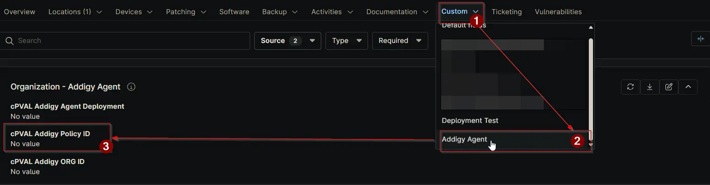

## Summary

Stores the Addigy Policy ID for this organization. Ensures all macOS devices report to the correct policy bucket in Addigy for proper management and compliance.

## Details

| Label | Field Name | Definition Scope | Type | Options | Required | Default Value | Technician Permission | Automation Permission | API Permission | Description | Tool Tip | Footer Text |  Custom Field Tab Name |
| ----- | ---------- | ---------------- | ---- | ------- | -------- | ------------- | --------------------- | --------------------- | -------------- | ----------- | -------- | ----------- | ----------- |
| cPVAL Addigy Policy ID | cpvalAddigyPolicyId | Organization | Text | | Partially | | Editable | Read_Write | Read_Write | Stores the Addigy Policy ID for this organization. Ensures all macOS devices report to the correct policy bucket in Addigy for proper management and compliance. | Enter the Addigy Policy ID to link devices to the correct policy bucket in Addigy. | This field is critical for accurate policy mapping in Addigy. Verify the Policy ID before saving to avoid misreporting or incorrect device grouping. | Addigy Agent |

## Dependencies

- [Solution: Addigy Agent Deployment](/docs/1f1e6543-8ab7-4b30-adde-ac0f0b2f54a1)

## Custom Field Creation

[Custom Field Configuration](https://github.com/ProVal-Tech/ninjarmm/blob/main/custom-fields/cpval-addigy-policy-id.toml)

## Sample Screenshot

