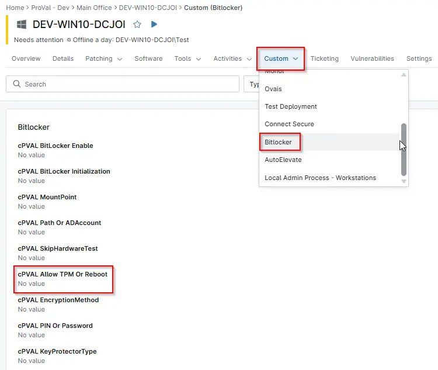

## Summary

Options for allowing TPM initialization and rebooting. 0 = Do not allow, 1 = Allow TPM Initialization, 2 = Allow Reboot, 3 = Allow TPM Initialization and Reboot. Allow the script to attempt initialization of TPM if necessary.

## Details

| Label | Field Name | Definition Scope | Type | Required | Default Value | Technician Permission | Automation Permission | API Permission | Description | Tool Tip | Footer Text |  Custom Field Tab Name |
| ----- | ---- | ---------------- | ---- | -------- | ------------- | --------------------- | --------------------- | -------------- | ----------- | -------- | ----------- | ----------- |
| cPVAL Allow TPM Or Reboot| cpvalAllowTpmOrReboot| `Organizations`,`Devices`,`Location` | Drop-down |  | `0`, `1`, `2`, `3` | Editable | Read_Write | Read_Write | Options for allowing TPM initialization and rebooting. 0 = Do not allow, 1 = Allow TPM Initialization, 2 = Allow Reboot, 3 = Allow TPM Initialization and Reboot. Allow the script to attempt initialization of TPM if necessary. | Defines whether TPM initialization or reboot is allowed during BitLocker setup. | Controls TPM initialization and reboot permissions used during BitLocker enablement. | Bitlocker |

## Dependencies

- [Automation - Initialize Bitlocker](/docs/e3a24552-f347-4117-82f5-7afaaa3fc198)

## Custom Field Creation

[Custom Field Configuration](https://github.com/ProVal-Tech/ninjarmm/blob/main/custom-fields/cpval-allow-tpm-or-reboot.toml)

## Sample Screenshot

  
