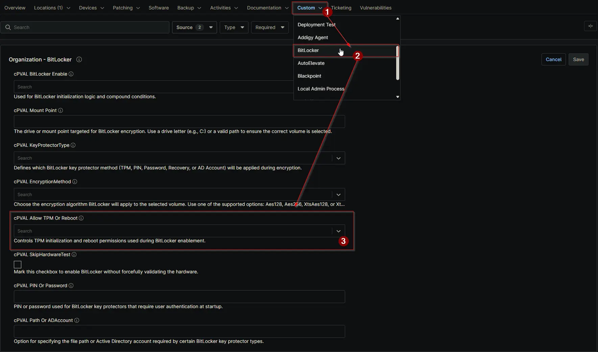

## Summary

Options for allowing TPM initialization and rebooting.

- 0 = Do not allow
- 1 = Allow TPM Initialization
- 2 = Allow Reboot
- 3 = Allow TPM Initialization and Reboot.

Allows the script to attempt initialization of TPM if necessary.

## Details

| Label | Field Name | Definition Scope | Type | Required | Available Options | Default Values | Technician Permission | Automation Permission | API Permission | Description | Tool Tip | Footer Text |  Custom Field Tab Name |
| ----- | ---- | ---------------- | ---- | -------- | ------------- | ------------- | --------------------- | --------------------- | -------------- | ----------- | -------- | ----------- | ----------- |
| cPVAL Allow TPM Or Reboot | cpvalAllowTpmOrReboot | `Organizations`,`Devices`,`Location` | Drop-down | `false` | `0`, `1`, `2`, `3` | `0` | Editable | Read_Write | Read_Write | Options for allowing TPM initialization and rebooting. 0 = Do not allow, 1 = Allow TPM Initialization, 2 = Allow Reboot, 3 = Allow TPM Initialization and Reboot. Allow the script to attempt initialization of TPM if necessary. | Defines whether TPM initialization or reboot is allowed during BitLocker setup. | Controls TPM initialization and reboot permissions used during BitLocker enablement. | BitLocker |

## Dependencies

- [Solution - BitLocker Initialize - NinjaOne](/docs/2ebfabd5-05cf-4175-a513-2aa290eb26e8)

## Custom Field Creation

[Custom Field Configuration](https://github.com/ProVal-Tech/ninjarmm/blob/main/custom-fields/cpval-allow-tpm-or-reboot.toml)

## Sample Screenshot

  
