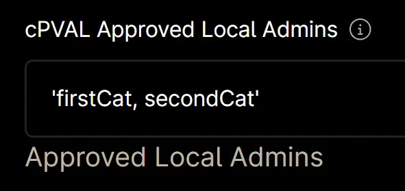
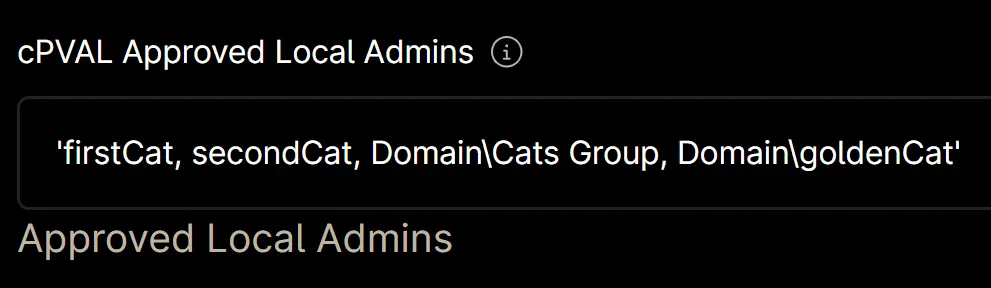

## Summary

A comma-separated list of approved local admins for the client. Setting this custom field at the location or computer level will override the value set at the organization level.

### Notes

- Enclose the value in this custom field within single quotes.  
  **Example:** `'firstCat'`  
    

- For multiple entries, separate each value with a comma.  
  **Example:** `'firstCat, secondCat'`  
    

- Use the `Domain` keyword for domain users or groups. You do not need to specify the actual domain name; the [automation](/docs/27432f96-a5bf-4605-b2c8-fd046487b2db) will automatically convert `Domain` to the correct domain name for domain-joined machines and ignore it for workgroup machines.  
  **Example:** `'firstCat, secondCat, Domain\Cats Group, Domain\goldenCat'`  
    

- There is no need to include `Administrator` or `Domain\Domain Admins` in the custom field, as the [automation](/docs/27432f96-a5bf-4605-b2c8-fd046487b2db) will automatically add `Administrator` and, for domain-joined machines, `Domain\Domain Admins`.

- If this custom field is left unset, the [automation](/docs/27432f96-a5bf-4605-b2c8-fd046487b2db) will remove all users from the local Admin group except for 'Administrator' (and 'Domain Admins' on domain-joined machines).

## Details

| Label | Field Name | Definition Scope | Type | Required | Default Value | Technician Permission | Automation Permission | API Permission | Description | Tool Tip | Footer Text |
| ----- | ---- | ---------------- | ---- | -------- | ------------- | --------------------- | --------------------- | -------------- | ----------- | -------- | ----------- |
| cPVAL Approved Local Admins | cpvalApprovedLocalAdmins | `Organization`, `Location`, `Device` | Text | False | | Editable | Read/Write | Read/Write | A comma-separated list of approved local admins for the client. Setting this custom field at the location or computer level will override the value set at the organization level. | A comma-separated list of approved local admins for the client. Setting this custom field at the location or computer level will override the value set at the organization level. | Approved Local Admins |

## Custom Field Creation

### Step 1

Navigate to the `Administration` menu, then proceed to `Devices` and select `Global Custom Fields`.  

### Step 2

Locate the `Add` button on the right-hand side of the screen and click on it.  
  

### Step 3

After clicking the `Add` button, select the `Field` button that appears.  

The following Pop-up screen will appear:  

### Step 4

**Custom Field Type:** `Text`

Select `Text` for the `Custom field type` and click `Continue` to proceed.  

The following Pop-up screen will appear:  

### Step 5

Set the following details in the `Overview` section and click the `Next` button.

**Label:** `cPVAL Approved Local Admins`  
**Name:** `cpvalApprovedLocalAdmins`  
**Definition Scope:** `Organization`, `Location`, `Device`
**Custom field is required:** `<Leave it unchecked>`

Clicking the `Next` button will take you to the `Permission` section.  

### Step 6

Set the following details in the `Permission` section and click the `Next` button.  

**Technician:** `Editable`  
**Automation:** `Read/Write`  
**API:** `Read/Write`

Clicking the `Next` button will take you to the details tab.  

### Step 7

Fill in the following information in the `Details` section and click the `Create` button to create the `Custom Field`.

**Description:** `A comma-separated list of approved local admins for the client. Setting this custom field at the location or computer level will override the value set at the organization level.`  
**Tooltip Text:** `A comma-separated list of approved local admins for the client. Setting this custom field at the location or computer level will override the value set at the organization level.`  
**Footer Text:** `Approved Local Admins`

## Completed Custom Field

