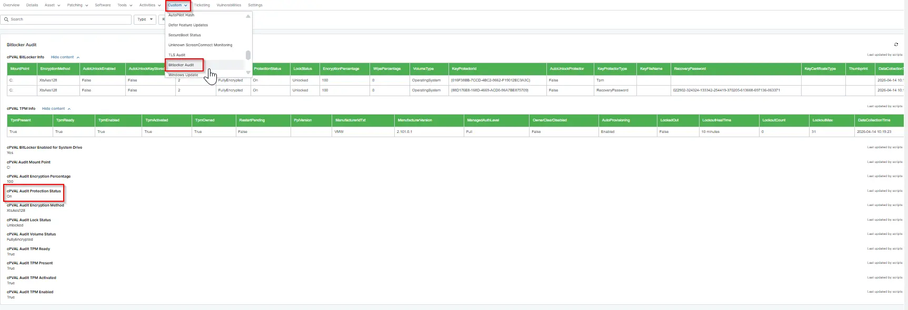

## Summary

Displays whether BitLocker protection is enabled on the device. Indicates if drive protection is turned on or off.

## Details

| Label | Field Name | Definition Scope | Type | Required | Available Options | Technician Permission | Automation Permission | API Permission | Description | Tool Tip | Footer Text | Custom Field Tab Name |
| ----- | ---- | ---------------- | ---- | -------- | ------------- | --------------------- | --------------------- | -------------- | ----------- | -------- | ----------- | ----------- |
| cPVAL Audit Protection Status | cpvalAuditProtectionStatus | `Devices` | Text | `False` | | Editable | Read_Write | Read_Write | Displays whether BitLocker protection is enabled on the device. | Indicates if drive protection is turned on or off. | BitLocker protection status of the device. | BitLocker Audit |

## Dependencies

- [Automation: BitLocker and TPM Audit](/docs/2d104874-ec69-4d95-b912-7fcd240bf592)
- [Automation: Initialize BitLocker](/docs/e3a24552-f347-4117-82f5-7afaaa3fc198)
- [Solution: BitLocker and TPM Audit](/docs/57c787ad-8d22-4ae4-b5e5-dac34fc600fc)

## Custom Field Creation

[Custom Field Configuration](https://github.com/ProVal-Tech/ninjarmm/blob/main/custom-fields/cpval-audit-protection-status.toml)

## Sample Screenshot

## Changelog

### 2026-04-14

- Initial version of the document
