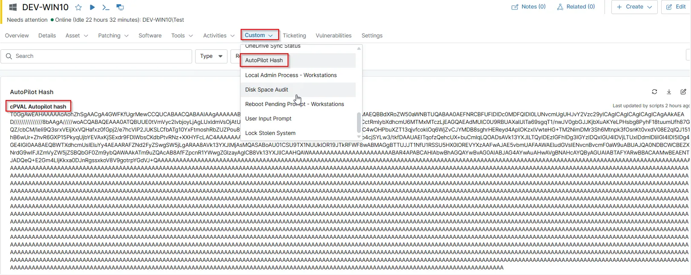

## Summary

This custom field is used to store the Windows Autopilot hardware hash value. This data is retreived by the automation [Get - AutoPilot Hash](/docs/d91bf7d6-5279-429d-b304-4876132453a5).

## Details

| Label                | Field Name         | Definition Scope | Type        | Required | Default Value | Technician Permission | Automation Permission | API Permission | Description                                                                                | Tool Tip                                                                          | Footer Text                                                    | Custom Field Tab Name |
| -------------------- | ------------------ | ---------------- | ----------- | -------- | ------------- | --------------------- | --------------------- | -------------- | ------------------------------------------------------------------------------------------ | --------------------------------------------------------------------------------- | -------------------------------------------------------------- | --------------------- |
| cPVAL Autopilot Hash | cpvalAutopilotHash | `Device`         | `Multiline` | Yes      | —             | Editable              | Read/Write            | Read/Write     | Stores the Windows Autopilot hardware hash value for device registration and provisioning. | Used to store the Windows Autopilot hardware hash required for device enrollment. | This field contains the Windows Autopilot hardware hash value. | `Autopilot Hash`      |

## Dependencies

- [Automation - Get - AutoPilot Hash](/docs/d91bf7d6-5279-429d-b304-4876132453a5)
- [Solution - Get - AutoPilot Hash - NinjaOne](/docs/d5b749b5-eda4-43d2-8679-eb88f51a3527)

## Custom Field Creation

[Custom Field Configuration](https://github.com/ProVal-Tech/ninjarmm/blob/main/custom-fields/cpval-autopilot-hash.toml)

## Sample Screenshot

## Changelog

### 2026-02-20

- Initial version of the document
