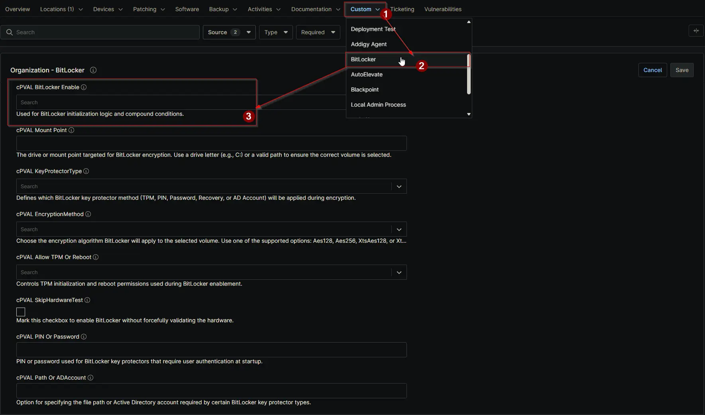

## Summary

This custom field is used to trigger the automation for BitLocker initialization. It is referenced in compound conditions to determine whether BitLocker needs to be enabled on the device.

## Details

| Label | Field Name | Definition Scope | Type | Required | Available Options | Technician Permission | Automation Permission | API Permission | Description | Tool Tip | Footer Text | Custom Field Tab Name |
| ----- | ---- | ---------------- | ---- | -------- | ------------- | --------------------- | --------------------- | -------------- | ----------- | -------- | ----------- | ----------- |
| cPVAL BitLocker Enable | cpvalBitlockerEnable | `Organizations`,`Devices`,`Location` | Drop-down | `true` | `Windows`, `Windows Servers`, `Windows Workstations`, `Disable` | Editable | Read_Write | Read_Write | This custom field is used to trigger the automation for BitLocker initialization. It is referenced in compound conditions to determine whether BitLocker needs to be enabled on the device. | Indicates whether BitLocker initialization needs to run on this device. | Used for BitLocker initialization logic and compound conditions. | BitLocker |

## Dependencies

- [Solution - BitLocker Initialize - NinjaOne](/docs/2ebfabd5-05cf-4175-a513-2aa290eb26e8)

## Custom Field Creation

[Custom Field Configuration](https://github.com/ProVal-Tech/ninjarmm/blob/main/custom-fields/cpval-bitLocker-enable.toml)

## Sample Screenshot

