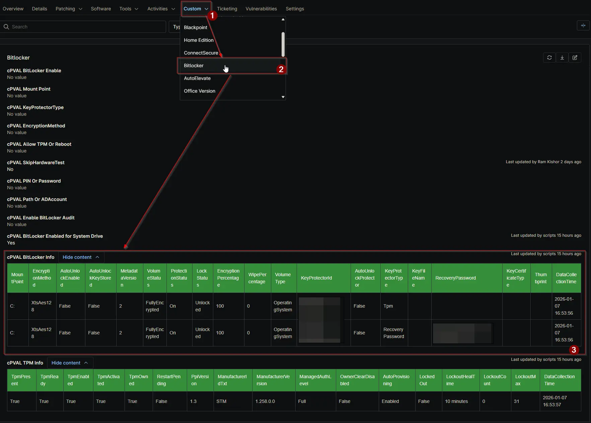

## Summary

Stores an HTML inventory of BitLocker volumes, including mount points, algorithms, protection status, and key protector types. Populated automatically by the BitLocker automation script.

## Details

| Label | Field Name | Definition Scope | Type | Required | Available Options | Technician Permission | Automation Permission | API Permission | Description | Tool Tip | Footer Text | Custom Field Tab Name |
| ----- | ---- | ---------------- | ---- | -------- | ------------- | --------------------- | --------------------- | -------------- | ----------- | -------- | ----------- | ----------- |
| cPVAL BitLocker Info | cpvalBitlockerInfo | `Devices` | WYSIWYG | `False` | | Editable | Read_Write | Read_Write | Stores an HTML inventory of BitLocker volumes, including mount points, algorithms, protection status, and key protector types. Populated automatically by the BitLocker automation script. | Auto-populated HTML table displaying detailed encryption status for all volumes. | Read-only. Data is refreshed by the BitLocker solution. | BitLocker |

## Dependencies

- [Automation: BitLocker and TPM Audit](/docs/2d104874-ec69-4d95-b912-7fcd240bf592)
- [Automation: Initialize BitLocker](/docs/e3a24552-f347-4117-82f5-7afaaa3fc198)
- [Solution: BitLocker and TPM Audit](/docs/57c787ad-8d22-4ae4-b5e5-dac34fc600fc)

## cPVAL BitLocker Info

| Column Name          | Description |
| :---                 | :--- |
| MountPoint           | The drive letter (e.g., C:, D:) of the volume. |
| EncryptionMethod     | The algorithm used for encryption (e.g., XtsAes128, Aes256). |
| AutoUnlockEnabled    | Boolean indicating if the volume is set to unlock automatically. |
| AutoUnlockKeyStored  | Boolean indicating if an auto-unlock key is stored on the system. |
| MetadataVersion      | The version of the BitLocker metadata on the volume. |
| VolumeStatus         | Current state of the volume (e.g., FullyEncrypted, FullyDecrypted, EncryptionInProgress). |
| ProtectionStatus     | The protection status (On/Off). 'On' means the volume is encrypted and the key is protected. |
| LockStatus           | Indicates if the volume is currently Locked or Unlocked. |
| EncryptionPercentage | The percentage of the volume that is encrypted. |
| WipePercentage       | The percentage of free space that has been wiped. |
| VolumeType           | The type of volume (e.g., OperatingSystem, Data, Fixed, Removable). |
| KeyProtectorId       | The unique identifier (GUID) for the specific Key Protector in this row. |
| AutoUnlockProtector  | Boolean indicating if this specific protector is an Auto-Unlock protector. |
| KeyProtectorType     | The type of key protector (e.g., Tpm, RecoveryPassword, Password, StartupKey). |
| KeyFileName          | The filename of the key (if applicable, usually for External Key protectors). |
| RecoveryPassword     | The 48-digit recovery password (if the row represents a RecoveryPassword protector). |
| KeyCertificateType   | The type of certificate used (if applicable). |
| Thumbprint           | The thumbprint of the certificate (if applicable). |
| DataCollectionTime   | The timestamp when the audit was performed. |

## Custom Field Creation

[Custom Field Configuration](https://github.com/ProVal-Tech/ninjarmm/blob/main/custom-fields/cpval-bitlocker-info.toml)

## Sample Screenshot

