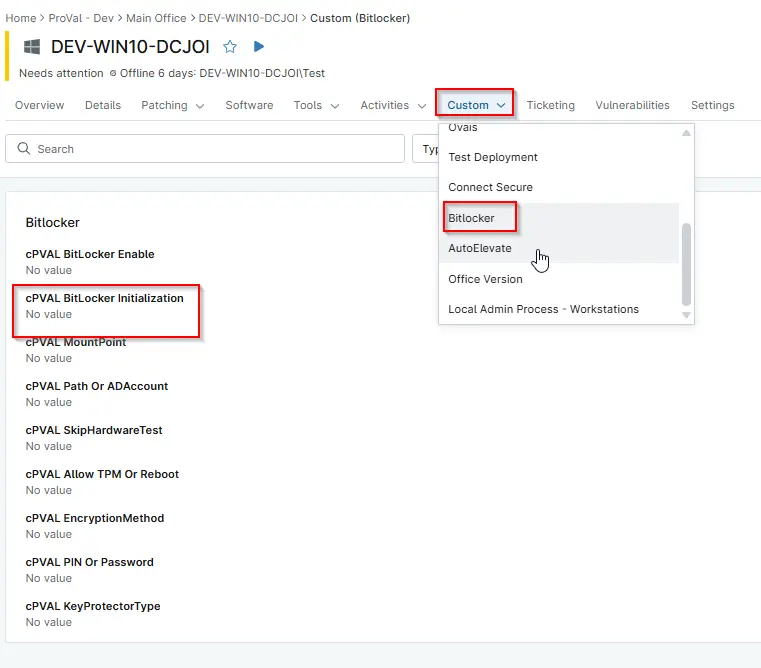

## Summary

Controls whether BitLocker initialization should run on the device. Used by automation to determine if the system should be included or excluded from BitLocker deployment.

## Details

| Label | Field Name | Definition Scope | Type | Required | Default Value | Technician Permission | Automation Permission | API Permission | Description | Tool Tip | Footer Text |  Custom Field Tab Name |
| ----- | ---- | ---------------- | ---- | -------- | ------------- | --------------------- | --------------------- | -------------- | ----------- | -------- | ----------- | ----------- |
| cPVAL BitLocker Initialization | cpvalBitlockerInitialization | `Organizations`,`Devices`,`Location` | Drop-down |  | `Enabled`, `Disabled` | Editable | Read_Write | Read_Write | Controls whether BitLocker initialization should run on the device. Used by automation to determine if the system should be included or excluded from BitLocker deployment. | This field is referenced by automation to enable or skip BitLocker initialization. Adjust this value if a device or organization should be excluded from BitLocker deployment. | This field is referenced by automation to enable or skip BitLocker initialization. Adjust this value if a device or organization should be excluded from BitLocker deployment. | Bitlocker |

## Dependencies

- [Automation - Initialize Bitlocker](/docs/e3a24552-f347-4117-82f5-7afaaa3fc198)

## Custom Field Creation

[Custom Field Configuration](https://github.com/ProVal-Tech/ninjarmm/blob/main/custom-fields/cpval-bitlocker-initialization.toml)

## Sample Screenshot

  
