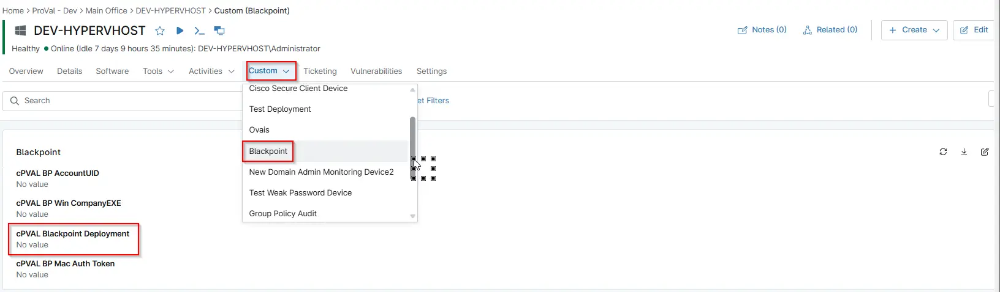

## Summary

Choose the operating system to activate the auto deployment of the BlackPoint Agent. Auto deployment can be enabled for Windows machines only or for both Windows and Macintosh computers.

## Details

| Label | Field Name | Definition Scope | Type | Required | Default Value | Technician Permission | Automation Permission | API Permission | Description | Tool Tip | Footer Text |  Custom Field Tab Name |
| ----- | ---- | ---------------- | ---- | -------- | ------------- | --------------------- | --------------------- | -------------- | ----------- | -------- | ----------- | ----------- |
| cPVAL Blackpoint Deployment | cpvalBlackpointDeployment | `Device`, `organization`, `Location` | `Drop-Down`| True | `Disabled`, `Windows`, `Windows Workstations`, `Windows Servers`, `MacOS`, `Windows and MacOS`, `Windows Server and MacOS`, `Windows Workstations and MacOS` | Editable | `Read/Write` | `Read/Write`   |     Choose the operating system to activate the auto deployment of the BlackPoint Agent.   |   Auto deployment can be enabled for Windows machines only or for both Windows and Macintosh computers.   | Auto deployment can be enabled for Windows machines only or for both Windows and Macintosh computers. | BlackPoint |

## Dependencies

- [Compound Condition - BlackPoint SNAP Installer - MacOS](/docs/c4c8973c-059f-4d8b-a091-8ad01760831b)
- [Compound Condition - BlackPoint SNAP Installer - Windows Server](/docs/729cb4c0-adc7-4c9b-9274-5dd4ff093ca3)
- [Compound Condition - BlackPoint SNAP Installer - Windows Workstations](/docs/85a2de03-5004-4e90-9598-9de731bb5b6b)
- [Solution - BlackPoint Agent Deployment](/docs/b9f13c4b-742d-4118-be8e-0c03e43ded17)

## Custom Field Creation

- [Custom Field Configuration](https://github.com/ProVal-Tech/ninjarmm/blob/main/custom-fields/cpval-blackpoint-deployment.toml)

## Sample Screenshot

