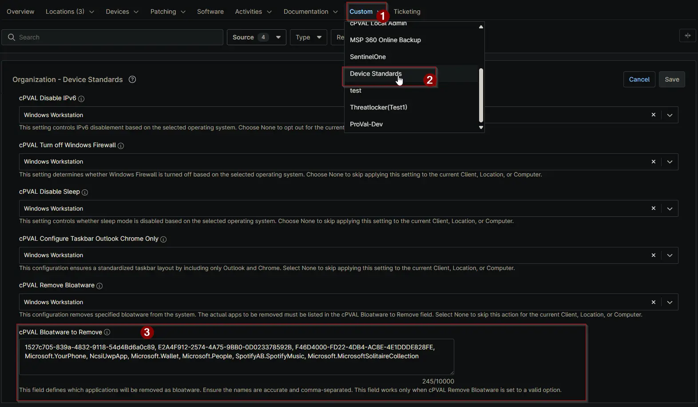

## Summary

This field defines which applications will be removed as bloatware. Ensure the names are accurate and comma-separated. This field works only when [cPVAL Remove Bloatware](/docs/4eef200f-a609-4993-9533-b7fce30b29ef) is set to a valid option.

## Details

| Label | Field Name | Definition Scope | Type | Required | Default Value | Available Options | Technician Permission | Automation Permission | API Permission | Description | Tool Tip | Footer Text | Custom Field Tab Name |
| ----- | ---- | ---------------- | ---- | -------- | ------------- | --------------------- | --------------------- | -------------- | ----------- | -------- | ----------- | ----------- | ----------- |
| cPVAL Bloatware to Remove| cpvalBloatwareToRemove | `Organization`, `Location`, `Device` | Multi-line | False | | | Editable | Read_Write | Read_Write | Specify the list of applications (bloatware) to be removed from the system. Enter the names as a comma-separated list (e.g., Microsoft.Print3D, Microsoft.RemoteDesktop, Microsoft.SkypeApp, Microsoft.StorePurchaseApp). | Enter the names of bloatware apps to remove, separated by commas. This list will be used when cPVAL Remove Bloatware is enabled. | This field defines which applications will be removed as bloatware. Ensure the names are accurate and comma-separated. This field works only when cPVAL Remove Bloatware is set to a valid option. | Device Standards |

## Dependencies

- [Custom Field - cPVAL Remove Bloatware](/docs/4eef200f-a609-4993-9533-b7fce30b29ef)
- [Solution - Remove Bloatware](/docs/9912c1d2-27b8-449a-8d54-d5e24b436721)
- [Solution - Device Standards](/docs/a0c383d4-699a-4bb8-af7f-c2a007747182)

## Custom Field Creation

[Custom Field Configuration](https://github.com/ProVal-Tech/ninjarmm/blob/main/custom-fields/cpval-bloatware-to-remove.toml)

## Sample Screenshot

