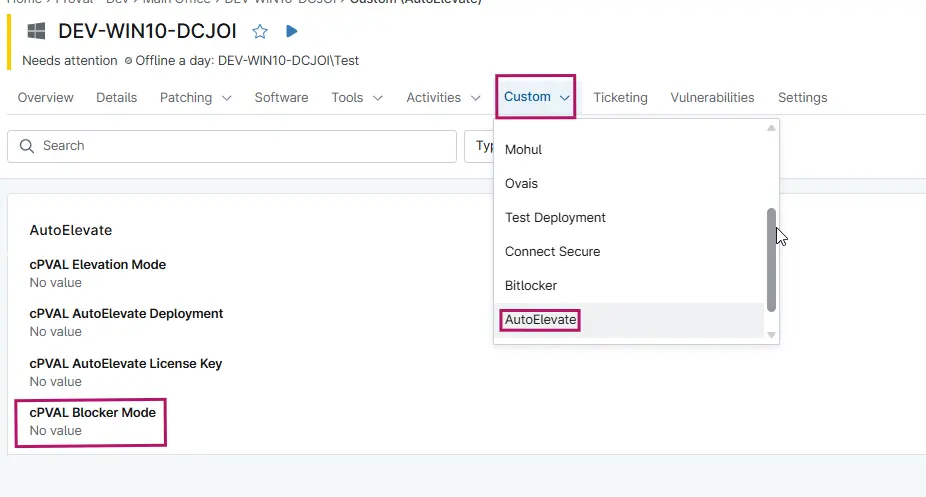

## Summary

Blocker Mode is a required parameter that needs to be passed during the AutoElevate agent deployment. This parameter is used to set the Blocker Mode configuration for the end user at the time of installation.

## Details

| Label                          | Field Name                 | Definition Scope | Type | Required | Available Options | Default Value | Technician Permission | Automation Permission | API Permission | Description                             | Tool Tip | Footer Text | Custom Field Tab Name |
| ------------------------------ | -------------------------- | ---------------- | ---- | ---- | -------- | ------------- | --------------------- | --------------------- | -------------- | --------------------------------------- | -------- | ----------- | --------------------- |
| cPVAL Blocker Mode | cpvalBlockerMode | `Organization`, `Location`, `Device`     | Dropdown | No  | `Live`, `Audit`, `Disabled`   | `Disabled`           | Editable              | Read/Write            | Read/Write     | Blocker Mode is a required parameter that needs to be passed during the AutoElevate agent deployment. This parameter is used to set the Blocker Mode configuration for the end user at the time of installation.| This parameter is used to set the Blocker Mode configuration for the end user at the time of installation.     | Controls behavior for blocked elevation attempts.        | AutoElevate     |

## Dependencies

- [AutoElevate Agent Deployment](/docs/45b83c20-5a25-4321-a253-5239633ecbd4)
- [Solution Document - AutoElevate Deployment - NinjaOne](/docs/58fe4653-c2ac-49d3-bdf5-b8ba1e50f0c9)

## Custom Field Creation

- [Custom Field Configuration](https://github.com/ProVal-Tech/ninjarmm/blob/main/custom-fields/cpval-blocker-mode.toml)

## Sample Screenshot

