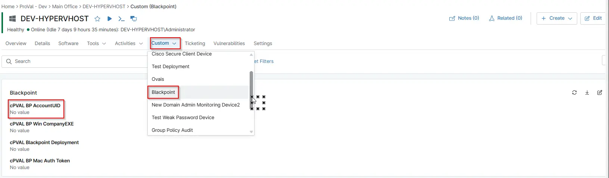

## Summary

This field stores the unique Blackpoint AccountUID, which is the identifier used by Blackpoint to associate endpoints and services with the correct customer account. It ensures accurate mapping and automation when deploying agents.

## Details

| Label | Field Name | Definition Scope | Type | Required | Default Value | Technician Permission | Automation Permission | API Permission | Description | Tool Tip | Footer Text |  Custom Field Tab Name |
| ----- | ---- | ---------------- | ---- | -------- | ------------- | --------------------- | --------------------- | -------------- | ----------- | -------- | ----------- | ----------- |
| cPVAL BP AccountUID| cpvalbpaccountuid | `Device`, `organization`, `Location` | Text | True | -- |  Editable | `Read/Write` | `Read/Write`   |     This field stores the unique Blackpoint AccountUID, which is the identifier used by Blackpoint to associate endpoints and services with the correct customer account. It ensures accurate mapping and automation when deploying agents.   |   Stores the unique Blackpoint Account UID used to identify and link endpoints to the correct Blackpoint account.   | Stores the unique Blackpoint Account UID used to identify and link endpoints to the correct Blackpoint account. | BlackPoint |

## Dependencies

- [Automation - BlackPoint SNAP Installer - Windows](/docs/06b6d11b-92b0-478d-9323-3f599d5caa46)

## Custom Field Creation

- [Custom Field Configuration](https://github.com/ProVal-Tech/ninjarmm/blob/main/custom-fields/cpval-bp-account-uid.toml)

## Solution Document

- [Solution - BlackPoint Agent Deployment](/docs/b9f13c4b-742d-4118-be8e-0c03e43ded17)

## Sample Screenshot

