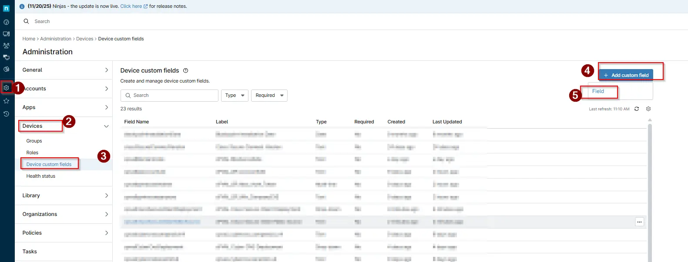
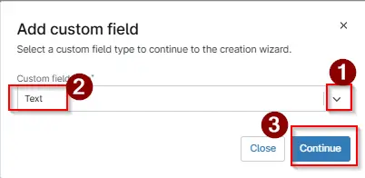
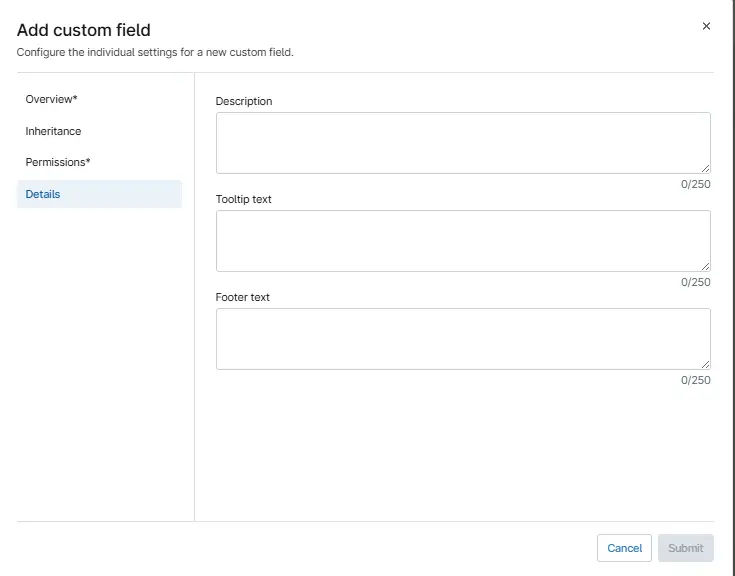

## Summary

This custom filed is used to hold the cPVAL_BP_AccountUID data.

## Details

| Label | Field Name | Definition Scope | Type | Option Value | Default Value | Required  | Technician Permission | Automation Permission | API Permission | Description | Tool Tip | Footer Text |
| ----- | ---------- | ---------------- | ---- | ------------ | ------------- | --------- | --------------------- | --------------------- | -------------- | ----------- | -------- | ----------- |
| cPVAL_BP_AccountUID| cpvalbpaccountuid | `Device`, `organization`, `Location` | Text | `All`, `Windows`, `Windows Workstations`, `Windows Servers`, `Macintosh`, `Disabled` | Dynamic | True | Editable | Read/Write | Read/Write | This is used to hold the cPVAL_BP_AccountUID data. |cPVAL_BP_AccountUID | cPVAL_BP_AccountUID |

## Custom Field Creation

### Step 1

Navigate to the `Administration` menu, then proceed to `Devices` and select `Device Custom Fields`. Locate the `Add Custom Field` button on the right-hand side of the screen and click on it.  

### Step 2

After clicking the `Add` button, select the `Field` button that appears. Choose the Custom filed type ans select `Continue`

**Custom Field Type:** `Text`

### Step 3

The following Pop-up screen will appear:  

### Step 4

Set the following details in the `Overview` section and click the `Next` button.

**Custom Filed Type:** `Text`
**Label:** `cPVAL_BP_AccountUID`  
**Name:** `cpvalbpaccountuid`  
**Custom field is required:** `<Leave it unchecked>`

### Step 5

Clicking the `Next` button will take you to the `Inheritance` section.  

Set the following details  `Inheritance` section and click the `Next` button.  

**Deive:** `Already checked`
**End User:** `Uncheck`
**Location:** `check`  
**Organization:** `check`

### Step 5

in the `Permission` section and click the `Next` button.  

**Technician:** `Editable`  
**Automation:** `Read/Write`  
**API:** `Read/Write`

Clicking the `Next` button will take you to the details tab.  

### Step 6

Fill in the following information in the `Details` section and click the `Submit` button.

**Description:** `This is used to hold the cPVAL_BP_AccountUID data.`  
**Tooltip Text:** `cPVAL_BP_AccountUID`  
**Footer Text:** `cPVAL_BP_AccountUID`

Clicking the `Next` button will take you to the `Advanced Settings` tab.  
