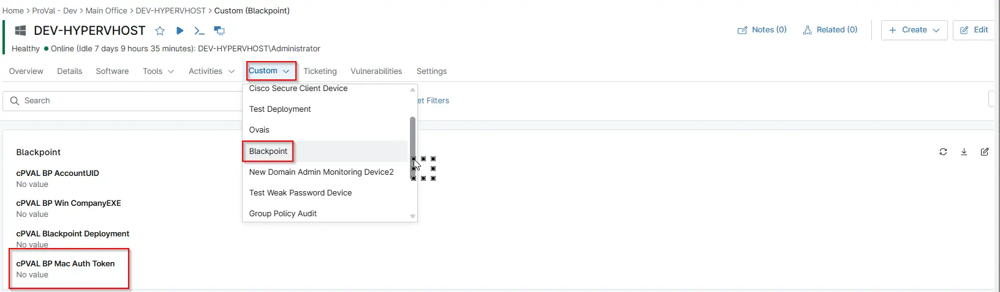

## Summary

Stores the Blackpoint macOS Authorization Token, which is required for automated deployment and authentication of the Blackpoint agent on macOS devices.

## Details

| Label | Field Name | Definition Scope | Type | Required | Default Value | Technician Permission | Automation Permission | API Permission | Description | Tool Tip | Footer Text |  Custom Field Tab Name |
| ----- | ---- | ---------------- | ---- | -------- | ------------- | --------------------- | --------------------- | -------------- | ----------- | -------- | ----------- | ----------- |
| cPVAL BP Mac Auth Token | cpvalBpMacAuthToken | `Device`, `organization`, `Location` | Multi-line | -- | True | Editable | Read/Write | Read/Write | Stores the Blackpoint macOS Authorization Token, which is required for automated deployment and authentication of the Blackpoint agent on macOS devices. | Holds the Blackpoint macOS authorization token for agent deployment. | Holds the Blackpoint macOS authorization token for agent deployment. | BlackPoint |

## Dependencies

- [Automation - BlackPoint SNAP Installer - MacOS](/docs/22a99cac-7acf-4251-a790-41a3b651f183)

## Custom Field Creation

- [Custom Field Configuration](https://github.com/ProVal-Tech/ninjarmm/blob/main/custom-fields/cpval-bp-mac-auth-token.toml)

## Sample Screenshot

