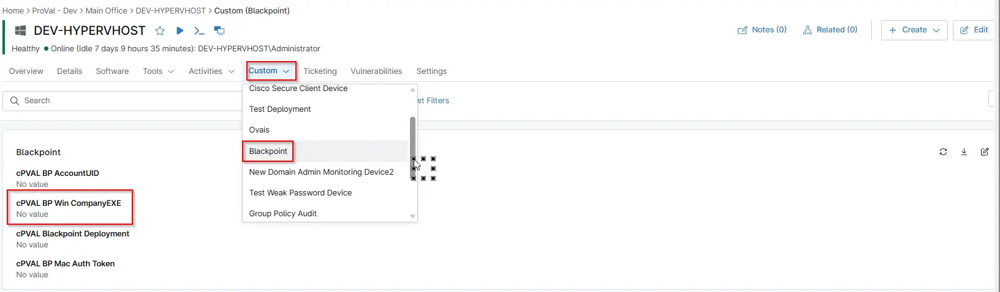

## Summary

This field is used to store the `CompanyEXE` value to help download the correct exe for each organization during the automation.

## Details

| Label | Field Name | Definition Scope | Type | Required | Default Value | Technician Permission | Automation Permission | API Permission | Description | Tool Tip | Footer Text |  Custom Field Tab Name |
| ----- | ---- | ---------------- | ---- | -------- | ------------- | --------------------- | --------------------- | -------------- | ----------- | -------- | ----------- | ----------- |
| cPVAL_BP_Win_CompanyEXE | cpvalbpwincompanyexe | `Device`, `organization`, `Location` | Text | -- | True | Editable | Read/Write | Read/Write | This field is used to store the `CompanyEXE` value to help download the correct exe for each organization during the automation. | It holds the company exe value for BlackPoint endpoint for each client. | It holds the company exe value for BlackPoint endpoint for each client. | BlackPoint |

## Dependencies

- [Automation - black-point-deployment-windows](/docs/06b6d11b-92b0-478d-9323-3f599d5caa46)

## Custom Field Creation

- [Custom Field Configuration](https://github.com/ProVal-Tech/ninjarmm/blob/main/custom-fields/cpval-bp-win-company-exe.toml)

## Sample Screenshot

