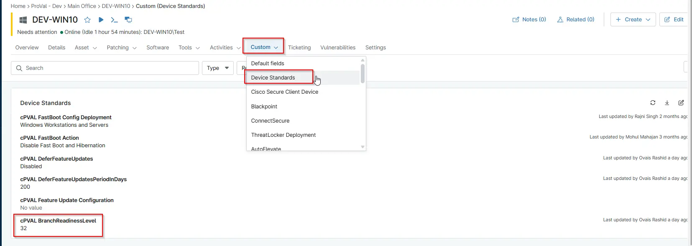

## Summary

This field controls the Windows Update Branch Readiness Level. Select the appropriate channel to determine which feature update builds the device will receive.

## Details

| Label | Field Name | Definition Scope | Type | Required | Default Value | Technician Permission | Automation Permission | API Permission | Description | Tool Tip | Footer Text |  Custom Field Tab Name |
| ----- | ---- | ---------------- | ---- | -------- | ------------- | --------------------- | --------------------- | -------------- | ----------- | -------- | ----------- | ----------- |
| cPVAL BranchReadinessLevel | cpvalBranchreadinesslevel | `Device`, `Location`, `Organization` | `DropDown` | false | `16`, `32` | Editable | Read/Write | Read/Write | This field controls the Windows Update Branch Readiness Level. Select the appropriate channel to determine which feature update builds the device will receive. | Choose the update servicing channel. Semi-Annual Channel (Value: 16) is recommended for production devices. Insider Preview Builds (Value: 32) is intended for testing and pre-release validation. | Choose the update servicing channel. Semi-Annual Channel (Value: 16) is recommended for production devices. Insider Preview Builds (Value: 32) is intended for testing and pre-release validation. | Device Standards |

## Dependencies

- [Solution: Update Windows Deferral Settings](/docs/56e6b247-f80a-4bd8-b2e2-8cf44f76b7e1)
- [Solution - Device Standards](/docs/a0c383d4-699a-4bb8-af7f-c2a007747182)
- [Automation: update windows deferral settings](/docs/5d4e1aa7-4ec8-4a7a-ba50-7a93366a232a)

## Custom Field Creation

- [Custom Field Configuration](https://github.com/ProVal-Tech/ninjarmm/blob/main/custom-fields/cpval-branch-readiness-level.toml)

## Sample Screenshot

## Changelog

### 2026-03-06

- Initial version of the document
