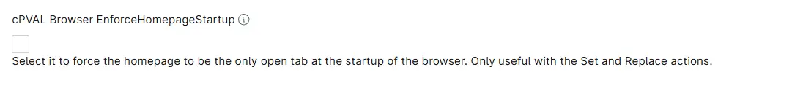

## Summary
Custom Field to force the homepage to be the only open tab at the startup of the browser. Only useful with the Set and Replace actions.

## Details

| Label | Field Name | Definition Scope | Type | Required | Default Value | Technician Permission | Automation Permission | API Permission | Description | Tool Tip | Footer Text |  Custom Field Tab Name |
| ----- | ----- | ----- | ----- | ----- | ----- | ----- | ----- | ----- | ----- | ----- | ----- | ----- | 
| cPVAL Browser EnforceHomepageStartup | cpvalBrowserEnforcehomepagestartup |  `Organization`, `Location`, `Device`  | CheckBox | False | | Read Only | Read/Write | Read/Write | Select it to force the homepage to be the only open tab at the startup of the browser. Only useful with the Set and Replace actions. | Select it to force the homepage to be the only open tab at the startup of the browser. Only useful with the Set and Replace actions. | Select it to force the homepage to be the only open tab at the startup of the browser. Only useful with the Set and Replace actions. | Manage Browser HomePage |

## Dependencies

- [Solution - Browser - HomePage - Manage](/docs/3197b1ea-9250-4373-9d21-6124a0b72ec6)

## Custom Field Creation

- [Custom Field Configuration](https://github.com/ProVal-Tech/ninjarmm/blob/main/custom-fields/cpval-browser-enforcehomepagestartup.toml)

## Sample Screenshot

## Changelog

### 2026-09-28

- Initial version of the document
