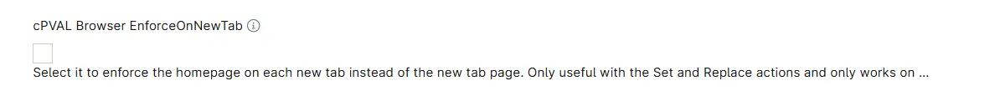

## Summary

Custom Field to enforce the homepage on each new tab instead of the new tab page. Useful only with the `Set` and `Replace` actions and supported exclusively on Chromium Browsers (Brave,Chrome and Edge).

## Details

| Label | Field Name | Definition Scope | Type | Required | Default Value | Technician Permission | Automation Permission | API Permission | Custom Field Tab Name |
| ----- | ----- | ----- | ----- | ----- | ----- | ----- | ----- | ----- | ----- |
| cPVAL Browser EnforceOnNewTab | cpvalBrowserEnforceonnewtab |  `Organization`, `Location`, `Device`  | CheckBox | False | | Read Only | Read/Write | Read/Write | Manage Browser HomePage |

## Dependencies

- [Solution - Browser - HomePage - Manage](/docs/3197b1ea-9250-4373-9d21-6124a0b72ec6)

## Custom Field Creation

- [Custom Field Configuration](https://github.com/ProVal-Tech/ninjarmm/blob/main/custom-fields/cpval-browser-enforceonnewtab.toml)

## Sample Screenshot

## Changelog

### 2026-10-01

- Initial version of the document
