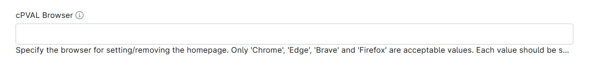

## Summary

Custom Field to specify the browser for setting/removing the homepage. Only 'Chrome', 'Edge', 'Brave' and 'Firefox' are acceptable values.

## Details

| Label | Field Name | Definition Scope | Type | Required | Default Value | Technician Permission | Automation Permission | API Permission | Custom Field Tab Name |
| ----- | ----- | ----- | ----- | ----- | ----- | ----- | ----- | ----- | ----- | 
| cPVAL Browser | cpvalBrowser |  `Organization`, `Location`, `Device`  | Text | False | | Read Only | Read/Write | Read/Write | Manage Browser HomePage |

## Dependencies

- [Solution - Browser - HomePage - Manage](/docs/3197b1ea-9250-4373-9d21-6124a0b72ec6)

## Custom Field Creation

- [Custom Field Configuration](https://github.com/ProVal-Tech/ninjarmm/blob/main/custom-fields/cpval-browser.toml)

## Sample Screenshot

## Changelog

### 2026-10-01

- Initial version of the document
